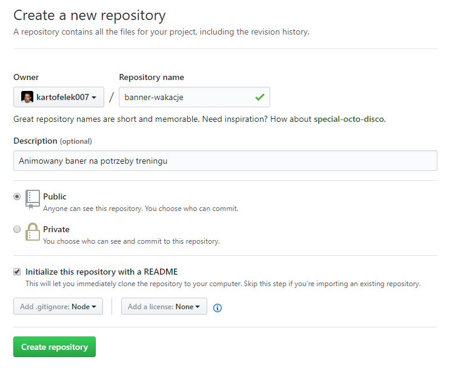
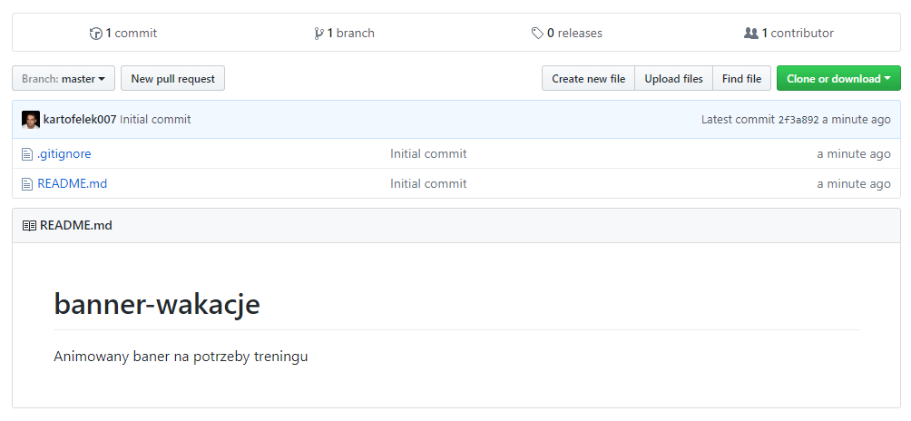
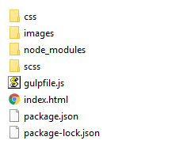
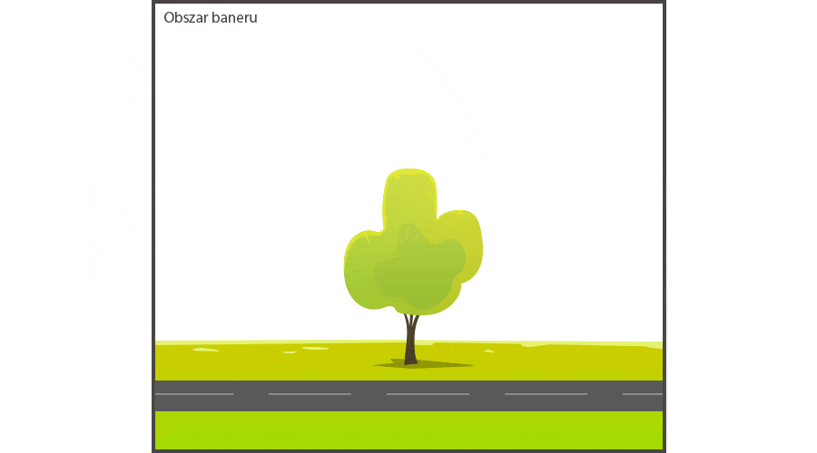
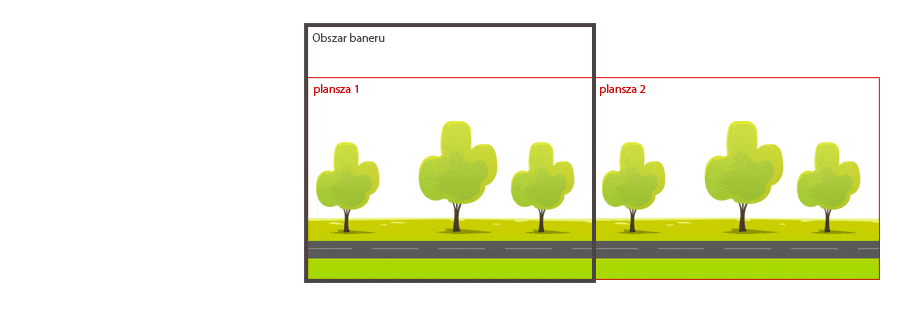

Jak niektórzy wiedzą, od jakiegoś czasu zajmuję się nauczaniem frontendu.
Z wczorajszą grupą kończyliśmy temat sass, i między innymi animacji css, czyli tego o czym pisałem ostatnim razem.
Nie ukrywam - bardzo lubię te tematy, bo pozwalają trochę poczarować.
Zawsze po skończeniu takiego działu zabieramy się za jakiś mini projekt, który zbiera i podsumowuje poznane techniki.
Tym razem przygotowałem dla kursantów baner, który miał służyć do poćwiczenia animacji.
Niestety bardzo mało czasu spowodowało, że zamiast wykonać całość od początku do końca, zdążyliśmy tylko omówić jakie techniki zastosować na danych składowych tego banera. Całość zostawiłem im do samodzielnego wykonania.

Dzisiaj rano wstałem i stwierdziłem, że takie zadanie to fajny materiał na tutorial. Nie teoria, a praktyka.
No to co? Zaczynamy?

<!--more-->

## Najważniejsza część
Pierwszą rzeczą za jaką powinniśmy się zabrać, to... *zrobienie odpowiedniego researchu i zaplanowanie całości*. Tak. Znowu przynudza. Gdybym miał oceniać znaczenie faz projektu, to właśnie projekt i planowanie było by tą najważniejszą częścią (którą większość początkujących pomija).
No ale ok. Powiedzmy, że <a href="https://pl.pinterest.com/search/pins/?q=mobile%20games&rs=typed&term_meta[]=mobile%7Ctyped&term_meta[]=games%7Ctyped">research</a>) i plan był zrobiony. Jako tako, byle jako. Ale jest...

W rezultacie załóżmy, że stworzyliśmy plan na stworzenie czegoś takiego:

Całość ma być oczywiście animowana.

Przechodzimy więc do kolejnego kroku czyli... przygotowania środowiska.

*W poniższym projekcie zakładam, że masz zainstalowany na komputerze <a href="https://www.youtube.com/watch?v=LEystZRF8fQ">git</a>, <a href="https://nodejs.org/en/">node</a> oraz <a href="https://gulpjs.com/">gulp-cli</a> (pierwsza linijka z tej strony)*

## Przygotowanie repozytorium
Pierwszą rzeczą którą się zajmiemy to repozytorium.
Ja do tego celu skorzystam z <a href="https://github.com/">GitHuba</a>, ale spokojnie możecie użyć innego serwisu - np. <a href="http://gitlab.com">GitLaba</a>.
Będąc już zalogowanym tworzymy nowe repozytorium klikając na zielony przycisk New repository (lub przechodząc na stronę <a href="https://github.com/new">https://github.com/new</a>).
Ustawiamy opcje mniej więcej jak na poniższym screenie.

*Repository name* - nazwa repozytorium - ja wpisałem "banner-wakacje"

*Description* - opis projektu - "Animowany baner na potrzeby treningu"

Repozytorium ustawiłem na publiczne (każdy może je klonować, forkować itp).
Na Githubie wszystkie repozytoria muszą być publiczne, chyba że zapłacimy. Jeżeli to Ci przeszkadza, skorzystaj z <a href="http://gitlab.com">GitLaba</a>, na którym takich obostrzeń nie ma (sam używam do wielu projektów i nie narzekam).

Zaznaczyłem opcję *Initialize this repository with a README*. Dzięki temu
automatycznie zostanie stworzony plik README.md. Plik ten to opis, który widzimy po wejściu
na każdy inny projekt na githubie. W naszym przypadku zostanie do niego automatycznie wstawiony tytuł projektu i treść pola description. Później możemy spokojnie sobie go ręcznie edytować. Jeżeli nie utworzymy tego pliku za pomocą tej opcji, spokojnie możemy go potem utworzyć ręcznie.

Mała opcja *Add .gitignore* utworzy nam automatycznie plik .gitignore. Plik ten - bardzo ważny - wyłączy z kommitowania katalogi, które nie powinny się pojawić w repozytorium. Dla przykładu *phpStorm* lub *webStorm* tworzą w katalogu projektu ukryty katalog *.idea*. Nie chcemy go mieć w repozytorium.
Drugim katalogiem który głównie nas interesuje to *node_modules*. W katalogu tym znajdzie się zaraz ok 10000 plików, których nie powinniśmy kommitować.
W naszym przypadku w tym pliku musi się znaleźć minimum jedna linia:

<pre  class="line-numbers"><code>
node_modules
</code></pre>

Opcję tą też spokojnie możemy olać, a potem plik taki stworzyć ręcznie.
Pamiętaj, że na windowsie utworzenie takiego pliku w normalny sposób będzie niemożliwe. Trzeba skorzystać z edytora i uzyć opcji "save as".

Klikam na "Create repository". Utworzyło nam repozytorium z 2 plikami.

Teraz je klonujemy, i zaczynamy pracę właściwą. Pobieram więc adres do klonowania poprzez prawy zielony przycisk na stronie i w konsoli na komputerze wpisuję

<pre  class="line-numbers"><code>
git clone https://github.com/kartofelek007/banner-wakacje.git
</code></pre>

Utworzy nam nowy katalog ze sklonowanym projektem. Katalog ten będzie utworzony w miejscu, gdzie byliśmy w konsoli.

Tak wiem - tyle pisania a jeszcze nie zaczęliśmy kodzić.

## Środowisko pracy
W naszym mini projekcie będziemy używać SCSS, który będziemy kompilować za pomocą gulpa.
Ja skorzystam tutaj z mini templatki do gulpa, która służy tylko do kompilowania sass. Pisałem na te tematy we wpisie o <a href="http://domanart.pl/gulp">Gulpie</a>.
Do katalogu głównego projektu dodajemy więc 3 pliki <a href="http://domanart.pl/dema/banner-wakacje/package.json">package.json</a>, <a href="http://domanart.pl/dema/banner-wakacje/">package-lock.json</a> oraz <a href="http://domanart.pl/dema/banner-wakacje/gulpfile.js">gulpfile.js</a>, a następnie w konsoli instalujemy wszystkie składniki poleceniem

<pre  class="line-numbers"><code>
npm i
//lub na macach i linuksach
sudo npm i
</code></pre>

Dodatkowo tworzymy katalog scss, w którym tworzymy jeden pusty plik style.scss, oraz index.html z podstawową strukturą html. W pliku index.html podpinamy plik *css/style.css* (będzie automatycznie tworzony).
Musimy jeszcze ściągnąć paczkę grafik, z których będziemy korzystać.

<a href="http://domanart.pl/dema/banner-wakacje/images.zip" class="demo">Paczka grafik</a>

Paczkę rozpakowujemy do głównego katalogu.
Nasza struktura projektu powinna teraz wyglądać tak:

Całość dodajemy do gita i wrzucamy do repozytorium:

<pre  class="line-numbers"><code>
git status
git add .
git status
git commit -m "początkowa struktura projektu"
git status
git push origin master
</code></pre>

Zauważyłeś, że nadużywam polecenia git status? Dobrze wiedzieć na czym się stoi...
Najważniejsze by powyższy commit nie puścił nam na repozytorium katalogu node_modules. Stąd też git status bardzo się przydaje. Zresztą to bardzo dobry nawyk.

## Rozpoczęcie pracy
Ufff. Tyle tekstu, a dopiero zaczynamy pracę.

W naszym projekcie zastosujemy podejście, jakie stosuje się przy modelowaniu.
Lepisz, lepisz, od ogółu do szczegółu. Tak samo tutaj - zaczynamy pisać kod. Na początku ciut spontanicznie, a potem zaczynam refakturyzację - dokładamy szczegóły, bardziej układamy, dzielimy kod na oddzielne pliki.

Środowisko przygotowane. Zaczynamy prace właściwą :)
Odpalamy środowisko poleceniem w konsoli:

<pre  class="line-numbers"><code>gulp</code></pre>

## Ułożenie baneru
W poniższych kodach będę dawał listingi parami: html + scss.
Zaczynamy od wyśrodkowania w html ramki z banerem:

<pre  class="line-numbers"><code class="language-html">
&lt;div class="banner">
&lt;/div>
</code></pre>

<pre  class="line-numbers"><code class="language-scss">
html, body {
    margin:0;
    height:100%;
}
body {
    display:flex;
    justify-content: center;
    align-items: center;
    background: lighten(#007643, 2);
}

.banner {
    height:500px;
    border-radius: 15px;
    box-shadow:
            0 0 300px rgba(#FFD658, 0.3),
            0 0 100px rgba(#FFD658, 0.5);
    width:800px;
    background: linear-gradient(to bottom, rgba(133,241,247,1) 1%, rgba(252,225,136,1) 39%, rgba(255,255,255,1) 100%);
    position: relative;
    overflow: hidden;
}
</code></pre>

Najważniejsza rzecz z powyższego kodu to pozycjonowanie relatywne baneru, które umożliwi nam zastosowanie pozycjonowania absolutnego dla elementów baneru.

<a href="http://domanart.pl/dema/banner-wakacje/banner0.html" class="demo">Banner pusty</a>

Git status, git commit i git push.

## Droga i drzewa
Zaczynamy układać elementy na banerze.

Aby zaoszczędzić wam czasu, w listingach od razu wrzucam animację.
Gdy ja robiłem ten baner, na początku ułożyłem wszystkie elementy, a animację dopisywałem na końcu. Czasami wymagało to przemodelowania danego elementu. Po napisaniu podstawowego kodu, podzieliłem go na oddzielne pliki scss, które potem includowałem w głównym pliku style.scss. Ale to pozostawiam wam.

Pierwsze na celownik trafiają droga i drzewa. Droga leży na dole baneru, ma pełna szerokość.
Wystarczy ją więc ustawić pozycjonowaniem absolutnym na dole baneru, dać odpowiednie tło.
Czekaj - nie przepisuj. Wpierw teoria.

<pre  class="line-numbers"><code class="language-scss">
.ground {
    position:absolute;
    bottom:0;
    left:0;
    width:100%;
    height:125px;
    background: url(../images/ziemia.png) repeat-x;
    animation: animGrass 5s 0s infinite linear;
}

@keyframes animGrass {
    0% {background-position: 0 0;}
    100% {background-position: -800px 0;}
}
</code></pre>

Sama animacja drogi jest bardzo prosta. Przesuwamy tło za pomocą
*background-position*

<a href="http://domanart.pl/dema/banner-wakacje/banner1.html" class="demo">Banner 1</a>

Co do drzew. Moglibyśmy ustawić je na planszy w odpowiednich miejscach:

<pre  class="line-numbers"><code class="language-scss">
.tree1 {
    position:absolute;
    bottom:100px;
    left:145px;
    width:220px;
    height:125px;
    background: url(../images/drzewo1.png) no-repeat;
}
.tree2 { ... }
.tree3 { ... }
</code></pre>

a następnie przesuwać je zmieniając pozycję *left*

Z podejściem tym jest jednak pewien problem, który nam tylko utrudni robotę.
Spójrz jeszcze raz na grafikę poglądową. Niekóre drzewa od razu są widoczne na środku ekranu. Oznacza to, że ich animacja zaczyna się w połowie baneru. Żeby zaanimować jego ruch (i go zapętlić) musimy je więc wysunąć w lewo za obszar baneru, następnie jakoś przenieść go na prawo za widoczny obszar, a potem w odpowiedniej prędkości przesunąć do pozycji początkowej.

Tylko jak przenieść takie drzewo z lewa na prawo? Sama zmiana pozycji z -200px na 900px nie zadziała jak należy, bo wtedy zobaczymy przelatujący z gwiezdną szybkością przez baner niezidentyfikowany obiekt koloru zielono brązowego (i bynajmniej nie będzie to Hulk).
Trzeba by więc przed takim przeniesieniem ustawić na chwilę opacity 0, a potem po przeskoku znowu je przywrócić.

Animacja w css teoretycznie mogła by więc wyglądać mniej więcej tak:

<pre  class="line-numbers"><code class="language-scss">
@keyframes animTree {
    0% { left:200px; }
    20% { left:-200px; opacity:1; }
    21% { left:-200px; opacity:0; }
    22% { left:900px; opacity:0; }
    23% { left:900px; opacity:1; }
    100% { left:200px; }
}
</code></pre>

Ciut skomplikowanie.
Jak widzisz na powyższej animacji moglibyśmy mieć też problemy z synchronizacją szybkości poruszania się drzewa z szybkością poruszania się drogi, co wygląda tak sobie (ślizganie się). Dodatkowo skąd mamy wiedzieć ile procent animacji przeznaczyć na przesunięcie z pozycji początkowej poza baner a ile z prawa do pozycji początkowej?
A najgorsze z tego wszystkiego - my wciąż mówimy tylko o 1 drzewie, a przecież takich drzew ma być więcej. Uh...

Rozwiązaniem tutaj jest zastosowanie innej techniki. Drzewa i drogę połączymy w jeden wspólny element za pomocą <a href="https://developer.mozilla.org/en-US/docs/Web/CSS/CSS_Backgrounds_and_Borders/Using_multiple_backgrounds">wieloelementowego tła</a>, które możemy definiować po przecinku.
Dodamy więc drogę, oraz drzewa na wspólny element, a następnie będziemy przesuwać cały element.

<pre  class="line-numbers"><code class="language-scss">
.ground {
    background:
        url(../images/drzewo1.png) 200px 20px no-repeat,
        url(../images/drzewo2.png) 650px 10px no-repeat,
        url(../images/drzewo1.png) 510px 20px no-repeat,
        url(../images/drzewo3.png) 0 20px no-repeat,
        url(../images/ziemia.png) 0 bottom repeat-x;
    height:330px;
    width:100%;
    position: absolute;
    bottom:0;
    left:0;
    z-index: 3;
}
</code></pre>

Problem z tym podejściem jest taki, że znowu mamy tutaj konkretne pozycje drzew, które tak samo jak powyżej musielibyśmy jakoś indywidualnie poruszać.

Ale i tutaj możemy zastosować pewną sztuczkę - znaną twórcom gier. Wystarczy, że zrobimy dwie takie same plansze z elementami, które będziemy odpowiednio przemieszczać:

Poniżej już poprawny kod - można przepisywać:

<pre  class="line-numbers"><code class="language-html">
&lt;div class="banner"&gt;
    &lt;div class="ground"&gt;
        &lt;div&gt;&lt;/div&gt;
        &lt;div&gt;&lt;/div&gt;
    &lt;/div&gt;
&lt;/div&gt;
</code></pre>

<pre  class="line-numbers"><code class="language-scss">
.ground {
    position: absolute;
    bottom:0;
    left:0;
    width:200%;
    height:330px;
    z-index: 3;
    animation: animGrass 5s 0s infinite linear;
}

.ground div {
    float:left;
    width:50%;
    height:330px;
    background:
        url(../images/drzewo1.png) 200px 20px no-repeat,
        url(../images/drzewo2.png) 650px 10px no-repeat,
        url(../images/drzewo1.png) 510px 20px no-repeat,
        url(../images/drzewo3.png) 0 20px no-repeat,
        url(../images/ziemia.png) 0 bottom repeat-x;
}

@keyframes animGrass {
    0% {transform:translate(-50%, 0);}
    100% {transform:translate(0%, 0);}
}
</code></pre>

<a href="http://domanart.pl/dema/banner-wakacje/banner2.html" class="demo">Banner 2</a>

Git status, git commit i git push.

## Roślinki
Kolejny element - roślinki na dole ekranu. Zwykły div w którym będziemy animować pozycję tła:

<pre  class="line-numbers"><code class="language-html">
&lt;div class="banner"&gt;
    ...
    &lt;div class="plants"&gt;&lt;/div&gt;
&lt;/div&gt;
</code></pre>

<pre  class="line-numbers"><code class="language-scss">
.plants {
    background: url(../images/roslinki.png) repeat-x;
    position: absolute;
    bottom:0;
    left:0;
    width:100%;
    height:102px;
    z-index: 10;
    filter:blur(1px);
    animation: animPlants 7s 0s infinite linear;
}

@keyframes animPlants {
    0% {background-position: 0% 0;}
    100% {background-position: 800px 0;}
}
</code></pre>

<a href="http://domanart.pl/dema/banner-wakacje/banner3.html" class="demo">Banner 3</a>

Git status, git commit i git push.

## Góry
Jak widzisz na grafice, mamy 3 typy gór: daleko oddalone w tle wysokie szczyty, niższe na środku i niskie zielone najbliżej widza. Wszystkie to divy, w których będziemy - tak samo jak w przypadku roślinek przesuwać tylko pozycję tła - w odpowiedniej szybkości - by uzyskać efekt paralaxy.

<pre  class="line-numbers"><code class="language-html">
&lt;div class="banner"&gt;
    &lt;div class="mountains-layer1"&gt;&lt;/div&gt;
    &lt;div class="mountains-layer2"&gt;&lt;/div&gt;
    &lt;div class="mountains-layer3"&gt;&lt;/div&gt;
    ...
&lt;/div&gt;
</code></pre>

<pre  class="line-numbers"><code class="language-scss">
/* gory zielone tuz nad ziemia */
.mountains-layer1 {
    height:208px;
    width:100%;
    background: url(../images/gory.png) repeat-x;
    position: absolute;
    bottom:120px;
    left:0;
    z-index: 2;
    animation: animMountains1 35s 0s infinite linear;
}
@keyframes animMountains1 {
    0% {background-position: 0% 0;}
    100% {background-position: -800px 0;}
}

/* gory faliste */
.mountains-layer2 {
    height:60px;
    width:100%;
    background: url(../images/gory-zielone.png) repeat-x;
    position: absolute;
    bottom:120px;
    left:0;
    z-index: 2;
    animation: animMountains2 27s 0s infinite linear;
}
@keyframes animMountains2 {
    0% {background-position: 0% 0;}
    100% {background-position: -800px 0;}
}

/* wysokie szczyty w tle */
.mountains-layer3 {
    background: url(../images/gory-w-tle.png) repeat-x;
    position: absolute;
    bottom:100px;
    left:0;
    width:100%;
    height:381px;
    z-index: 1;
    animation: animMountains3 100s 0s infinite linear;
}
@keyframes animMountains3 {
    0% {background-position: 0% 0;}
    100% {background-position: -800px 0;}
}
</code></pre>

<a href="http://domanart.pl/dema/banner-wakacje/banner4.html" class="demo">Banner 4</a>

Git status...

## Słoneczko
Słoneczko to zwykły zaokrąglony div z box-shadow:

<pre  class="line-numbers"><code class="language-html">
&lt;div class="banner"&gt;
    ...
    &lt;div class="sun"&gt;&lt;/div&gt;
&lt;/div&gt;
</code></pre>

<pre  class="line-numbers"><code class="language-scss">
.sun {
    width:300px;
    height: 300px;
    border-radius: 50%;
    background: #F8E84D;
    box-shadow: 0 0 100px #F8E84D;
    position: absolute;
    left:400px;
    top:-100px;
    z-index: 0;
}
</code></pre>

<a href="http://domanart.pl/dema/banner-wakacje/banner5.html" class="demo">Banner 5</a>

## Chmury
Przy chmurach zastosujemy tą samą technikę co w przypadku drogi i drzew, czyli podzielimy ten element na dwie takie same plansze. Dla lepszego efektu dodamy dwa zestawy chmur:

<pre  class="line-numbers"><code class="language-html">
&lt;div class="banner"&gt;
    ...
    &lt;div class="clouds1"&gt;
        &lt;div&gt;&lt;/div&gt;
        &lt;div&gt;&lt;/div&gt;
    &lt;/div&gt;
    &lt;div class="clouds2"&gt;
        &lt;div&gt;&lt;/div&gt;
        &lt;div&gt;&lt;/div&gt;
    &lt;/div&gt;
&lt;/div&gt;
</code></pre>

<pre  class="line-numbers"><code class="language-scss">
/* chmóry zestaw 1 */
.clouds1 {
    width:200%;
    height:300px;
    position: absolute;
    left:0;
    top:0;
    z-index: 2;
    opacity: 0.8;
}

.clouds1 div {
    float:left;
    width:50%;
    height:100%;
    background:
            url(../images/chmura3.png) 200px 30px no-repeat,
            url(../images/chmura2.png) 0 10px no-repeat,
            url(../images/chmura3.png) 500px 10px no-repeat;
}

/* chmóry zestaw 2 */
.clouds2 {
    width:200%;
    height:300px;
    position: absolute;
    left:0;
    top:0;
    z-index: 2;
    opacity: 0.4;
    filter:blur(2px);
}

.clouds2 div {
    float:left;
    width:50%;
    height:100%;
    background:
            url(../images/chmura3.png) 400px 60px no-repeat,
            url(../images/chmura2.png) 520px 10px no-repeat,
            url(../images/chmura3.png) 100px 50px no-repeat;
}
</code></pre>

<a href="http://domanart.pl/dema/banner-wakacje/banner6.html" class="demo">Banner 6</a>

W tym przypadku moglibyśmy skorzystać jeszcze z innego podejścia. Zamiast wrzucać chmury jako kolejne tła, moglibyśmy po prostu wrzucić je jako dodatkowe elementy pojedynczej części. Dzięki temu moglibyśmy animować każdą chmurę indywidualnie (np lekko poruszać ją w pionie). Czy mówiłem wam jak ważne jest planowanie?.. Ja niestety o tym zawczasu nie pomyślałem, ale na szczęście da się i bez tego żyć.

Git...

## Samochód
Ah dochodzimy do najważniejszej części naszego banera.
Cały samochód składa się z 2 kół i nadwozia, które upakujemy we wspólny kontener. Dzięki temu będziemy mogli poruszać całym samochodem, ale też nadwoziem i kołami z osobna.

<pre  class="line-numbers"><code class="language-html">
&lt;div class="car"&gt;
    &lt;div class="car-body"&gt;&lt;/div&gt;
    &lt;div class="car-wheel car-wheel-left"&gt;&lt;/div&gt;
    &lt;div class="car-wheel car-wheel-right"&gt;&lt;/div&gt;
&lt;/div&gt;
</code></pre>

<pre  class="line-numbers"><code class="language-scss">
.car {
    width:348px;
    height:197px;
    position: absolute;
    left:230px;
    bottom:83px;
    z-index: 3;
    animation: animCar 1s 0s infinite linear alternate;
}

@keyframes animCar {
    0% {transform:rotate(2deg);}
    100% {transform:rotate(-2deg);}
}

.car-body {
    width:348px;
    height:197px;
    background: url(../images/samochod.png);
    position: absolute;
    left:0;
    bottom:0;
    animation: animCarBody 0.3s 0s infinite alternate linear;
}

@keyframes animCarBody {
    0% {transform:translateY(0);}
    100% {transform:translateY(4px);}
}
</code></pre>

Cały samochód lekko obracam na boki. Nadwozie subtelnie poruszam w pionie.
Koła samochodu to osobne części, dzięki temu bez problemu możemy je animować:

<pre  class="line-numbers"><code class="language-scss">
.car-wheel {
    width:76px;
    height:77px;
    background: url(../images/kolo.png);
    position: absolute;
    left:65px;
    bottom:-30px;
    animation: animWheel 1s 0s infinite linear,
               animWheelUp 0.2s 0s infinite;
}

.car-wheel-right {
    left:228px;
}

@keyframes animWheel {
    0% {transform:rotate(0deg);}
    100% {transform:rotate(-360deg);}
}

@keyframes animWheelUp {
    0% {margin-top:0}
    100% {margin-top:2px;}
}
</code></pre>

Dla pojedynczego koła dodałem po przecinku 2 animacje. Jedna to obracanie się koła, a druga lekkie drżenie w pionie.

<a href="http://domanart.pl/dema/banner-wakacje/banner7.html" class="demo">Banner 7</a>

Kolejny krok za nami. Wiesz co masz zrobić :)

## Tekst
Przyszedł czas na animowany tekst na banerze.

<pre  class="line-numbers"><code class="language-html">
&lt;div class="banner"&gt;
    &lt;div class="text"&gt;
        &lt;h2&gt;A po egzaminie&lt;/h2&gt;
        &lt;h3&gt;Jazwa na wczasy!&lt;/h3&gt;
    &lt;/div&gt;
&lt;/div&gt;
</code></pre>

<pre  class="line-numbers"><code class="language-scss">
.text {
    position: absolute;
    left:0;
    top:20px;
    width: 100%;
    z-index: 4;
    font-family: 'Bangers', cursive;
    font-size:60px;
    line-height: 1;
    transform:rotate(-5deg) skew(-10deg);
    letter-spacing: 2px;
    padding:20px;
    text-shadow: 4px 4px 0px #fff;

    h2, h3 {
        margin:0;
        text-align: center;

    }

    h2 {
        color:#E80F7A;
    }

    h3 {
        color:#115EFC;
    }
}
</code></pre>

Jak widzisz jako czcionkę wybrałem <a href="https://fonts.google.com/specimen/Bangers">Bangers</a>. Aby jej użyć wrzuć do nagłowka strony link

<pre  class="line-numbers"><code>
&lt;link href="https://fonts.googleapis.com/css?family=Bangers&amp;subset=latin-ext" rel="stylesheet">
</code></pre>

<a href="http://domanart.pl/dema/banner-wakacje/banner8.html" class="demo">Banner 8</a>

Co można zrobić z takim tekstem?
Możemy zmienić jego pozycję, możemy pobawić się opacity, skalą itp.

Spróbujmy jednak wyjść poza to.
Zacznijmy od objęcia każdej litery spanem. Możemy do tego użyć JS - na przykład:

<pre  class="line-numbers"><code class="language-js">
function changeLettersToSpans(text) {
    return text.split('').map(letter => {
        if (letter == ' ') {
            return '&lt;span&gt;&nbsp;&lt;/span&gt;';
        } else {
            return '&lt;span&gt;'+letter+'&lt;/span&gt;'
        }
    }).join('');
}

const h2 = document.querySelector('.banner h2');
const h3 = document.querySelector('.banner h3');

h2.innerHTML = changeLettersToSpans(h2.innerText);
h3.innerHTML = changeLettersToSpans(h3.innerText);
</code></pre>

Ja to jednak zrobiłem ręcznie. Liter nie ma aż tyle, a dzięki ręcznej robocie pozbyłem się się JS z naszego banera:

<pre  class="line-numbers"><code class="language-html">
&lt;div class="banner"&gt;
    &lt;div class="text"&gt;
        &lt;h2&gt;
            &lt;span&gt;A&lt;/span&gt;&lt;span&gt;&nbsp;&lt;/span&gt;&lt;span&gt;p&lt;/span&gt;&lt;span&gt;o&lt;/span&gt;&lt;span&gt;&nbsp;&lt;/span&gt;&lt;span&gt;e&lt;/span&gt;&lt;span&gt;g&lt;/span&gt;&lt;span&gt;z&lt;/span&gt;&lt;span&gt;a&lt;/span&gt;&lt;span&gt;m&lt;/span&gt;&lt;span&gt;i&lt;/span&gt;&lt;span&gt;n&lt;/span&gt;&lt;span&gt;i&lt;/span&gt;&lt;span&gt;e&lt;/span&gt;
        &lt;/h2&gt;
        &lt;h3&gt;
            &lt;span&gt;J&lt;/span&gt;&lt;span&gt;a&lt;/span&gt;&lt;span&gt;z&lt;/span&gt;&lt;span&gt;d&lt;/span&gt;&lt;span&gt;a&lt;/span&gt;&lt;span&gt;&nbsp;&lt;/span&gt;&lt;span&gt;n&lt;/span&gt;&lt;span&gt;a&lt;/span&gt;&lt;span&gt;&nbsp;&lt;/span&gt;&lt;span&gt;w&lt;/span&gt;&lt;span&gt;c&lt;/span&gt;&lt;span&gt;z&lt;/span&gt;&lt;span&gt;a&lt;/span&gt;&lt;span&gt;s&lt;/span&gt;&lt;span&gt;y&lt;/span&gt;&lt;span&gt;!&lt;/span&gt;
        &lt;/h3&gt;
    &lt;/div&gt;
&lt;/div&gt;
</code></pre>

Kto co woli.

Dzięki temu, że każda litera jest teraz oddzielnym elementem, możemy ją indywidualnie animować. Wykorzystajmy do tego pętlę w Sassie:

<pre  class="line-numbers"><code class="language-scss">
.text {
    ...

    @for $i from 1 through 30 {
        $time : (0.1 * $i) * 1s;
        $timeLoop : (0.2 + 0.1 * $i) * 1s;
        $whenOut : 8s;

        span:nth-of-type(#{$i}) {
            animation: animLetterIn 1s #{$time} 1 linear forwards,
                       animLetterLoop 1s #{$timeLoop} infinite alternate,
                       animLetterOut 1s #{$whenOut + $time} 1 linear forwards;
        }
    }
}
</code></pre>

W pętli wyliczyliśmy sobie opóźnienie dla animacji każdej z liter. Pierwsza animacja
to wjazd liter na baner, druga to powiewanie na wietrze, a ostatnia to wyjazd liter.

<pre  class="line-numbers"><code class="language-scss">
@keyframes animLetterIn {
    0% {
        opacity:0;
        top:-30px;
        left:100px;
    }
    100% {
        opacity:1;
        top:0;
        left:0;
    }
}

@keyframes animLetterLoop {
    0% { transform: translateY(-4px); }
    100% { transform: translateY(4px); }
}

@keyframes animLetterOut {
    0% {
        opacity:1;
        left:0;
    }
    100% {
        opacity:0;
        left:-80px;
    }
}
</code></pre>

<a href="http://domanart.pl/dema/banner-wakacje/banner9.html" class="demo">Baner końcowy</a>

## Pomysły
Pisałem na początku, że najważniejszy jest plan - prawda?
W czasie pisania tego tekstu pojawiła mi się masa nowych pomysłów, które mogłem zastosować.
Kwiatki z przodu moglibyśmy dać jako indywidualne obiekty, dzięki czemu można by je obracać.
A może drzewa byśmy dali jako oddzielne dzieci elementu .ground? Dzięki temu można by pokusić się o ich lekkie pochylanie - coby zasymulować wiatr.
A ludziki w samochodzie? Fajnie było by je poryszyć. Wcale nie było by to jakieś trudne - delikatne machanie rączkami, główkami. Mini detale, które dawały by +5 do "superości".

Niestety Marcin grafik olał najważniejszą część procesu (tłumacząc na ludzki - dał ciała), i większość tych pomysłów wymagała by teraz "sporych zmian".

A może coś jeszcze?
Jak zwykle pozostawiam to wam. Czerpcie przyjemność z frontendu.

Repozytorium z banerem <a href="https://github.com/kartofelek007/banner-wakacje">znajdziecie tutaj</a>.