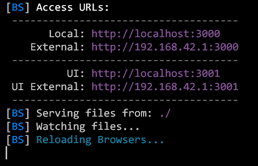
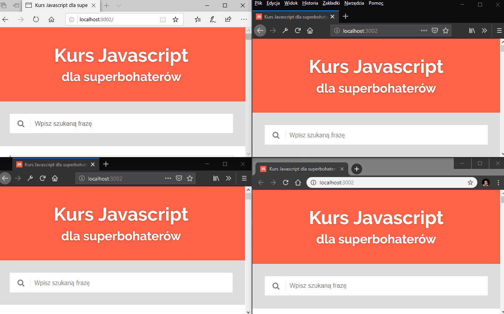
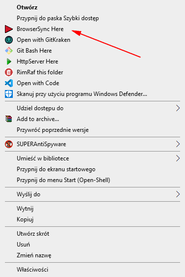

Browser-sync czyli jedna z najlepszych rzeczy jakie wymyślił człowiek. W tym tekście kilka ustawień by przyjemniej nam się z nim pracowało.

<!--more-->
## Co to jest Browsersync
Browsersync to narzędzie, które po odpaleniu serwuje nam stronę na na mikro serwerze.
Dzięki temu strona taka może być automatycznie odświeżana gdy zmieni się zawartość jej plików, może być oglądana równocześnie na wielu urządzeniach, a dodatkowo takie przeglądanie odbywa się synchronicznie. Gdy na naszym PC przewiniemy stronę w dół, zrobimy to równocześnie na wszystkich urządzeniach, którymi w danej chwili oglądamy naszą stronę. Gdy klikniemy na jakiś przycisk, równocześnie klikniemy w niego na każdym urządzeniu itp.

No a po co - skoro w edytorach mamy np. <a href="https://marketplace.visualstudio.com/items?itemName=ritwickdey.LiveServer">LiveServer</a>? Można i tak, tylko pamiętaj, że wtedy uzależniony jesteś od danego edytora. Gdy używasz Browsersync zewnętrznie, wtedy możesz sobie pisać w czym chcesz.

## Instalacja Browsersync
Aby zainstalować Browsersync, potrzebujemy mięć zainstalowany NodeJS. O samej instalacji Node pisałem <a href="https://kursjs.pl/kurs/es6/webpack.php#node">tutaj</a>.

Browsersync instalujemy w zależności od potrzeb. Może to być instalacja per projekt, może być też globalna. Zacznijmy od tej drugiej. Zgodnie z <a href="https://www.browsersync.io/">oficjalną stroną</a> w terminalu wpisujemy:

<pre><code class="language-js">
npm i browser-sync -g
</code></pre>

Od tego momentu jeżeli w danym katalogu chcemy włączyć Browsersync, wpisujemy polecenie:

<pre><code class="language-js">
browser-sync start
</code></pre>

co odpali naszego bohatera.

Pierwsze dwa adresy to adresy, na które się łączymy. Jeżeli mamy jakieś urządzenie podłączone do tej samej sieci, wystarczy, że połączymy się na adres External, co powinno otworzyć nam widok ze stroną z danego katalogu. Domyślnie otwierany jest plik index.html.

Te dwa pozostałe adresy otwierają panel zarządzania daną instancją Browsersynca, gdzie możemy ustawić co ma działać równocześnie na różnych urządzeniach (wspomniane równoczesne przewijanie, klikanie itp.)

Od razu przy takim odpaleniu warto podać kilka dodatkowych parametrów, które opisane są na <a href="https://www.Browsersync.io/docs/command-line">tej stronie</a>:

<pre><code class="language-js">
browser-sync start --server --no-notify --files "**/*.html, **/*.css, **/*.js"
</code></pre>

co spowoduje, że Browsersync otworzy naszą stronę w przeglądarce, ale też będzie nasłuchiwał zmian w plikach html, css i js.
Jeżeli je wykryje, odświeży naszą stronę. Dodatkowo za pomocą parametru `--no-notify` wyłączyliśmy upierdliwe powiadomienie o tym, że strona została przeładowana (które normalnie pojawia się w prawym górnym rogu strony).
Parametry na powyższej stronie warto sobie przejrzeć, bo dla przykładu jeżeli chcemy zmienić domyślną przeglądarkę, wystarczy dodać parametr:

<pre><code class="language-js" data-lines="">
--browser "Firefox"
</code></pre>

przy czym nazwa przeglądarki uzależniona jest od systemu (<a href="https://stackoverflow.com/questions/47984484/Browsersync-browser-option-in-ubuntu-16-04">1</a>, <a href="https://stackoverflow.com/questions/24686585/gulp-browser-sync-open-chrome-only">2</a>).

## Browser-sync jako menu kontektowe
Powyższy proces odpalania Browsersync można sobie jeszcze bardziej usprawnić.
Ja to zrobiłem na 2 sposoby.

Pierwszy z nich to dodanie do menu kontekstowego opcji, która będzie odpalać powyższe polecenie w danym katalogu. Aby to zrobić stworzyłem <a href="http://domanart.pl/dema/regexp/browserSync-here.reg">mini plik, który dodaje wpis do rejestru</a>.

Jeżeli też chcesz dodać sobie taką opcję, koniecznie przed odpaleniem tego pliku otwórz go w jakimś edytorze (np. VSC). By potem nie było, że ci system rozwaliłem.

Po odpaleniu tego pliku i potwierdzeniu, że chcemy dodać odpowiednią informację do rejestru, po kliknięciu prawym przyciskiem na dany folder pojawi nam się odpowiednia opcja:

Ta czerwona ikonka, którą mam przy danej opcji jest u mnie wrzucona do katalogu Window. Ścieżka podana jest w powyższym pliku reg, więc w razie czego jak chcesz to ją sobie zmień. Same ikonki można ściągnąć z wielu miejsc w necie (np. <a href="http://www.iconarchive.com/search?q=arrow">z tego</a>) - wystarczy szukać plików z rozszerzeniem .ico. Ewentualnie w ogóle tą opcję usunąć.

## Browser-sync w Terminalu
Ja używamy dwóch terminali. Jeden to <a href="https://cmder.net/">Cmder</a> a drugi Windows Terminal, który można pobrać bezpośrednio z Windows store.

Żeby nie wpisywać całego polecenia BrowserSync za każdym razem możemy dodać sobie do terminali odpowiednie aliasy.

**Alias w Cmder:** 
Na powyższej stronie jest opisane jak oficjalnie je zrobić, ale szczerze mówiąc jest na to bardzo prosta metoda. W katalogu, w którym amym Cmder edytujemy plik `config/user_aliases.cmd`.
Na jego końcu dodałem do niego linijkę:

<pre><code class="language-js">
bs=browser-sync start --server --no-notify --files "**/*.html, **/*.css, **/*.js"
</code></pre>

Od tej pory po wpisaniu w terminal cmder polecenia `bs` odpala mi się Browsersync.

**Alias w Terminalu:** 
W terminalu możemy mieć odpalone różne środowiska. Zakładam więc, że mówimy o domyślnym - powershell.
Po pierwsze sprawdźmy sobie gdzie zapisany jest nasz profil. Wpisujemy `$profile`. Wyskoczy nam ścieżka do pliku. To właśnie w nim dodajemy nasze aliasy.
Osobiście dodałem sobie w tym katalogu plik posh-git-alias **https://github.com/AlexZeitler/posh-git-alias** by mieć dodatkowo aliasy dla gita. Następnie w pliku który widzieliśmy w terminalu dodałem ścieżkę `. C:\Users\sciezka_do_katalogu_z_profilem\posh-git-alias.ps1`. W pliku znajdziesz funkcje z aliasami. Podobnie dodałem do niego własne np.

<pre><code>
function bs() {
    browser-sync start --server --no-notify --host 192.168.0.24 --files "**/*.html, **/*.css, **/*.js"
}
</code></pre>

## Browser-sync, Gulp i Php
W artykule o <a href="https://kursjs.pl/kurs/es6/gulp" target="_blank">Gulpie</a> pisałem już jak zainstalować w nim Browsersync.

Instalacja tamta działała na plikach HTML. Osobiście dość często działam też w PHP, dlatego czasami korzystam z ciut innej konfiguracji:

<pre><code class="language-js">
...
const browserSync = require("browser-sync").create();

//zmieniamy lekko task server
const server = (cb) => {
    browserSync.init({
        proxy: "kursjs.lh", //virtua-host-address
        host: "127.0.0.1",
        baseDir: "./dist",
        open:true,
        notify:false
    });

    cb();
}

const watch = function() {
    ...
    //dodajemy nasłuch na pliki .php
    gulp.watch("**/*.php").on("change", Browsersync.reload);
};
</code></pre>

Cała reszta konfiguracji pozostaje bez zmian.

Parametr proxy powinien wskazywać na adres Virtua Host z serwera lokalnego na jakim normalnie odpalaliśmy naszą stronę. Temat przewijał nam się już w artykule o <a href="http://domanart.pl/serwer-lokalny/">lokalnym serwerze</a>.

Ciekawy artykuł na podobne tematy znajduje się pod adresem <a href="https://garywoodfine.com/php-server-Browsersync-gulp/">https://garywoodfine.com/php-server-Browsersync-gulp/</a>
