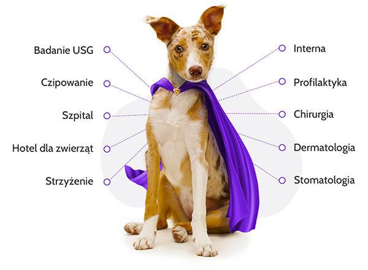
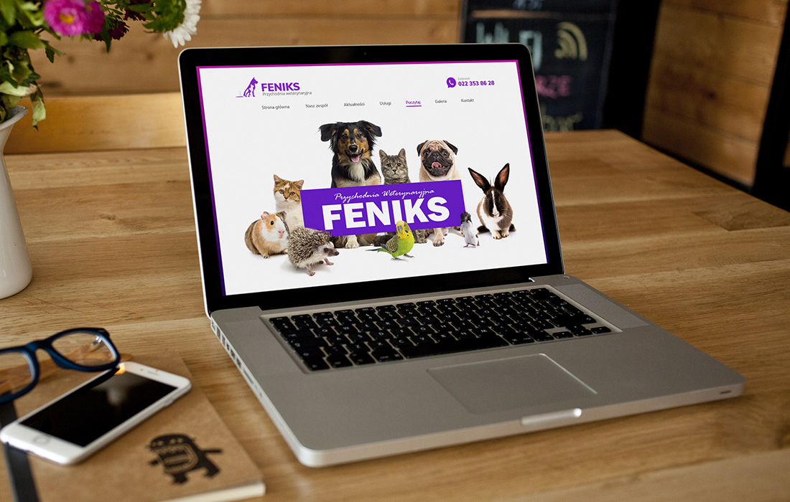
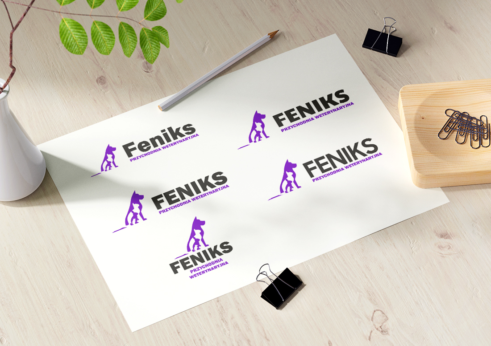
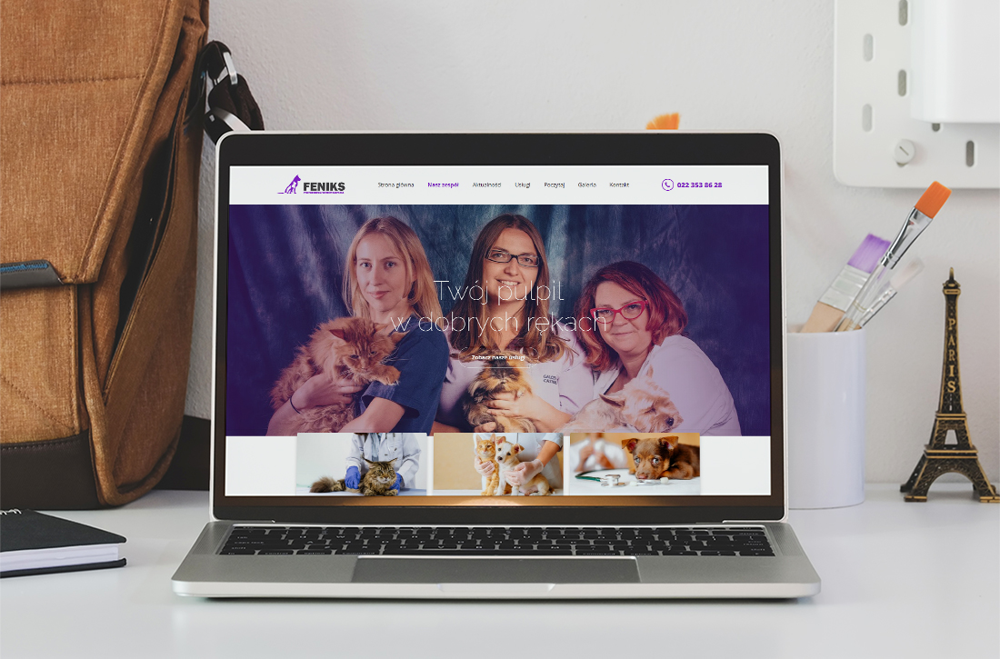
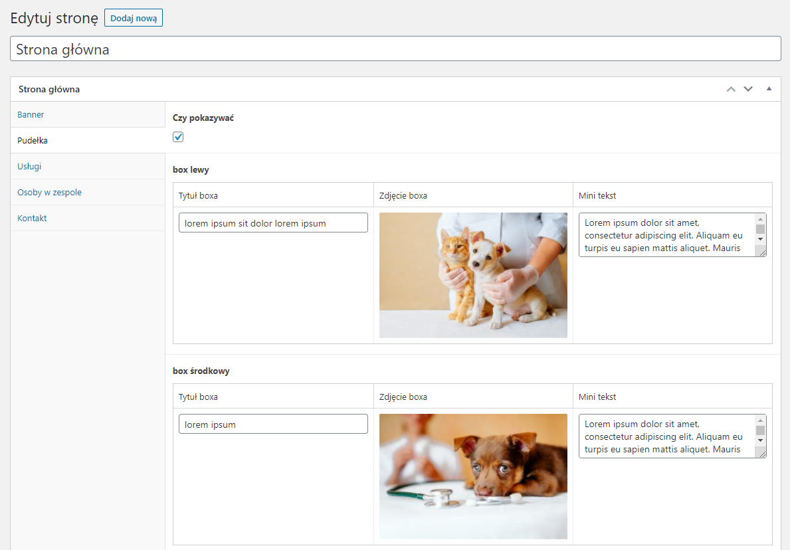

Dawno, dawno temu moja przyjaciółka poprosiła mnie, bym przygotował stronę dla pewnej przychodni weterynaryjnej. Strona znajduje się pod adresem: <a href="http://przychodnia-feniks.pl/">http://przychodnia-feniks.pl/</a>.

<!--more-->

<a href="./strona-przychodnia-feniks-old.jpg">Stary strona</a> jaka jest każdy widzi. Starutki twór, który - jak się zagłębimy w kod - był oparty o floaty, wykrywanie ie8 i podobne starocia. Jak popatrzycie po najstarszych wpisach na tym blogu - to mniej więcej to.

Plus do tego inne smakołyki jak nie działająca już google mapa, newsletter, który nie pozwalał się zapisać (a którego i tak nikt nigdy nie wysłał, bo ani to nie serwis tej wielkości, ani oni nie mają takiej potrzeby).

Największym problemem był jednak dla użytkowników brak responsywności. I to właśnie by ją dorobić w ostatnim czasie głównie mnie prosili (co też pokazuje, że dla użytkowników liczy się to, co bezpośrednio ich dotyka).

Niby dało by się ją wprowadzić, ale problem w tym, że w zasadzie każda część strony wymagała by sporo rzeźbienia by to sensownie działało, a i gryzły w oczy wspomniane braki.

Wolałem więc nieco zmodernizować tą stronę.

Ala zanim przejdziemy dalej z tym "niby case study", mini odskocznia od głównego tematu.

Gdzieś tam kiedyś słyszałem, że dobre uczynki wracają.
Kilka lat po stworzeniu tamtej strony, mój pies zaczął mieć coraz większe problemy ze zdrowiem. Wizyty u kolejnych weterynarzy nic nie dawały, a jedyne co się zmieniało, to stan psa - na gorszy.

Właścicielkę przychodni znałem na Facebooku, choć realnie nigdy się nie poznaliśmy. Pewnego dnia zaproponowała mi ziołowe proszki dla zwierzaka - a nóż pomogą? Bo może ten jej stan wcale nie przez pasożyty czy grzyby, a zwyczajnie przez nerwy? Wpadnij, pogadamy, poznasz nas, a przy okazji spojrzymy na twojego "rudzielca".

Tak zrobiłem. Młoda weterynarz osłuchała kundla i umówiła się na kolejny dzień na USG. Co jest?! Ja tu wpadam tylko po ziołowe proszki, a ci od razu z grubej rury jakieś badania.
Podczas oględzin dość szybko wyszło, że mój pies ma w brzuchu dziwny obiekt. Może guz, może coś innego. Stan psa się pogarszał, więc nie zwlekając zbyt długo podjęliśmy decyzję o wykonaniu operacji. Dwa, trzy dni później wyciągnęli Szamsonowi z brzucha... piłkę do Squasha, którą kiedyś zgubił mój kumpel 🙄

Mój pies wcale jakiś olbrzymich rozmiarów nie jest (<a href="https://kursjs.pl/images/IMG_20180826_140806.jpg">1</a>, <a href="https://kursjs.pl/images/IMG_20190124_150605.jpg">2</a>), więc dziw, że coś takiego w ogóle połknęła.

Kiedyś ja im pomogłem, tym razem oni pomogli nam biorąc na barki całe leczenie.

Wracając do gwoździa programu. Szczerze mówiąc nie za bardzo miałem wenę do ruszenia tego layoutu. W pewnym momencie nawet stworzyłem wątek na Facebookowej grupie dla grafików o lekkie zmodyfikowanie strony głównej - cobym mógł złapać kierunek. Niestety oferty które dostałem w komentarzach troszkę mnie odrzuciły.

Pozostało zakasać rękawy i samemu coś pokombinować. Mam teraz trochę więcej czasu, więc mogłem popracować z tym zadaniem.

## Gotowi? Start

Zacząłem od researchu oraz zbierania materiałów. Niezastąpiony tutaj okazał się program <a href="https://eagle.cool/">Eagle</a> - jedno z najlepszych narzędzi do zbierania referencji. Podpatrzyłem go u <a href="https://www.youtube.com/watch?v=KYFwcIRx16g">Kewina Powella</a> i w zasadzie z miejsca kupiłem/polubiłem. Wcześniej używałem darmowych odpowiedników - <a href="https://www.pureref.com/">PureRef</a> czy chociażby <a href="https://app.milanote.com/">Milanote</a>, ale Eagle jest zwyczajnie wygodniejszy.

Po zebraniu wielu, wielu referencji (naprawdę wielu!) zacząłem robić pierwsze eksperymenty z layoutem. Podstrony będą bardzo proste, bo poza zespołem i usługami to w zasadzie na obecnej stronie są tylko wpisy z życia przychodni.

Do projektowania używałem zestawu Adobe XD + Ilustrator + Photoshop + kilku stron z darmowymi materiałami.

Tworzenie layoutów skończyłem się na <a href="./strona-glowna.jpg">czymś takim</a>. Przy okazji powstało kilka wersji banera i poprawione stare logo (którego mocno zmienić nie mogłem, bo jest już na nastu materiałach).

Wersji mobilnej już nie robiłem, zakładając, że ogarnę to już samym kodem.

Nie marnując czasu rozpocząłem tworzenie HTML, który potem miałem podpiąć pod CMS. Początkowo podczas cięcia używałem opisywanego przeze mnie <a href="http://domanart.pl/gulp">Gulpa</a>, a całość pisałem w dzielonych na kawałki plikach HTML, które potem trafiały scalone do katalogu dist.

No właśnie - tylko, że ja jestem stara szkoła wychowana na PHP i nie lubię jak jakieś automaty zabierają mi możliwości.

Przy n-tym widoku stwierdziłem, że brakuje mi generowania powtarzalnego się contentu. Z jednej strony co za problem napisać w HTML jeden element, a potem go naście razy w kodzie skopiować. Wolałbym jednak generować taki kod za pomocą pętli, bo wtedy łatwiej wprowadzać zmiany i testować przypadki gdy elementów jest wiele. Nie chciałem tego robić za pomocą wymyślnych systemów templatek, a najprościej jak się da.

Wybrałem więc sprawdzone w bojach rozwiązanie - najzwyklejszy PHP. Chcesz coś dołączyć? include. Chcesz wygenerować 100 artykułów? Zwykły for pisany bezpośrednio w kodzie. A może na chwilę potrzebujesz sesji, zmiennej czy czegoś podobnego? Żaden problem. I nie - nic nie musisz instalować, nic nie musisz dodatkowo stawiać. Po prostu piszesz kod HTML. Przy okazji podłubałem w konfiguracji Gulpa i BrowserSync by automatycznie serwowały i odświeżały PHP z danego katalogu, po czym dalej ruszyłem z pracą - tym razem o wiele wygodniej. Jak do tego dodać narzędzie zwące się <a href="https://laragon.org/">laragon</a>, które mega upraszcza zarządzanie lokalnym serwerem - to czego chcieć więcej?

Cięcie layoutów poszło jak błyskawica. Pocięta strona znajduje się <a href="http://domanart.pl/dema/case-study-przychodnia-feniks/v00">tutaj</a>.

Gdy pokazałem finalną wersję wybranym znajomym, pierwsze reakcje brzmiały mniej więcej "facebookowo, kolorowo". Faktycznie - strona bardziej przypomina reklamę karmy czy może akcji "przygarnij zwierzaka". Po pierwszym komentarzu siostry przyznałem jej 100% racji i postanowiłem całość przerobić. To poszło nieporównywalnie szybciej niż przy pierwotnej wersji.

Po przerobieniu layoutów (przy okazji przygotowaniu kilku wersji banera) przeszedłem do przerzucania kodu. Nie wszystko było jeden do jeden, bo niektóre części dla wersji mobilnej postanowiłem wykonać w formie slidera. Wybrałem tutaj <a href="https://swiperjs.com/">swiperjs</a>.

Ostatnią wersję na jakiej skończyłem możecie zobaczyć <a href="http://domanart.pl/dema/case-study-przychodnia-feniks/v01">tutaj</a> i <a href="http://domanart.pl/dema/case-study-przychodnia-feniks/v02">tutaj</a>.

Po stworzeniu html mogłem już zacząć podpinanie pod CMS. Początkowo chciałem spróbować czegoś innego i użyć jakiegoś headles CMS. Po pierwszych testach postanowiłem jednak pozostać przy początkowym planie - Wordpress + ACF. Gdybym w przyszłości sam zarządzał tą stroną to pewnie tak - mógłbym pokusić się po inne rozwiązania. Tutaj jednak mam do czynienia z ekspertami od zwierząt, a nie koniecznie od spraw związanych z zarządzaniem treścią.

Poniżej screen z przykładowego widoku:

Nie jest to najbardziej idealne rozwiązanie, ale działa. Niestety nasza branża składa się z masy ciemnych miejsc, o których unika się na co dzień rozmowy. Jednoosobowe budowanie ładnych paneli do realnych zastosować jest jednym z wielu takich miejsc.

