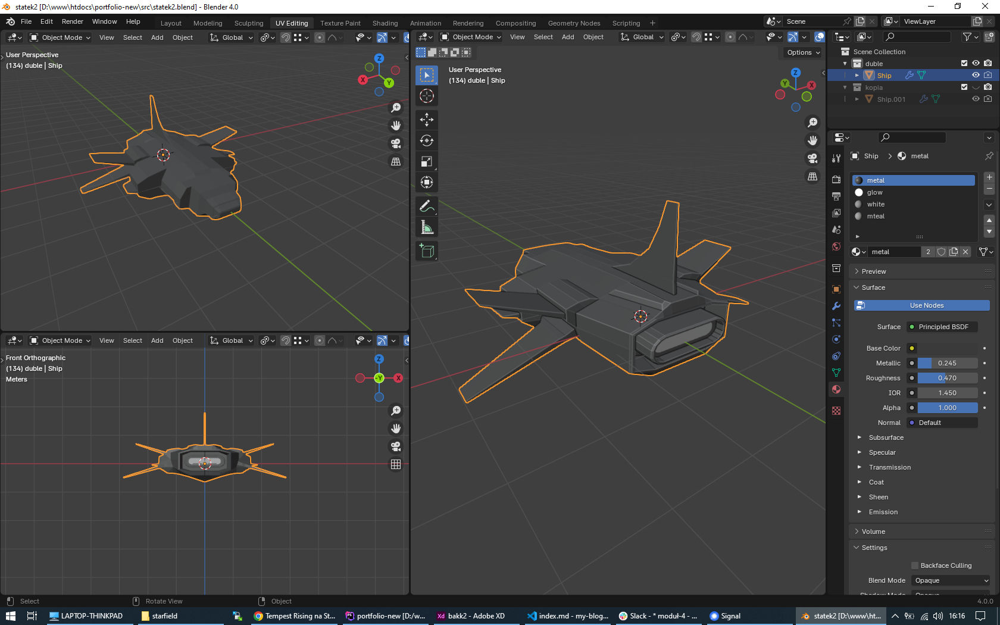
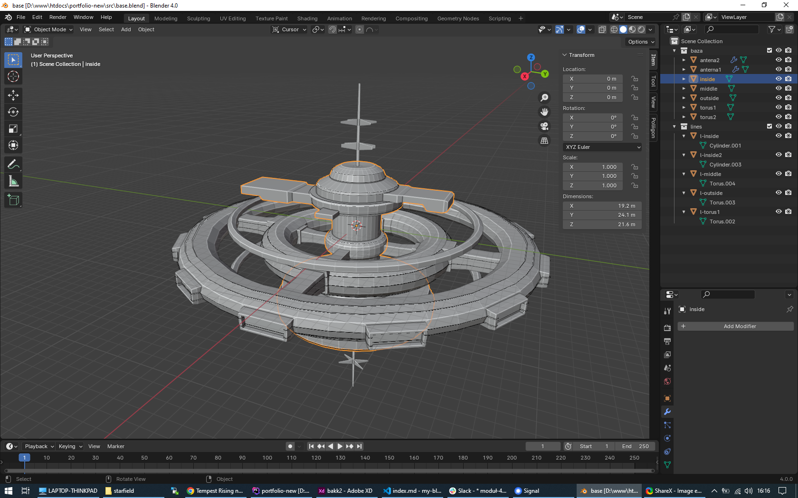

Jakiś czas temu moja siostra poprosiła mnie bym nieco zboostował jej layout pewnej strony.
Wraz z grafikiem przygotowaliśmy jej kilka wariacji.

  
  

Na jednej z wersji kumpel wrzucił w baner jakąś kulę.

Pomyślałem sobie, że może dobrym pomysłem było by, gdyby taki baner wprowadzić w ruch? Wygenerowanie takiej animacji w Blender3D nie powinno być wielkim wyzwaniem. A jeżeli to nie wyjdzie, to nauczę się ThreeJS.

Wpierw przygotowałem w programie graficznym odpowiednią animację. Efekt meh, ale miał to być tylko prosty koncept pokazujący idee takiej animacji:

<video controls mute>
  <source src="/blog/jak-narysowac-sowe/test0001.mp4">
</video>

W międzyczasie w ramach eksperymentu przygotowałem też wersję w ThreeJS. Znowu było to bardzo prosty koncept <a href="/blog/jak-narysowac-sowe/demo/index.html" target="_blank">takiej animacji</a>. Docelowo można by pójść w kierunku animacji znanej z głównej strony gita. Coś w ten deseń: https://codepen.io/prisoner849/full/BaQzqqx

Cały temat niestety zamarł.

Pomyślałem sobie, że w sumie pomysł na tyle mi się podoba, że poświęcę mu jeszcze trochę czasu.

<a href="https://portfolio.domanart.pl" target="_blank" class="demo">Efekt końcowy</a>

## Układanie klocków
Chciałbym napisać, że powyższy efekt końcowy jest przykładem "Creative Coding", ale to było by trochę zakłamanie rzeczywistości.

To tylko poskładanie kilku klocków znalezionych w necie.

Planszę początkową zrobiłem za pomocą własnego skryptu https://github.com/kartofelek007/hyperspace. Dla lepszego efektu połączyłem ją z animacjami gsap.

Planeta główna i księżyc to w zasadzie to samo co w początkowym koncepcie. Różnica tutaj taka, że dla planet dodałem normal mapę. Eksperymentowałem tutaj także z teksturami, ale efekt nie było przekonujący.

Latające na około planety śmieci i meteoryty zostały utworzone na bazie  przepisów: https://discourse.threejs.org/t/create-circle-with-fuzzy-edge-made-of-individual-random-particles/30150/6

https://discourse.threejs.org/t/create-circle-with-fuzzy-edge-made-of-individual-random-particles/30150/5

https://hofk.de/main/discourse.threejs/2022/Points(color,animation,rotationOrder)/Points(color,animation,rotationOrder).html

Latające w tle statki to proste poruszające się na osi X obiekty plus dla zwiększenia immersji efekt particle zapożyczony stąd: https://codepen.io/prisoner849/pen/WNKXwwE?editors=0010

Przelatujące zza kamery statki wymodelowałem w Blender3D.

Ciągnące się za nimi świetlne ogony zrobiłem na bazie klasy, którą stworzyłem korzystając z tego skryptu: https://codepen.io/itzkinnu/pen/erwKzY?editors=0010

Baza kosmiczna też została wymodelowana w Blender3D.

Niestety w momencie pisania tego tekstu shadery są dla mnie magią, dlatego oświetlenie bazy wykonałem za pomocą... świateł. Modelując obiekt w Blenderze, niektóre linie (edge) modelu zduplikowałem. Po zaimportowaniu całości do ThreeJS wykorzystałem te linie, a w zasadzie ich vertexy jako punkty, gdzie umieściłem obiekty świateł. Nie jest to optymalne podejście, ale działa.

## Jak narysować sowę?

No więc jak narysować sowę? Prosta sprawa. Na początku rysujemy kółeczka.

...a potem całą resztę.

