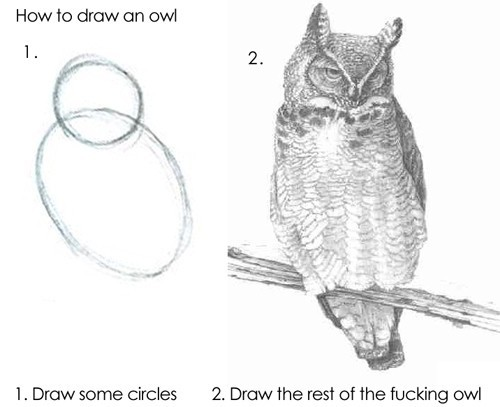

Jakiś czas temu moja siostra poprosiła mnie bym nieco zboostował jej layout pewnej strony.
Krótka prosta robotka, bez zbytniego zaangażowania. Wraz z grafikiem przygotowaliśmy jej kilka wariacji.

  
  

Na jednej z wersji kolega grafik wrzucił w baner jakąś kulę.

Pomyślałem sobie, że może dobrym pomysłem było by, gdyby taki baner wprowadzić w ruch? Wygenerowanie takiej animacji w Blender3D nie powinno być wielkim wyzwaniem. A jeżeli to nie wyjdzie, to najwyżej nauczę się ThreeJS.

Zacząłem od przygotowania w Blender3D odpowiedniej animację. Efekt taki sobie, ale miał to być tylko prosty koncept pokazujący idee takiej animacji:

<video controls mute>
  <source src="/blog/jak-narysowac-sowe/test0001.mp4">
</video>

W międzyczasie w ramach eksperymentu przygotowałem też wersję w ThreeJS. Znowu był to <a href="/blog/jak-narysowac-sowe/demo/index.html" target="_blank">bardzo prosty przykład</a>.

Cały temat niestety umarł śmiercią naturalną.

Pomyślałem więc, że go przejmę do własnych eksperymentów, a przy okazji podszkolę się w ThreeJS.
Naście commitów dalej udało mi się uzyskać coś takiego:

<a href="https://portfolio.domanart.pl" target="_blank" class="demo">Efekt końcowy</a>

## Jak narysować sowę?

No więc jak narysować sowę? Prosta sprawa. Na początku rysujemy koła.

...a potem całą resztę.

