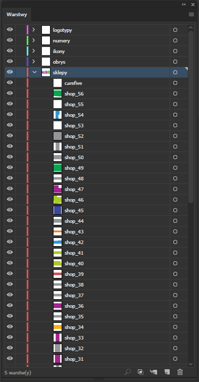
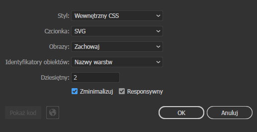

Ten tekst będzie małą aktualizacją do <a href="http://domanart.pl/klikalna-mapa-w-svg/">wcześniejszego artykułu odnośnie budowania mapy w svg</a>.
No dobrze. Chcemy zrobić interaktywną mapę. Tym razem nie będzie to mapa naszego kraju, a mapa centrum handlowego.

<!--more-->

Do przygotowania mapy centrum skorzystałem z Adobe Ilustratora. Tak naprawdę można skorzystać z dowolnego programu do tworzenia wektorów (np.
<a href="https://affinity.serif.com/en-gb/">Affinity Designer</a>, <a href="https://www.sketchapp.com/">Sketch</a>, <a href="https://www.coreldraw.com/pl/">CorelDraw</a> czy np. <a href="https://inkscape.org/pl/">InkScape</a>). Osobiście uważam, że ciężko znaleźć alternatywę dla Illustratora. Sketch nadaję się do innych zastosowań, Affinity Designer zapowiada się całkiem fajnie, ale może za kilka lat, bo teraz wieje biedą, a InkScape - mimo, że generuje całkiem fajny kod, jego UI woła o pomstę do nieba. Może to kwestia przyzwyczajenia. Ale żeby pięknie nie było - Ilustrator jest drogi a i też ma sporo błędów. Z ciekawości też spróbowałem CorelDraw, ale nie otworzył poprawnie svg więc dałem sobie spokój (choć wiem, że to potężne narzędzie).

Nie ważne jaki program użyjesz, elementy interaktywne trzeba jakoś potem wyłapać. Dlatego tworząc takie SVG albo daj interaktywnym elementom nazwy które są tworzone pod jakąś wspólny wzór (np. shop_...) albo zgrupuj je wszystkie pod jedną warstwą. Na poniższym screenie ja wszystkim kształtom (sklepom) dałem podobną nazwę, ale ważniejsze jest, że wszystkie kształty sklepów są zgrupowane w warstwie "sklepy". Numery, dodatkowe ikonki, napisy itp wydzieliłem do innych warstw. I tak z nich nie będę korzystał.

Wygenerowaną grafikę wyeksportowałem do SVG za pomocą opcji File->Export.

Plik AI i wstępny svg możesz pobrac <a href="http://domanart.pl/dema/mapa-svg2/mapa-sklepow.zip">tutaj</a>.

Otrzymałem kod jak poniżej:

<pre><code class="language-html">
&lt;svg xmlns="http://www.w3.org/2000/svg" viewBox="0 0 762 386">&lt;defs>&lt;style>.cls-1{fill:#3196d3;}.cls-2{fill:#ed4697;}.cls-3{fill:#a3258d;}.cls-4{fill:#a9c923;}.cls-5{fill:#949598;}.cls-6{fill:#fbaf1b;}.cls-7{fill:#f47a20;}.cls-8{fill:#59595c;}.cls-9{fill:#cc5050;}.cls-10{fill:#3c4994;}.cls-11{fill:#0aa650;}.cls-12{fill:#68bd46;}.cls-13{fill:none;stroke:#707275;stroke-miterlimit:10;}.cls-14,.cls-15{fill:#707275;}.cls-15{font-size:24px;font-family:MyriadPro-Black, Myriad Pro;}.cls-16{font-size:8px;}.cls-16,.cls-17,.cls-18,.cls-19,.cls-21,.cls-22{fill:#fff;}.cls-16,.cls-17,.cls-18,.cls-19,.cls-21{font-family:Arial-BoldMT, Arial;font-weight:700;}.cls-17{font-size:7px;}.cls-18{font-size:9px;}.cls-19{font-size:6px;}.cls-20{letter-spacing:-0.06em;}.cls-21{font-size:13px;}&lt;/style>&lt;/defs>&lt;title>centrum handlowe&lt;/title>&lt;g id="sklepy">&lt;path id="shop_1" class="cls-1" d="M89,82v6h3v23h27V89s-2-2-2-7Z"/>&lt;path id="shop_2" class="cls-2" d="M25,132s0,41,2,72h76V182h15V119H33v13Z"/>&lt;polygon id="shop_3" class="cls-3" points="27 206 34 283 114 310 114 232 103 232 103 206 27 206"/>&lt;polygon id="shop_4" class="cls-4" points="123 232 123 285 126 285 126 288 147 288 147 294 152 294 152 232 123 232"/>&lt;path id="shop_5" class="cls-3" d="M154,221v75H141v26s47,22,86,15V221Z"/>&lt;path id="shop_6" class="cls-5" d="M229,221V337s3,0,13-4,15-5,26-7,16-2,27-5a118.69,118.69,0,0,0,22-9V232H303V221Z"/>&lt;rect id="shop_7" class="cls-1" x="140" y="83" width="39" height="44"/>&lt;rect id="shop_8" class="cls-1" x="140" y="129" width="39" height="13"/>&lt;polygon id="shop_9" class="cls-5" points="179 144 179 161 161 161 161 194 154 194 154 181.5 140 181.5 140 144 179 144"/>&lt;rect id="shop_10" class="cls-6" x="163" y="163" width="16" height="31"/>&lt;rect id="shop_11" class="cls-3" x="181" y="144" width="22" height="50"/>&lt;rect id="shop_12" class="cls-3" x="205" y="144" width="10" height="50"/>&lt;rect id="shop_13" class="cls-5" x="217" y="144" width="17" height="50"/>&lt;rect id="shop_14" class="cls-5" x="240" y="144" width="12" height="50"/>&lt;rect id="shop_15" class="cls-1" x="254" y="144" width="22" height="50"/>&lt;rect id="shop_16" class="cls-5" x="278" y="157" width="12" height="37"/>&lt;polygon id="shop_17" class="cls-3" points="318 157 303 157 292 157 292 194 303 194 303 181 318 181 318 157"/>&lt;rect id="shop_18" class="cls-5" x="278" y="144" width="40" height="11"/>&lt;rect id="shop_19" class="cls-7" x="278" y="131" width="40" height="11"/>&lt;rect id="shop_20" class="cls-7" x="278" y="118" width="40" height="11"/>&lt;path id="shop_21" class="cls-1" d="M318,111H278V82h26.5c0,14.5,13.5,13,13.5,13Z"/>&lt;polygon id="shop_22" class="cls-1" points="467.14 104.33 477 104.33 477 86 409 86 409 142 467.14 142 467.14 104.33"/>&lt;rect id="shop_23" class="cls-8" x="389" y="86" width="18" height="10"/>&lt;rect id="shop_24" class="cls-8" x="389" y="98" width="18" height="10"/>&lt;rect id="shop_25" class="cls-8" x="389" y="110" width="18" height="32"/>&lt;path id="shop_26" class="cls-5" d="M361.5,82H343c0,8-4,8-4,8v9h20v10h21V82Z"/>&lt;rect id="shop_27" class="cls-1" x="339" y="101" width="18" height="18"/>&lt;rect id="shop_28" class="cls-5" x="339" y="121" width="41" height="34"/>&lt;polygon id="shop_29" class="cls-3" points="357 157 353 157 339 157 339 181 353 181 353 194 366 194 366 157 357 157"/>&lt;rect id="shop_30" class="cls-5" x="368" y="157" width="12" height="37"/>&lt;rect id="shop_31" class="cls-3" x="387" y="146" width="31" height="48"/>&lt;rect id="shop_32" class="cls-5" x="420" y="146" width="33" height="48"/>&lt;rect id="shop_33" class="cls-3" x="455" y="146" width="22" height="48"/>&lt;rect id="shop_34" class="cls-6" x="479" y="183" width="23" height="11"/>&lt;rect id="shop_35" class="cls-5" x="479" y="170" width="39" height="11"/>&lt;rect id="shop_36" class="cls-3" x="479" y="146" width="39" height="22"/>&lt;rect id="shop_37" class="cls-5" x="479" y="133" width="39" height="11"/>&lt;rect id="shop_38" class="cls-5" x="479" y="120" width="39" height="11"/>&lt;rect id="shop_39" class="cls-9" x="479" y="106" width="39" height="12"/>&lt;path id="shop_40" class="cls-4" d="M518,104H479V83h33.17C512,94.87,518,93.5,518,93.5Z"/>&lt;path id="shop_41" class="cls-4" d="M580,83V97H539V90s2-1,2-7Z"/>&lt;polygon id="shop_42" class="cls-1" points="582 95 582 99 539 99 539 125 617 125 617 120 617 99 617 95 582 95"/>&lt;rect id="shop_43" class="cls-7" x="539" y="127" width="78" height="17"/>&lt;rect id="shop_44" class="cls-5" x="539" y="146" width="78" height="35"/>&lt;rect id="shop_45" class="cls-10" x="538" y="234" width="39" height="46"/>&lt;path id="shop_46" class="cls-4" d="M538,302v24s3-2,3,16c10,0,36-6,36-6V310H555v-8Z"/>&lt;polygon id="shop_47" class="cls-3" points="502 233.64 502 221 478 221 478 256 498 256 502 256 517 256 517 233.64 502 233.64"/>&lt;rect id="shop_48" class="cls-5" x="478" y="258" width="39" height="11"/>&lt;rect id="shop_49" class="cls-11" x="489" y="271" width="28" height="23"/>&lt;polygon id="shop_50" class="cls-5" points="487.43 296 479.27 296 465 296 465 323 479.27 323 487.43 323 517 323 517 296 487.43 296"/>&lt;rect id="shop_51" class="cls-5" x="454" y="221" width="22" height="48"/>&lt;rect id="shop_52" class="cls-5" x="465" y="271" width="22" height="23"/>&lt;path id="shop_53" class="cls-3" d="M393,221v26h-7v62h-7v13s47-23,84-6V271H452V221Z"/>&lt;polygon id="shop_54" class="cls-1" points="391 221 384 221 378 221 367 221 367 271 384 271 384 245 391 245 391 221"/>&lt;polygon id="shop_55" class="cls-3" points="365 273 365 221 353 221 353 232 337 232 337 295 378 295 378 288 384 288 384 273 365 273"/>&lt;polygon id="shop_56" class="cls-11" points="337 303 337 322 365 324 365 303 337 303"/>&lt;path id="carefive" class="cls-12" d="M591,63V93h28v90H579V295h6v24h13v-5h12s22,1,28,12c-1,7-2,17-2,17l55,10h40l8-39-25-8V63Z"/>&lt;/g>&lt;g id="obrys">&lt;path class="cls-13" d="M724,50H582V76h-9V67H543V54H518V68H471V79H387V67H271V79H188V65H66v43H18v13H10s1,98,11,169c11,4,20,11,66.5,28.5s108,39,149,30c38-8.35,62.92-15.27,105-4,56,15,67-28,145.5-.5,63.57,22.27,79.5.5,120.5,6.5s15.3,1.6,79.5,12.5a235.29,235.29,0,0,0,51.5,2.5L749,308l-25-10Z"/>&lt;/g>&lt;g id="ikony">&lt;circle class="cls-13" cx="329" cy="206" r="12.5"/>&lt;circle class="cls-13" cx="528" cy="206" r="12.5"/>&lt;circle class="cls-13" cx="130" cy="206" r="12.5"/>&lt;path id="pomoc" class="cls-14" d="M257.25,117.25h-12A3.26,3.26,0,0,0,242,120.5v12a3.26,3.26,0,0,0,3.25,3.25h12a3.26,3.26,0,0,0,3.25-3.25v-12A3.26,3.26,0,0,0,257.25,117.25Zm-.11,11.21h-3.92v3.92h-3.92v-3.92h-3.92v-3.92h3.92v-3.92h3.92v3.92h3.92Z"/>&lt;text class="cls-15" transform="translate(221.28 65)">P&lt;/text>&lt;text class="cls-15" transform="translate(426.28 65)">P&lt;/text>&lt;path id="strzalka" class="cls-14" d="M337.59,47.55a1.84,1.84,0,0,0-2.59,0l-3.83,3.83V43.94H327.5v7.15L324,47.55a1.83,1.83,0,0,0-2.59,2.59l6.73,6.73a2.05,2.05,0,0,0,2.75,0l6.73-6.73A1.84,1.84,0,0,0,337.59,47.55Z"/>&lt;path class="cls-14" d="M304.76,36.69l-1.71-7.42h2.13l.43,2.75c.13.86.26,1.84.37,2.61h0c.12-.84.27-1.73.44-2.64l.47-2.72h2.12l.46,2.85c.13.86.23,1.62.33,2.45h0c.11-.84.24-1.71.37-2.59l.44-2.72h2l-1.83,7.42H308.7l-.49-2.9c-.11-.65-.21-1.34-.31-2.22h0c-.12.87-.22,1.57-.35,2.22l-.56,2.9Z"/>&lt;path class="cls-14" d="M318.19,33.7h-2.66v1.36h3v1.63h-5V29.27h4.82V30.9h-2.83v1.19h2.66Z"/>&lt;path class="cls-14" d="M321.29,29.27h2v4.58c0,2.16-1,3-2.82,3a4.65,4.65,0,0,1-1.31-.18l.21-1.6a3.36,3.36,0,0,0,.87.12c.64,0,1.06-.29,1.06-1.31Z"/>&lt;path class="cls-14" d="M324.72,34.71a4.46,4.46,0,0,0,1.93.46c.68,0,1-.23,1-.61s-.33-.56-1.17-.85c-1.25-.45-2.09-1.13-2.09-2.23,0-1.31,1.11-2.32,3-2.32a5,5,0,0,1,2,.37l-.42,1.6a3.86,3.86,0,0,0-1.61-.35c-.6,0-.94.22-.94.55s.4.52,1.33.87c1.33.5,1.93,1.2,1.93,2.23,0,1.28-1,2.37-3.16,2.37a5.26,5.26,0,0,1-2.18-.45Zm4.41-7.22-1.32,1.39h-1.58l.89-1.39Z"/>&lt;path class="cls-14" d="M336.31,36.49a4.73,4.73,0,0,1-1.86.31c-2.77,0-4-1.73-4-3.7a3.82,3.82,0,0,1,4.13-3.94,4.68,4.68,0,0,1,1.85.32L336,31.05a3.58,3.58,0,0,0-1.37-.26A2,2,0,0,0,332.54,33a2,2,0,0,0,2.17,2.18,4.11,4.11,0,0,0,1.32-.21Z"/>&lt;path class="cls-14" d="M339.38,29.27v7.42h-2V29.27Z"/>&lt;path class="cls-14" d="M345.39,33.7h-2.66v1.36h3v1.63h-5V29.27h4.82V30.9h-2.83v1.19h2.66Z"/>&lt;path class="cls-14" d="M348.76,36.69v-1.2l1-.87c1.45-1.25,2.19-2,2.2-2.73,0-.52-.34-.89-1.07-.89a2.7,2.7,0,0,0-1.53.58l-.54-1.42a4.28,4.28,0,0,1,2.46-.75c1.66,0,2.65.9,2.65,2.31a3.79,3.79,0,0,1-1.66,2.76l-.7.55v0h2.49v1.63Z"/>&lt;path id="strzalka-2" data-name="strzalka" class="cls-14" d="M538.11,35.55a1.84,1.84,0,0,0-2.59,0l-3.83,3.83V31.94H528v7.15l-3.54-3.54a1.83,1.83,0,0,0-2.59,2.59l6.73,6.73a2.05,2.05,0,0,0,2.75,0l6.73-6.73A1.84,1.84,0,0,0,538.11,35.55Z"/>&lt;path class="cls-14" d="M505.28,24.69l-1.71-7.42h2.13l.43,2.75c.13.86.26,1.84.37,2.61h0c.12-.84.27-1.73.44-2.64l.47-2.72h2.12l.46,2.85c.13.86.23,1.62.33,2.45h0c.11-.84.24-1.71.37-2.59l.44-2.72h2l-1.83,7.42h-2.17l-.49-2.9c-.11-.65-.21-1.34-.31-2.22h0c-.12.87-.22,1.57-.35,2.22l-.56,2.9Z"/>&lt;path class="cls-14" d="M518.71,21.7H516v1.36h3v1.63h-5V17.27h4.82V18.9H516v1.19h2.66Z"/>&lt;path class="cls-14" d="M521.81,17.27h2v4.58c0,2.16-1,3-2.82,3a4.65,4.65,0,0,1-1.31-.18l.21-1.6a3.36,3.36,0,0,0,.87.12c.64,0,1.06-.29,1.06-1.31Z"/>&lt;path class="cls-14" d="M525.24,22.71a4.46,4.46,0,0,0,1.93.46c.68,0,1-.23,1-.61s-.33-.56-1.17-.85c-1.25-.45-2.09-1.13-2.09-2.23,0-1.31,1.11-2.32,3-2.32a5,5,0,0,1,2,.37l-.42,1.6a3.86,3.86,0,0,0-1.61-.35c-.6,0-.94.22-.94.55s.4.52,1.33.87c1.33.5,1.93,1.2,1.93,2.23,0,1.28-1,2.37-3.16,2.37a5.26,5.26,0,0,1-2.18-.45Zm4.41-7.22-1.32,1.39h-1.58l.89-1.39Z"/>&lt;path class="cls-14" d="M536.82,24.49a4.73,4.73,0,0,1-1.86.31c-2.77,0-4-1.73-4-3.7a3.82,3.82,0,0,1,4.13-3.94,4.68,4.68,0,0,1,1.85.32l-.39,1.57a3.58,3.58,0,0,0-1.37-.26A2,2,0,0,0,533.06,21a2,2,0,0,0,2.17,2.18,4.11,4.11,0,0,0,1.32-.21Z"/>&lt;path class="cls-14" d="M539.89,17.27v7.42h-2V17.27Z"/>&lt;path class="cls-14" d="M545.91,21.7h-2.66v1.36h3v1.63h-5V17.27h4.82V18.9h-2.83v1.19h2.66Z"/>&lt;path class="cls-14" d="M549.59,22.82a4.25,4.25,0,0,0,1.71.43c.7,0,1.17-.25,1.17-.76s-.6-.86-1.25-.86h-.75V20.22h.7c.5,0,1.12-.15,1.12-.65s-.34-.6-1-.6a3.61,3.61,0,0,0-1.53.41L549.43,18a5,5,0,0,1,2.35-.54c1.58,0,2.52.79,2.52,1.81A1.7,1.7,0,0,1,553,20.88v0a1.73,1.73,0,0,1,1.53,1.69c0,1.32-1.21,2.21-3.06,2.21a4.56,4.56,0,0,1-2.24-.51Z"/>&lt;path class="cls-14" d="M104.28,37.69l-1.71-7.42h2.13l.43,2.75c.13.86.26,1.84.37,2.61h0c.12-.84.27-1.73.44-2.64l.47-2.72h2.12l.46,2.85c.13.86.23,1.62.33,2.45h0c.11-.84.24-1.71.37-2.59l.44-2.72h2l-1.83,7.42h-2.17l-.49-2.9c-.11-.65-.21-1.34-.31-2.22h0c-.12.87-.22,1.57-.35,2.22l-.56,2.9Z"/>&lt;path class="cls-14" d="M117.71,34.7H115v1.36h3v1.63h-5V30.27h4.82V31.9H115v1.19h2.66Z"/>&lt;path class="cls-14" d="M120.81,30.27h2v4.58c0,2.16-1,3-2.82,3a4.65,4.65,0,0,1-1.31-.18l.21-1.6a3.37,3.37,0,0,0,.87.12c.64,0,1.06-.29,1.06-1.31Z"/>&lt;path class="cls-14" d="M124.24,35.71a4.46,4.46,0,0,0,1.93.46c.68,0,1-.23,1-.61s-.33-.56-1.17-.85c-1.25-.45-2.09-1.13-2.09-2.23,0-1.31,1.11-2.32,3-2.32a5,5,0,0,1,2,.37l-.42,1.6a3.86,3.86,0,0,0-1.61-.35c-.6,0-.94.22-.94.55s.4.52,1.33.87c1.33.5,1.93,1.2,1.93,2.23,0,1.28-1,2.37-3.16,2.37a5.26,5.26,0,0,1-2.18-.45Zm4.41-7.22-1.32,1.39h-1.58l.89-1.39Z"/>&lt;path class="cls-14" d="M135.82,37.49a4.73,4.73,0,0,1-1.86.31c-2.77,0-4-1.73-4-3.7a3.82,3.82,0,0,1,4.13-3.94,4.68,4.68,0,0,1,1.85.32l-.39,1.57a3.58,3.58,0,0,0-1.37-.26A2,2,0,0,0,132.06,34a2,2,0,0,0,2.17,2.18,4.11,4.11,0,0,0,1.32-.21Z"/>&lt;path class="cls-14" d="M138.89,30.27v7.42h-2V30.27Z"/>&lt;path class="cls-14" d="M144.91,34.7h-2.66v1.36h3v1.63h-5V30.27h4.82V31.9h-2.83v1.19h2.66Z"/>&lt;path class="cls-14" d="M150.42,32.29h0l-1.41.64-.32-1.49,2-.9h1.62v7.15h-1.91Z"/>&lt;path id="strzalka-3" data-name="strzalka" class="cls-14" d="M137.11,48.55a1.84,1.84,0,0,0-2.59,0l-3.83,3.83V44.94H127v7.15l-3.54-3.54a1.83,1.83,0,0,0-2.59,2.59l6.73,6.73a2.05,2.05,0,0,0,2.75,0l6.73-6.73A1.84,1.84,0,0,0,137.11,48.55Z"/>&lt;path id="lazienka" class="cls-14" d="M187.23,101V92h-.28v3.47a.38.38,0,0,1-.21.37.45.45,0,0,1-.44,0,.38.38,0,0,1-.23-.37V91.67a1,1,0,0,1,.41-.87,1.83,1.83,0,0,1,1.06-.28h2.31a1.62,1.62,0,0,1,1.06.31,1.06,1.06,0,0,1,.38.87v3.52a.49.49,0,0,1-.23.45.37.37,0,0,1-.44,0,.5.5,0,0,1-.21-.45V92h-.28V101a.58.58,0,1,1-1.15,0V95.7h-.59V101a.58.58,0,1,1-1.15,0Zm11.52-4.31L197.06,92a.08.08,0,0,1,0-.06.13.13,0,0,1,.14-.14c.06,0,.09,0,.11.11l1.15,3a.61.61,0,0,0,.62.31q.17,0,.24-.25a1.58,1.58,0,0,0,.07-.34l-1.18-2.9a1.31,1.31,0,0,0-.51-.9,1.61,1.61,0,0,0-1-.37h-1.49a1.62,1.62,0,0,0-1.06.38,1.45,1.45,0,0,0-.55.89l-1.1,2.93c0,.06,0,.16,0,.32s.14.24.25.24c.36,0,.56-.09.62-.28l1.13-3a.11.11,0,0,1,.11-.08.1.1,0,0,1,.11.11v0L193,96.71v.37s0,.1.14.2.16.14.2.14h1.07v3.64a.52.52,0,0,0,.18.39.59.59,0,0,0,.41.17.58.58,0,0,0,.56-.56V97.27s.05,0,.15,0a1.46,1.46,0,0,1,.3,0c.09,0,.14,0,.14,0V101a.59.59,0,0,0,.17.41.55.55,0,0,0,.82,0,.59.59,0,0,0,.17-.41V97.42h1.1q.08,0,.2-.14a.43.43,0,0,0,.11-.2v-.37Zm-11.3-7.9a1.2,1.2,0,0,0,2,.85,1.17,1.17,0,0,0,.35-.86,1.14,1.14,0,0,0-.35-.83,1.2,1.2,0,0,0-2,.84Zm7.21,0A1.2,1.2,0,1,0,195,88,1.16,1.16,0,0,0,194.66,88.81Z"/>&lt;path id="lazienka-2" data-name="lazienka" class="cls-14" d="M539.55,297.41v-9.07h-.28v3.47a.38.38,0,0,1-.21.37.45.45,0,0,1-.44,0,.38.38,0,0,1-.23-.37v-3.75a1,1,0,0,1,.41-.87,1.83,1.83,0,0,1,1.06-.28h2.31a1.62,1.62,0,0,1,1.06.31,1.06,1.06,0,0,1,.38.87v3.52a.49.49,0,0,1-.23.45.37.37,0,0,1-.44,0,.5.5,0,0,1-.21-.45v-3.27h-.28v9.07a.58.58,0,1,1-1.15,0v-5.33h-.59v5.33a.58.58,0,1,1-1.15,0Zm11.52-4.31-1.69-4.68a.08.08,0,0,1,0-.06.13.13,0,0,1,.14-.14c.06,0,.09,0,.11.11l1.15,3a.61.61,0,0,0,.62.31q.17,0,.24-.25a1.58,1.58,0,0,0,.07-.34l-1.18-2.9a1.31,1.31,0,0,0-.51-.9,1.61,1.61,0,0,0-1-.37h-1.49a1.62,1.62,0,0,0-1.06.38,1.45,1.45,0,0,0-.55.89l-1.1,2.93c0,.06,0,.16,0,.32s.14.24.25.24c.36,0,.56-.09.62-.28l1.13-3a.11.11,0,0,1,.11-.08.1.1,0,0,1,.11.11v0l-1.66,4.7v.37s0,.1.14.2.16.14.2.14h1.07v3.64a.52.52,0,0,0,.18.39.59.59,0,0,0,.41.17.58.58,0,0,0,.56-.56v-3.78s.05,0,.15,0a1.46,1.46,0,0,1,.3,0c.09,0,.14,0,.14,0v3.75a.59.59,0,0,0,.17.41.55.55,0,0,0,.82,0,.59.59,0,0,0,.17-.41V293.8h1.1q.08,0,.2-.14a.43.43,0,0,0,.11-.2v-.37Zm-11.3-7.9a1.2,1.2,0,0,0,2,.85,1.17,1.17,0,0,0,.35-.86,1.14,1.14,0,0,0-.35-.83,1.2,1.2,0,0,0-2,.84Zm7.21,0a1.2,1.2,0,1,0,.35-.85A1.16,1.16,0,0,0,547,285.2Z"/>&lt;/g>&lt;g id="numery">&lt;text class="cls-16" transform="translate(420.55 279.49)">5&lt;/text>&lt;text class="cls-16" transform="translate(374.55 235.49)">54&lt;/text>&lt;text class="cls-16" transform="translate(349.55 270.49)">5&lt;/text>&lt;text class="cls-16" transform="translate(348.55 315.49)">5&lt;/text>&lt;text class="cls-16" transform="translate(493.55 244.49)">4&lt;/text>&lt;text class="cls-17" transform="translate(486.61 190.63)">34&lt;/text>&lt;text class="cls-17" transform="translate(494.61 177.47)">35&lt;/text>&lt;text class="cls-17" transform="translate(494.61 159.47)">36&lt;/text>&lt;text class="cls-16" transform="translate(461.55 172.49)">33&lt;/text>&lt;text class="cls-16" transform="translate(398.05 172.49)">31&lt;/text>&lt;text class="cls-16" transform="translate(348.05 173.49)">29&lt;/text>&lt;text class="cls-17" transform="translate(494.61 114.47)">39&lt;/text>&lt;text class="cls-17" transform="translate(494.61 96.47)">40&lt;/text>&lt;text class="cls-16" transform="translate(555.05 92.49)">41&lt;/text>&lt;text class="cls-18" transform="translate(572.99 114.51)">42&lt;/text>&lt;text class="cls-18" transform="translate(572.99 139.51)">43&lt;/text>&lt;text class="cls-16" transform="translate(554.55 326.49)">4&lt;/text>&lt;text class="cls-16" transform="translate(553.05 260.49)">45&lt;/text>&lt;text class="cls-16" transform="translate(355.05 140.49)">28&lt;/text>&lt;text class="cls-16" transform="translate(365.05 97.49)">26&lt;/text>&lt;text class="cls-16" transform="translate(460.55 247.49)">51&lt;/text>&lt;text class="cls-16" transform="translate(473.55 284.49)">5&lt;/text>&lt;text class="cls-16" transform="translate(486.55 312.49)">50&lt;/text>&lt;text class="cls-16" transform="translate(498.55 284.49)">49&lt;/text>&lt;text class="cls-16" transform="translate(493.55 265.49)">4&lt;/text>&lt;text class="cls-18" transform="translate(572.99 166.51)">44&lt;/text>&lt;text class="cls-17" transform="translate(494.61 127.47)">38&lt;/text>&lt;text class="cls-17" transform="translate(494.61 140.47)">37&lt;/text>&lt;text class="cls-16" transform="translate(432.05 172.49)">32&lt;/text>&lt;text class="cls-17" transform="translate(370.11 178.47)">30&lt;/text>&lt;text class="cls-17" transform="translate(344.11 112.47)">27&lt;/text>&lt;text class="cls-19" transform="translate(394.66 127.61)">25&lt;/text>&lt;text class="cls-19" transform="translate(394.66 104.61)">24&lt;/text>&lt;text class="cls-19" transform="translate(394.66 92.61)">23&lt;/text>&lt;text class="cls-16" transform="translate(433.55 116.49)">22&lt;/text>&lt;text class="cls-17" transform="translate(294.11 100.47)">21&lt;/text>&lt;text class="cls-17" transform="translate(294.11 151.47)">18&lt;/text>&lt;text class="cls-17" transform="translate(280.11 177.47)">16&lt;/text>&lt;text class="cls-17" transform="translate(242.11 172.63)">14&lt;/text>&lt;text class="cls-17" transform="translate(294.11 125.47)">20&lt;/text>&lt;text class="cls-17" transform="translate(294.11 138.47)">19&lt;/text>&lt;text class="cls-16" transform="translate(300.55 174.49)">17&lt;/text>&lt;text class="cls-17" transform="translate(261.11 172.63)">15&lt;/text>&lt;text class="cls-17" transform="translate(221.61 172.63)">13&lt;/text>&lt;text class="cls-17" transform="translate(206.11 172.63)">12&lt;/text>&lt;text class="cls-17" transform="translate(188.3 172.63)">&lt;tspan class="cls-20">1&lt;/tspan>&lt;tspan x="3.51" y="0">1&lt;/tspan>&lt;/text>&lt;text class="cls-17" transform="translate(167.11 180.63)">10&lt;/text>&lt;text class="cls-16" transform="translate(157.28 138.49)">8&lt;/text>&lt;text class="cls-16" transform="translate(157.28 108.49)">7&lt;/text>&lt;text class="cls-21" transform="translate(186.88 273.59)">5&lt;/text>&lt;text>&lt;/text>&lt;text class="cls-21" transform="translate(64.82 260.59)">3&lt;/text>&lt;text class="cls-21" transform="translate(64.82 165.59)">2&lt;/text>&lt;text class="cls-16" transform="translate(102.59 99.49)">1&lt;/text>&lt;text class="cls-21" transform="translate(268.88 273.59)">6&lt;/text>&lt;text class="cls-16" transform="translate(151.07 159.49)">9&lt;/text>&lt;/g>&lt;g id="logotypy">&lt;path id="sfora" class="cls-22" d="M148.4,274a3.63,3.63,0,0,0,.32-1.5c0-.85-.35-1.35-.85-1.35s-.73.34-1,1.22c-.29,1.05-.71,1.71-1.41,1.71s-1.35-.83-1.35-2.09a3.67,3.67,0,0,1,.24-1.43l.52.23a3.19,3.19,0,0,0-.24,1.23c0,.88.41,1.22.75,1.22s.69-.39,1-1.28c.33-1.09.73-1.65,1.46-1.65s1.43.74,1.43,2.26a4.14,4.14,0,0,1-.32,1.65Zm-4.19-4.84V265.7h.54v2.65h1.65v-2.44h.53v2.44h2.25v.83ZM146.64,259c1.71,0,2.62,1.35,2.62,3a2.61,2.61,0,0,1-2.53,2.9,2.7,2.7,0,0,1-2.61-3C144.12,260.14,145.16,259,146.64,259Zm.08,5a2.07,2.07,0,1,0-2.08-2.07A2,2,0,0,0,146.72,264Zm-2.45-6.1a11.2,11.2,0,0,1-.1-1.6,3.21,3.21,0,0,1,.41-1.87,1.12,1.12,0,0,1,.95-.51c.66,0,1.09.54,1.27,1.22h0a1.33,1.33,0,0,1,1-.95,6.63,6.63,0,0,0,1.37-.5v.86A5.36,5.36,0,0,1,148,255a1.16,1.16,0,0,0-1,1.29v.79h2.16v.83Zm2.27-.83v-.85c0-.89-.38-1.46-.95-1.46s-.92.6-.93,1.49a4.46,4.46,0,0,0,.06.82Zm1.08-5.42,1.57.67v.86l-5-2.19v-1l5-2.2v.89l-1.57.69Zm-.5-2.12-1.43.63c-.33.14-.62.24-.91.33v0c.3.1.6.2.9.33l1.44.63Z"/>&lt;path id="care5" class="cls-22" d="M621.89,214.26a3.23,3.23,0,0,1,2.35,1v-.14q0-.79.85-.79a.85.85,0,0,1,.89.89c0,.12,0,.3,0,.54q-.06.58-.06.83a4.34,4.34,0,0,0,0,.54,4.4,4.4,0,0,1,0,.54.88.88,0,0,1-.32.71,1.25,1.25,0,0,1-.83.27q-1.08,0-1.05-.89v-.44a.9.9,0,0,0-.38-.77,1.58,1.58,0,0,0-1-.3q-1.88,0-1.88,3a4.32,4.32,0,0,0,.46,2.27,1.61,1.61,0,0,0,1.46.71,1.68,1.68,0,0,0,1-.29.86.86,0,0,0,.38-.76v-.51a.87.87,0,0,1,.28-.71,1.09,1.09,0,0,1,.76-.27,1.18,1.18,0,0,1,.93.4,1.58,1.58,0,0,1,.34,1.07,2.69,2.69,0,0,1-1.07,2.2,4.26,4.26,0,0,1-2.75.85,4.18,4.18,0,0,1-3.26-1.31,5.14,5.14,0,0,1-1.19-3.59,5.8,5.8,0,0,1,1.07-3.7A3.53,3.53,0,0,1,621.89,214.26Zm11.32,9.92a1.52,1.52,0,0,1-1.55-.93,3.31,3.31,0,0,1-2.35.93,2.6,2.6,0,0,1-1.78-.59,2,2,0,0,1-.66-1.56,1.83,1.83,0,0,1,1.29-1.92,8.94,8.94,0,0,1,1.27-.31,4.35,4.35,0,0,0,1.36-.39.73.73,0,0,0,.36-.67.67.67,0,0,0-.27-.54,1.07,1.07,0,0,0-.69-.22c-.31,0-.47.1-.47.3v.25a.82.82,0,0,1-.33.66,1.26,1.26,0,0,1-.82.27,1.31,1.31,0,0,1-.93-.34,1.11,1.11,0,0,1-.37-.85,1.33,1.33,0,0,1,.81-1.2,4.68,4.68,0,0,1,2.22-.44,4.39,4.39,0,0,1,2.28.47,2.06,2.06,0,0,1,.81,1.89v2.92c0,.3.07.45.23.45h.31a.76.76,0,0,1,.55.22.74.74,0,0,1,.23.54.88.88,0,0,1-.42.75A1.82,1.82,0,0,1,633.21,224.18Zm-2.06-3v-.31a12.84,12.84,0,0,1-1.23.36q-.77.2-.77.61,0,.66.76.66Q631.15,222.47,631.15,221.16Zm6.87-3.89v1.2a3.05,3.05,0,0,1,.47-1.06,2.1,2.1,0,0,1,1.74-.78,1.83,1.83,0,0,1,1.31.5,1.64,1.64,0,0,1,.53,1.24,1.37,1.37,0,0,1-.34,1,1.11,1.11,0,0,1-.86.37,1,1,0,0,1-.67-.25.81.81,0,0,1-.27-.62,1.31,1.31,0,0,1,.18-.55H640a1.26,1.26,0,0,0-1.27,1,6.14,6.14,0,0,0-.25,1.85v.54a1.53,1.53,0,0,0,.08.65.22.22,0,0,0,.2.08,1.26,1.26,0,0,0,.35-.07,1.28,1.28,0,0,1,.34-.07.72.72,0,0,1,.53.22.74.74,0,0,1,.22.54,1,1,0,0,1-.27.7.91.91,0,0,1-.67.28q-.21,0-.79-.07a7.61,7.61,0,0,0-.89,0,9.21,9.21,0,0,0-.95,0l-.83.07q-.88,0-.88-.95,0-.79.68-.79a.78.78,0,0,1,.25,0,.69.69,0,0,0,.21,0q.24,0,.24-.79v-2.29q0-.81-.24-.81l-.22,0a.94.94,0,0,1-.25,0q-.68,0-.68-.78a1,1,0,0,1,.23-.69.73.73,0,0,1,.58-.27,2,2,0,0,1,.4.06,2.19,2.19,0,0,0,.48.06,3.12,3.12,0,0,0,.49-.06,3.18,3.18,0,0,1,.48-.06A.39.39,0,0,1,638,217.27Zm7.46,0v1.2a3.05,3.05,0,0,1,.47-1.06,2.1,2.1,0,0,1,1.74-.78,1.83,1.83,0,0,1,1.31.5,1.64,1.64,0,0,1,.53,1.24,1.37,1.37,0,0,1-.34,1,1.11,1.11,0,0,1-.86.37,1,1,0,0,1-.67-.25.81.81,0,0,1-.27-.62,1.31,1.31,0,0,1,.18-.55h-.08a1.26,1.26,0,0,0-1.27,1,6.14,6.14,0,0,0-.25,1.85v.54a1.53,1.53,0,0,0,.08.65.22.22,0,0,0,.2.08,1.26,1.26,0,0,0,.35-.07,1.28,1.28,0,0,1,.34-.07.72.72,0,0,1,.53.22.74.74,0,0,1,.22.54,1,1,0,0,1-.27.7.91.91,0,0,1-.67.28q-.21,0-.79-.07a7.61,7.61,0,0,0-.89,0,9.21,9.21,0,0,0-.95,0l-.83.07q-.88,0-.88-.95,0-.79.68-.79a.78.78,0,0,1,.25,0,.69.69,0,0,0,.21,0q.24,0,.24-.79v-2.29q0-.81-.24-.81l-.22,0a.94.94,0,0,1-.25,0q-.68,0-.68-.78a1,1,0,0,1,.23-.69.73.73,0,0,1,.58-.27,2,2,0,0,1,.4.06,2.19,2.19,0,0,0,.48.06,3.12,3.12,0,0,0,.49-.06,3.18,3.18,0,0,1,.48-.06A.39.39,0,0,1,645.48,217.27Zm11.19,2.53a1.44,1.44,0,0,1-.15.79.7.7,0,0,1-.59.2h-3.45a.62.62,0,0,0-.32,0s-.06.12-.06.25a1.37,1.37,0,0,0,.38,1,1.28,1.28,0,0,0,1,.4,1.74,1.74,0,0,0,1.22-.65,1.26,1.26,0,0,1,.93-.45,1,1,0,0,1,.69.24.79.79,0,0,1,.26.61,1.65,1.65,0,0,1-.9,1.39,4,4,0,0,1-2.18.57,3.6,3.6,0,0,1-2.68-1,3.7,3.7,0,0,1-1-2.71,3.86,3.86,0,0,1,1-2.76,3.43,3.43,0,0,1,2.61-1.05,3.32,3.32,0,0,1,2.4.86A3,3,0,0,1,656.67,219.8Zm-4.49-.71a.23.23,0,0,0,0,.14s.13.06.3.06h1.58a.43.43,0,0,0,.26,0,.25.25,0,0,0,0-.18.82.82,0,0,0-.32-.64,1.14,1.14,0,0,0-.76-.28,1.12,1.12,0,0,0-.92.44A.85.85,0,0,0,652.17,219.09Zm11.73-2.46a1.12,1.12,0,0,1-.74-.24.77.77,0,0,1-.29-.62,1.68,1.68,0,0,0-.76-.18q-1.22,0-1.22.9v.17a.3.3,0,0,0,.29.32,15.66,15.66,0,0,0,1.69,0q.58,0,1.51-.06l.42,0H665c.19,0,.28.15.28.45v4.25q0,.72.28.72a.85.85,0,0,0,.27-.06.48.48,0,0,1,.23,0q.55,0,.55.75,0,1-.79,1c-.12,0-.4,0-.82-.07a7.77,7.77,0,0,0-.86,0,5.4,5.4,0,0,0-.65.06,5.39,5.39,0,0,1-.62.06q-.65,0-.65-.95c0-.46.15-.69.46-.69h.19c.13,0,.2-.12.21-.37v-3.15q0-.38-.21-.46a1.5,1.5,0,0,0-.43,0h-1c-.21,0-.35,0-.4.12a1.25,1.25,0,0,0-.08.57v2.56q0,.69.14.75a.31.31,0,0,0,.14,0h.23c.28,0,.42.25.42.73a1.16,1.16,0,0,1-.17.65.52.52,0,0,1-.45.25l-.69-.08a6.15,6.15,0,0,0-.69,0,8.18,8.18,0,0,0-1,0q-.57.07-.73.07a.71.71,0,0,1-.57-.26,1,1,0,0,1-.22-.69q0-.79.65-.79l.37.08h.11q.27,0,.27-.79V218.7a.53.53,0,0,0-.06-.29c0-.05-.12-.08-.25-.08H658q-.65,0-.65-.68t.68-.76h.35a.49.49,0,0,0,.34-.08.65.65,0,0,0,.08-.36q.09-2.18,3.29-2.18a4.87,4.87,0,0,1,2.16.39,1.19,1.19,0,0,1,.77,1.08.78.78,0,0,1-.31.64A1.23,1.23,0,0,1,663.9,216.64Zm6.39,2.6,1,3.11,1-3.11.11-.31a1,1,0,0,0,0-.23c0-.13-.12-.22-.37-.27s-.54-.34-.54-.79.25-.81.76-.81a7.5,7.5,0,0,1,.76.06,7.28,7.28,0,0,0,.76.06,5.24,5.24,0,0,0,.78-.06,4.33,4.33,0,0,1,.55-.06q.83,0,.83.89t-.72.85h-.14a.48.48,0,0,0-.18,0q-.24,0-.4.44l-.28.73-1.22,3.17q-.44,1.16-1.26,1.1l-.66,0-.66,0h-.06q-.66,0-1-.84l-1.47-4a3,3,0,0,0-.24-.51.25.25,0,0,0-.21-.09h-.38a.58.58,0,0,1-.47-.22.88.88,0,0,1-.18-.57q0-.94.86-.94a5.57,5.57,0,0,1,.64.06,5.37,5.37,0,0,0,.64.06q.3,0,1-.07l.65,0q.76,0,.76.81t-.56.79q-.35,0-.35.28A3.4,3.4,0,0,0,670.29,219.24Zm12.88.57a1.44,1.44,0,0,1-.15.79.7.7,0,0,1-.59.2H679a.62.62,0,0,0-.32,0s-.06.12-.06.25a1.37,1.37,0,0,0,.38,1,1.28,1.28,0,0,0,1,.4,1.74,1.74,0,0,0,1.22-.65,1.26,1.26,0,0,1,.93-.45,1,1,0,0,1,.69.24.79.79,0,0,1,.26.61,1.65,1.65,0,0,1-.9,1.39,4,4,0,0,1-2.18.57,3.6,3.6,0,0,1-2.68-1,3.7,3.7,0,0,1-1-2.71,3.86,3.86,0,0,1,1-2.76,3.43,3.43,0,0,1,2.61-1.05,3.32,3.32,0,0,1,2.4.86A3,3,0,0,1,683.17,219.8Zm-4.49-.71a.23.23,0,0,0,0,.14s.13.06.3.06h1.58a.43.43,0,0,0,.26,0,.25.25,0,0,0,0-.18.82.82,0,0,0-.32-.64,1.14,1.14,0,0,0-.76-.28,1.12,1.12,0,0,0-.92.44A.85.85,0,0,0,678.67,219.09Zm-30.75-35.25,4.54-.1-3.79-3.79-3.85,3.85C645.82,183.85,646.85,183.86,647.92,183.84Zm15.91,11.27-7.23-7.23,0,.52v.23a2.27,2.27,0,0,1-.68,1.69,2.39,2.39,0,0,1-1.74.66,2.15,2.15,0,0,1-2.19-1.73,1.05,1.05,0,0,0-.45-.7,2.43,2.43,0,0,0-.95-.13H647a1,1,0,0,0-.71.17,1.6,1.6,0,0,0-.22.8l-.27,2.49a15.83,15.83,0,0,1,4-.66,7.86,7.86,0,0,1,5.58,2,6.8,6.8,0,0,1,2.19,5.2,7.35,7.35,0,0,1-1.14,4.06Zm-24.25,5.75a3.47,3.47,0,0,1,1-2.54,3.3,3.3,0,0,1,2.46-1,3.08,3.08,0,0,1,2.14.76A2.48,2.48,0,0,1,646,200a2.7,2.7,0,0,1-.57,1.56,4.77,4.77,0,0,0,2.56.7,4.19,4.19,0,0,0,2.79-.92,2.9,2.9,0,0,0,1.1-2.32,2.93,2.93,0,0,0-1.2-2.39,4.6,4.6,0,0,0-3-1,8.26,8.26,0,0,0-2.13.31,11.51,11.51,0,0,1-2.19.45,2.91,2.91,0,0,1-2.13-.85,2.84,2.84,0,0,1-.86-2.12,3.52,3.52,0,0,1,0-.37v-.4l.55-5.12-7.49,7.49,6.1,6.1C639.6,201.09,639.58,201,639.58,200.85Zm8.31,5.75a11.73,11.73,0,0,1-3.34-.46l4.12,4.12L654,204.9A10.77,10.77,0,0,1,647.89,206.6Z"/>&lt;path id="kubota" class="cls-22" d="M407.88,268.87l-2.52-3.23-.87.66v2.56H403v-7h1.47V265l3.17-3.19h1.72l-3,3,3.25,4.06Zm5.44.1a3.17,3.17,0,0,1-2.22-.71,2.61,2.61,0,0,1-.77-2v-4.39h1.47v4.28a1.81,1.81,0,0,0,.4,1.26,1.5,1.5,0,0,0,1.17.43,1.58,1.58,0,0,0,1.21-.45,1.82,1.82,0,0,0,.42-1.29v-4.23h1.47v4.32a2.63,2.63,0,0,1-.83,2.07A3.37,3.37,0,0,1,413.32,269Zm10.68-2.1a1.73,1.73,0,0,1-.72,1.48,3.34,3.34,0,0,1-2,.52h-3.52v-7H421a3.49,3.49,0,0,1,1.95.45,1.49,1.49,0,0,1,.66,1.32,1.56,1.56,0,0,1-.33,1,1.7,1.7,0,0,1-1,.56,2.16,2.16,0,0,1,1.3.54A1.54,1.54,0,0,1,424,266.86Zm-1.89-3.06a.75.75,0,0,0-.3-.67,1.64,1.64,0,0,0-.9-.2h-1.68v1.74h1.69a1.5,1.5,0,0,0,.91-.22A.77.77,0,0,0,422.12,263.8Zm.41,2.94q0-1-1.42-1h-1.87v2h1.92a1.67,1.67,0,0,0,1-.26A.92.92,0,0,0,422.53,266.75Zm9.46-1.43a4.12,4.12,0,0,1-.43,1.93,3,3,0,0,1-1.24,1.27,3.88,3.88,0,0,1-1.89.44,3.44,3.44,0,0,1-2.6-1,3.69,3.69,0,0,1-.94-2.67,3.59,3.59,0,0,1,.94-2.64,4.05,4.05,0,0,1,5.22,0A3.59,3.59,0,0,1,432,265.32Zm-1.5,0a2.7,2.7,0,0,0-.54-1.78,1.86,1.86,0,0,0-1.51-.65,1.88,1.88,0,0,0-1.53.64,2.7,2.7,0,0,0-.54,1.79,2.77,2.77,0,0,0,.55,1.82,2.07,2.07,0,0,0,3,0A2.82,2.82,0,0,0,430.48,265.32Zm5.79-2.34v5.89H434.8V263h-2.27v-1.14h6V263Zm7.28,5.89-.62-1.8h-2.68l-.62,1.8h-1.47l2.56-7h1.74l2.55,7Zm-2-5.95,0,.11-.12.41q-.07.23-.86,2.52h2l-.69-2-.21-.68Z"/>&lt;path id="rezerwat" class="cls-22" d="M48.48,233.33,47.16,231h-1v2.3H44.54v-6.67h3.25a2.69,2.69,0,0,1,1.78.53,2,2,0,0,1,.63,1.58,2.17,2.17,0,0,1-.36,1.2,1.74,1.74,0,0,1-1,.75l1.7,2.61Zm0-4.48a1,1,0,0,0-.22-.7.82.82,0,0,0-.64-.24H46.16v1.93h1.36Q48.45,229.84,48.45,228.85Zm3.18-2.19H56.2v1.25H53.25v1.45h2.56v1.26H53.25v1.46H56.2v1.25H51.63Zm11,1.16-3.2,4.25h3.2v1.26H57.39v-1.18l3.28-4.22H57.44v-1.27h5.19Zm1.27-1.16h4.57v1.25H65.52v1.45h2.56v1.26H65.52v1.46h2.95v1.25H63.9Zm9.87,6.67L72.45,231h-1v2.3H69.83v-6.67h3.25a2.69,2.69,0,0,1,1.78.53,2,2,0,0,1,.63,1.58,2.17,2.17,0,0,1-.36,1.2,1.74,1.74,0,0,1-1,.75l1.7,2.61Zm0-4.48a1,1,0,0,0-.22-.7.82.82,0,0,0-.64-.24H71.45v1.93h1.36Q73.74,229.84,73.74,228.85ZM86,226.66l-1.87,6.67h-1.6L81.21,229l-1.33,4.33h-1.6l-1.87-6.67h1.77l1,4.66,1.35-4.66h1.25l1.36,4.67,1.05-4.67Zm4.17,5.23H87.69l-.48,1.44H85.68l2.52-6.67H90l2.36,6.67H90.67Zm-.4-1.19-.85-2.52-.84,2.52Z"/>&lt;/g>&lt;/svg>
</code></pre>

Moglibyśmy też przy eksporcie odznaczyć opcję minimalizacji kodu. Kto co woli.
Ja wybrałem wersję zminimalizowaną, bo łatwiej mi się z nią pracuje.

Następnie wprowadziłem do kodu poprawki.
Po pierwsze dodałem dla svg id <strong>map</strong>.
Po drugie w powyższym kodzie zamieniłem wszystkim sklepom id na data-id dodając dodatkowo każdemu data-name.
By to zrobić w edytorze wyszukując ciąg znaków (CTRL + R lub CTRL + H) włączyłem <a href="http://kursjs.pl/kurs/regular.php">wyrażenia regularne</a>:

phpStorm:

Vistual Studio Code:

Sublime Text:

Następnie wyszukałem <code>&lt;(g|path|rect|polygon|circle|text|defs|title|style|\/g|\/style|\/defs)</code> i zamieniłem na <code>\n<$1$2</code>

Co oznacza znajdź mi ciąg zaczynający się od znaku &lt;. Po nim może być jakiś ciąg (np. /) a potem któreś ze słów. Zamieniam to na znak nowej linii, po którym wstawiam to co znalazło się w 1 i 2 nawiasie ($1 i $2).

Powinno to trochę lepiej sformatować nasz kod.

<pre><code class="language-html">
&lt;svg xmlns="http://www.w3.org/2000/svg" viewBox="0 0 762 386">
&lt;defs>
&lt;style>.cls-1{fill:#3196d3;}.cls-2{fill:#ed4697;}.cls-3{fill:#a3258d;}.cls-4{fill:#a9c923;}.cls-5{fill:#949598;}.cls-6{fill:#fbaf1b;}.cls-7{fill:#f47a20;}.cls-8{fill:#59595c;}.cls-9{fill:#cc5050;}.cls-10{fill:#3c4994;}.cls-11{fill:#0aa650;}.cls-12{fill:#68bd46;}.cls-13{fill:none;stroke:#707275;stroke-miterlimit:10;}.cls-14,.cls-15{fill:#707275;}.cls-15{font-size:24px;font-family:MyriadPro-Black, Myriad Pro;}.cls-16{font-size:8px;}.cls-16,.cls-17,.cls-18,.cls-19,.cls-21,.cls-22{fill:#fff;}.cls-16,.cls-17,.cls-18,.cls-19,.cls-21{font-family:Arial-BoldMT, Arial;font-weight:700;}.cls-17{font-size:7px;}.cls-18{font-size:9px;}.cls-19{font-size:6px;}.cls-20{letter-spacing:-0.06em;}.cls-21{font-size:13px;}
&lt;/style>
&lt;/defs>
&lt;title>centrum handlowe&lt;/title>
&lt;g id="sklepy">
&lt;path id="shop_1" class="cls-1" d="M89,82v6h3v23h27V89s-2-2-2-7Z"/>
&lt;path id="shop_2" class="cls-2" d="M25,132s0,41,2,72h76V182h15V119H33v13Z"/>
&lt;polygon id="shop_3" class="cls-3" points="27 206 34 283 114 310 114 232 103 232 103 206 27 206"/>
&lt;polygon id="shop_4" class="cls-4" points="123 232 123 285 126 285 126 288 147 288 147 294 152 294 152 232 123 232"/>
&lt;path id="shop_5" class="cls-3" d="M154,221v75H141v26s47,22,86,15V221Z"/>
&lt;path id="shop_6" class="cls-5" d="M229,221V337s3,0,13-4,15-5,26-7,16-2,27-5a118.69,118.69,0,0,0,22-9V232H303V221Z"/>
&lt;rect id="shop_7" class="cls-1" x="140" y="83" width="39" height="44"/>
&lt;rect id="shop_8" class="cls-1" x="140" y="129" width="39" height="13"/>
&lt;polygon id="shop_9" class="cls-5" points="179 144 179 161 161 161 161 194 154 194 154 181.5 140 181.5 140 144 179 144"/>
&lt;rect id="shop_10" class="cls-6" x="163" y="163" width="16" height="31"/>
&lt;rect id="shop_11" class="cls-3" x="181" y="144" width="22" height="50"/>
&lt;rect id="shop_12" class="cls-3" x="205" y="144" width="10" height="50"/>
&lt;rect id="shop_13" class="cls-5" x="217" y="144" width="17" height="50"/>
&lt;rect id="shop_14" class="cls-5" x="240" y="144" width="12" height="50"/>
&lt;rect id="shop_15" class="cls-1" x="254" y="144" width="22" height="50"/>
&lt;rect id="shop_16" class="cls-5" x="278" y="157" width="12" height="37"/>
&lt;polygon id="shop_17" class="cls-3" points="318 157 303 157 292 157 292 194 303 194 303 181 318 181 318 157"/>
&lt;rect id="shop_18" class="cls-5" x="278" y="144" width="40" height="11"/>
&lt;rect id="shop_19" class="cls-7" x="278" y="131" width="40" height="11"/>
&lt;rect id="shop_20" class="cls-7" x="278" y="118" width="40" height="11"/>
&lt;path id="shop_21" class="cls-1" d="M318,111H278V82h26.5c0,14.5,13.5,13,13.5,13Z"/>
&lt;polygon id="shop_22" class="cls-1" points="467.14 104.33 477 104.33 477 86 409 86 409 142 467.14 142 467.14 104.33"/>
&lt;rect id="shop_23" class="cls-8" x="389" y="86" width="18" height="10"/>
&lt;rect id="shop_24" class="cls-8" x="389" y="98" width="18" height="10"/>
&lt;rect id="shop_25" class="cls-8" x="389" y="110" width="18" height="32"/>
&lt;path id="shop_26" class="cls-5" d="M361.5,82H343c0,8-4,8-4,8v9h20v10h21V82Z"/>
&lt;rect id="shop_27" class="cls-1" x="339" y="101" width="18" height="18"/>
&lt;rect id="shop_28" class="cls-5" x="339" y="121" width="41" height="34"/>
&lt;polygon id="shop_29" class="cls-3" points="357 157 353 157 339 157 339 181 353 181 353 194 366 194 366 157 357 157"/>
&lt;rect id="shop_30" class="cls-5" x="368" y="157" width="12" height="37"/>
&lt;rect id="shop_31" class="cls-3" x="387" y="146" width="31" height="48"/>
&lt;rect id="shop_32" class="cls-5" x="420" y="146" width="33" height="48"/>
&lt;rect id="shop_33" class="cls-3" x="455" y="146" width="22" height="48"/>
&lt;rect id="shop_34" class="cls-6" x="479" y="183" width="23" height="11"/>
&lt;rect id="shop_35" class="cls-5" x="479" y="170" width="39" height="11"/>
&lt;rect id="shop_36" class="cls-3" x="479" y="146" width="39" height="22"/>
&lt;rect id="shop_37" class="cls-5" x="479" y="133" width="39" height="11"/>
&lt;rect id="shop_38" class="cls-5" x="479" y="120" width="39" height="11"/>
&lt;rect id="shop_39" class="cls-9" x="479" y="106" width="39" height="12"/>
&lt;path id="shop_40" class="cls-4" d="M518,104H479V83h33.17C512,94.87,518,93.5,518,93.5Z"/>
&lt;path id="shop_41" class="cls-4" d="M580,83V97H539V90s2-1,2-7Z"/>
&lt;polygon id="shop_42" class="cls-1" points="582 95 582 99 539 99 539 125 617 125 617 120 617 99 617 95 582 95"/>
&lt;rect id="shop_43" class="cls-7" x="539" y="127" width="78" height="17"/>
&lt;rect id="shop_44" class="cls-5" x="539" y="146" width="78" height="35"/>
&lt;rect id="shop_45" class="cls-10" x="538" y="234" width="39" height="46"/>
&lt;path id="shop_46" class="cls-4" d="M538,302v24s3-2,3,16c10,0,36-6,36-6V310H555v-8Z"/>
&lt;polygon id="shop_47" class="cls-3" points="502 233.64 502 221 478 221 478 256 498 256 502 256 517 256 517 233.64 502 233.64"/>
&lt;rect id="shop_48" class="cls-5" x="478" y="258" width="39" height="11"/>
&lt;rect id="shop_49" class="cls-11" x="489" y="271" width="28" height="23"/>
&lt;polygon id="shop_50" class="cls-5" points="487.43 296 479.27 296 465 296 465 323 479.27 323 487.43 323 517 323 517 296 487.43 296"/>
&lt;rect id="shop_51" class="cls-5" x="454" y="221" width="22" height="48"/>
&lt;rect id="shop_52" class="cls-5" x="465" y="271" width="22" height="23"/>
&lt;path id="shop_53" class="cls-3" d="M393,221v26h-7v62h-7v13s47-23,84-6V271H452V221Z"/>
&lt;polygon id="shop_54" class="cls-1" points="391 221 384 221 378 221 367 221 367 271 384 271 384 245 391 245 391 221"/>
&lt;polygon id="shop_55" class="cls-3" points="365 273 365 221 353 221 353 232 337 232 337 295 378 295 378 288 384 288 384 273 365 273"/>
&lt;polygon id="shop_56" class="cls-11" points="337 303 337 322 365 324 365 303 337 303"/>
&lt;path id="carefive" class="cls-12" d="M591,63V93h28v90H579V295h6v24h13v-5h12s22,1,28,12c-1,7-2,17-2,17l55,10h40l8-39-25-8V63Z"/>
&lt;/g>
&lt;g id="obrys">
&lt;path class="cls-13" d="M724,50H582V76h-9V67H543V54H518V68H471V79H387V67H271V79H188V65H66v43H18v13H10s1,98,11,169c11,4,20,11,66.5,28.5s108,39,149,30c38-8.35,62.92-15.27,105-4,56,15,67-28,145.5-.5,63.57,22.27,79.5.5,120.5,6.5s15.3,1.6,79.5,12.5a235.29,235.29,0,0,0,51.5,2.5L749,308l-25-10Z"/>
&lt;/g>
&lt;g id="ikony">
&lt;circle class="cls-13" cx="329" cy="206" r="12.5"/>
&lt;circle class="cls-13" cx="528" cy="206" r="12.5"/>
&lt;circle class="cls-13" cx="130" cy="206" r="12.5"/>
&lt;path id="pomoc" class="cls-14" d="M257.25,117.25h-12A3.26,3.26,0,0,0,242,120.5v12a3.26,3.26,0,0,0,3.25,3.25h12a3.26,3.26,0,0,0,3.25-3.25v-12A3.26,3.26,0,0,0,257.25,117.25Zm-.11,11.21h-3.92v3.92h-3.92v-3.92h-3.92v-3.92h3.92v-3.92h3.92v3.92h3.92Z"/>
&lt;text class="cls-15" transform="translate(221.28 65)">P&lt;/text>
&lt;text class="cls-15" transform="translate(426.28 65)">P&lt;/text>
&lt;path id="strzalka" class="cls-14" d="M337.59,47.55a1.84,1.84,0,0,0-2.59,0l-3.83,3.83V43.94H327.5v7.15L324,47.55a1.83,1.83,0,0,0-2.59,2.59l6.73,6.73a2.05,2.05,0,0,0,2.75,0l6.73-6.73A1.84,1.84,0,0,0,337.59,47.55Z"/>
&lt;path class="cls-14" d="M304.76,36.69l-1.71-7.42h2.13l.43,2.75c.13.86.26,1.84.37,2.61h0c.12-.84.27-1.73.44-2.64l.47-2.72h2.12l.46,2.85c.13.86.23,1.62.33,2.45h0c.11-.84.24-1.71.37-2.59l.44-2.72h2l-1.83,7.42H308.7l-.49-2.9c-.11-.65-.21-1.34-.31-2.22h0c-.12.87-.22,1.57-.35,2.22l-.56,2.9Z"/>
&lt;path class="cls-14" d="M318.19,33.7h-2.66v1.36h3v1.63h-5V29.27h4.82V30.9h-2.83v1.19h2.66Z"/>
&lt;path class="cls-14" d="M321.29,29.27h2v4.58c0,2.16-1,3-2.82,3a4.65,4.65,0,0,1-1.31-.18l.21-1.6a3.36,3.36,0,0,0,.87.12c.64,0,1.06-.29,1.06-1.31Z"/>
&lt;path class="cls-14" d="M324.72,34.71a4.46,4.46,0,0,0,1.93.46c.68,0,1-.23,1-.61s-.33-.56-1.17-.85c-1.25-.45-2.09-1.13-2.09-2.23,0-1.31,1.11-2.32,3-2.32a5,5,0,0,1,2,.37l-.42,1.6a3.86,3.86,0,0,0-1.61-.35c-.6,0-.94.22-.94.55s.4.52,1.33.87c1.33.5,1.93,1.2,1.93,2.23,0,1.28-1,2.37-3.16,2.37a5.26,5.26,0,0,1-2.18-.45Zm4.41-7.22-1.32,1.39h-1.58l.89-1.39Z"/>
&lt;path class="cls-14" d="M336.31,36.49a4.73,4.73,0,0,1-1.86.31c-2.77,0-4-1.73-4-3.7a3.82,3.82,0,0,1,4.13-3.94,4.68,4.68,0,0,1,1.85.32L336,31.05a3.58,3.58,0,0,0-1.37-.26A2,2,0,0,0,332.54,33a2,2,0,0,0,2.17,2.18,4.11,4.11,0,0,0,1.32-.21Z"/>
&lt;path class="cls-14" d="M339.38,29.27v7.42h-2V29.27Z"/>
&lt;path class="cls-14" d="M345.39,33.7h-2.66v1.36h3v1.63h-5V29.27h4.82V30.9h-2.83v1.19h2.66Z"/>
&lt;path class="cls-14" d="M348.76,36.69v-1.2l1-.87c1.45-1.25,2.19-2,2.2-2.73,0-.52-.34-.89-1.07-.89a2.7,2.7,0,0,0-1.53.58l-.54-1.42a4.28,4.28,0,0,1,2.46-.75c1.66,0,2.65.9,2.65,2.31a3.79,3.79,0,0,1-1.66,2.76l-.7.55v0h2.49v1.63Z"/>
&lt;path id="strzalka-2" data-name="strzalka" class="cls-14" d="M538.11,35.55a1.84,1.84,0,0,0-2.59,0l-3.83,3.83V31.94H528v7.15l-3.54-3.54a1.83,1.83,0,0,0-2.59,2.59l6.73,6.73a2.05,2.05,0,0,0,2.75,0l6.73-6.73A1.84,1.84,0,0,0,538.11,35.55Z"/>
&lt;path class="cls-14" d="M505.28,24.69l-1.71-7.42h2.13l.43,2.75c.13.86.26,1.84.37,2.61h0c.12-.84.27-1.73.44-2.64l.47-2.72h2.12l.46,2.85c.13.86.23,1.62.33,2.45h0c.11-.84.24-1.71.37-2.59l.44-2.72h2l-1.83,7.42h-2.17l-.49-2.9c-.11-.65-.21-1.34-.31-2.22h0c-.12.87-.22,1.57-.35,2.22l-.56,2.9Z"/>
&lt;path class="cls-14" d="M518.71,21.7H516v1.36h3v1.63h-5V17.27h4.82V18.9H516v1.19h2.66Z"/>
&lt;path class="cls-14" d="M521.81,17.27h2v4.58c0,2.16-1,3-2.82,3a4.65,4.65,0,0,1-1.31-.18l.21-1.6a3.36,3.36,0,0,0,.87.12c.64,0,1.06-.29,1.06-1.31Z"/>
&lt;path class="cls-14" d="M525.24,22.71a4.46,4.46,0,0,0,1.93.46c.68,0,1-.23,1-.61s-.33-.56-1.17-.85c-1.25-.45-2.09-1.13-2.09-2.23,0-1.31,1.11-2.32,3-2.32a5,5,0,0,1,2,.37l-.42,1.6a3.86,3.86,0,0,0-1.61-.35c-.6,0-.94.22-.94.55s.4.52,1.33.87c1.33.5,1.93,1.2,1.93,2.23,0,1.28-1,2.37-3.16,2.37a5.26,5.26,0,0,1-2.18-.45Zm4.41-7.22-1.32,1.39h-1.58l.89-1.39Z"/>
&lt;path class="cls-14" d="M536.82,24.49a4.73,4.73,0,0,1-1.86.31c-2.77,0-4-1.73-4-3.7a3.82,3.82,0,0,1,4.13-3.94,4.68,4.68,0,0,1,1.85.32l-.39,1.57a3.58,3.58,0,0,0-1.37-.26A2,2,0,0,0,533.06,21a2,2,0,0,0,2.17,2.18,4.11,4.11,0,0,0,1.32-.21Z"/>
&lt;path class="cls-14" d="M539.89,17.27v7.42h-2V17.27Z"/>
&lt;path class="cls-14" d="M545.91,21.7h-2.66v1.36h3v1.63h-5V17.27h4.82V18.9h-2.83v1.19h2.66Z"/>
&lt;path class="cls-14" d="M549.59,22.82a4.25,4.25,0,0,0,1.71.43c.7,0,1.17-.25,1.17-.76s-.6-.86-1.25-.86h-.75V20.22h.7c.5,0,1.12-.15,1.12-.65s-.34-.6-1-.6a3.61,3.61,0,0,0-1.53.41L549.43,18a5,5,0,0,1,2.35-.54c1.58,0,2.52.79,2.52,1.81A1.7,1.7,0,0,1,553,20.88v0a1.73,1.73,0,0,1,1.53,1.69c0,1.32-1.21,2.21-3.06,2.21a4.56,4.56,0,0,1-2.24-.51Z"/>
&lt;path class="cls-14" d="M104.28,37.69l-1.71-7.42h2.13l.43,2.75c.13.86.26,1.84.37,2.61h0c.12-.84.27-1.73.44-2.64l.47-2.72h2.12l.46,2.85c.13.86.23,1.62.33,2.45h0c.11-.84.24-1.71.37-2.59l.44-2.72h2l-1.83,7.42h-2.17l-.49-2.9c-.11-.65-.21-1.34-.31-2.22h0c-.12.87-.22,1.57-.35,2.22l-.56,2.9Z"/>
&lt;path class="cls-14" d="M117.71,34.7H115v1.36h3v1.63h-5V30.27h4.82V31.9H115v1.19h2.66Z"/>
&lt;path class="cls-14" d="M120.81,30.27h2v4.58c0,2.16-1,3-2.82,3a4.65,4.65,0,0,1-1.31-.18l.21-1.6a3.37,3.37,0,0,0,.87.12c.64,0,1.06-.29,1.06-1.31Z"/>
&lt;path class="cls-14" d="M124.24,35.71a4.46,4.46,0,0,0,1.93.46c.68,0,1-.23,1-.61s-.33-.56-1.17-.85c-1.25-.45-2.09-1.13-2.09-2.23,0-1.31,1.11-2.32,3-2.32a5,5,0,0,1,2,.37l-.42,1.6a3.86,3.86,0,0,0-1.61-.35c-.6,0-.94.22-.94.55s.4.52,1.33.87c1.33.5,1.93,1.2,1.93,2.23,0,1.28-1,2.37-3.16,2.37a5.26,5.26,0,0,1-2.18-.45Zm4.41-7.22-1.32,1.39h-1.58l.89-1.39Z"/>
&lt;path class="cls-14" d="M135.82,37.49a4.73,4.73,0,0,1-1.86.31c-2.77,0-4-1.73-4-3.7a3.82,3.82,0,0,1,4.13-3.94,4.68,4.68,0,0,1,1.85.32l-.39,1.57a3.58,3.58,0,0,0-1.37-.26A2,2,0,0,0,132.06,34a2,2,0,0,0,2.17,2.18,4.11,4.11,0,0,0,1.32-.21Z"/>
&lt;path class="cls-14" d="M138.89,30.27v7.42h-2V30.27Z"/>
&lt;path class="cls-14" d="M144.91,34.7h-2.66v1.36h3v1.63h-5V30.27h4.82V31.9h-2.83v1.19h2.66Z"/>
&lt;path class="cls-14" d="M150.42,32.29h0l-1.41.64-.32-1.49,2-.9h1.62v7.15h-1.91Z"/>
&lt;path id="strzalka-3" data-name="strzalka" class="cls-14" d="M137.11,48.55a1.84,1.84,0,0,0-2.59,0l-3.83,3.83V44.94H127v7.15l-3.54-3.54a1.83,1.83,0,0,0-2.59,2.59l6.73,6.73a2.05,2.05,0,0,0,2.75,0l6.73-6.73A1.84,1.84,0,0,0,137.11,48.55Z"/>
&lt;path id="lazienka" class="cls-14" d="M187.23,101V92h-.28v3.47a.38.38,0,0,1-.21.37.45.45,0,0,1-.44,0,.38.38,0,0,1-.23-.37V91.67a1,1,0,0,1,.41-.87,1.83,1.83,0,0,1,1.06-.28h2.31a1.62,1.62,0,0,1,1.06.31,1.06,1.06,0,0,1,.38.87v3.52a.49.49,0,0,1-.23.45.37.37,0,0,1-.44,0,.5.5,0,0,1-.21-.45V92h-.28V101a.58.58,0,1,1-1.15,0V95.7h-.59V101a.58.58,0,1,1-1.15,0Zm11.52-4.31L197.06,92a.08.08,0,0,1,0-.06.13.13,0,0,1,.14-.14c.06,0,.09,0,.11.11l1.15,3a.61.61,0,0,0,.62.31q.17,0,.24-.25a1.58,1.58,0,0,0,.07-.34l-1.18-2.9a1.31,1.31,0,0,0-.51-.9,1.61,1.61,0,0,0-1-.37h-1.49a1.62,1.62,0,0,0-1.06.38,1.45,1.45,0,0,0-.55.89l-1.1,2.93c0,.06,0,.16,0,.32s.14.24.25.24c.36,0,.56-.09.62-.28l1.13-3a.11.11,0,0,1,.11-.08.1.1,0,0,1,.11.11v0L193,96.71v.37s0,.1.14.2.16.14.2.14h1.07v3.64a.52.52,0,0,0,.18.39.59.59,0,0,0,.41.17.58.58,0,0,0,.56-.56V97.27s.05,0,.15,0a1.46,1.46,0,0,1,.3,0c.09,0,.14,0,.14,0V101a.59.59,0,0,0,.17.41.55.55,0,0,0,.82,0,.59.59,0,0,0,.17-.41V97.42h1.1q.08,0,.2-.14a.43.43,0,0,0,.11-.2v-.37Zm-11.3-7.9a1.2,1.2,0,0,0,2,.85,1.17,1.17,0,0,0,.35-.86,1.14,1.14,0,0,0-.35-.83,1.2,1.2,0,0,0-2,.84Zm7.21,0A1.2,1.2,0,1,0,195,88,1.16,1.16,0,0,0,194.66,88.81Z"/>
&lt;path id="lazienka-2" data-name="lazienka" class="cls-14" d="M539.55,297.41v-9.07h-.28v3.47a.38.38,0,0,1-.21.37.45.45,0,0,1-.44,0,.38.38,0,0,1-.23-.37v-3.75a1,1,0,0,1,.41-.87,1.83,1.83,0,0,1,1.06-.28h2.31a1.62,1.62,0,0,1,1.06.31,1.06,1.06,0,0,1,.38.87v3.52a.49.49,0,0,1-.23.45.37.37,0,0,1-.44,0,.5.5,0,0,1-.21-.45v-3.27h-.28v9.07a.58.58,0,1,1-1.15,0v-5.33h-.59v5.33a.58.58,0,1,1-1.15,0Zm11.52-4.31-1.69-4.68a.08.08,0,0,1,0-.06.13.13,0,0,1,.14-.14c.06,0,.09,0,.11.11l1.15,3a.61.61,0,0,0,.62.31q.17,0,.24-.25a1.58,1.58,0,0,0,.07-.34l-1.18-2.9a1.31,1.31,0,0,0-.51-.9,1.61,1.61,0,0,0-1-.37h-1.49a1.62,1.62,0,0,0-1.06.38,1.45,1.45,0,0,0-.55.89l-1.1,2.93c0,.06,0,.16,0,.32s.14.24.25.24c.36,0,.56-.09.62-.28l1.13-3a.11.11,0,0,1,.11-.08.1.1,0,0,1,.11.11v0l-1.66,4.7v.37s0,.1.14.2.16.14.2.14h1.07v3.64a.52.52,0,0,0,.18.39.59.59,0,0,0,.41.17.58.58,0,0,0,.56-.56v-3.78s.05,0,.15,0a1.46,1.46,0,0,1,.3,0c.09,0,.14,0,.14,0v3.75a.59.59,0,0,0,.17.41.55.55,0,0,0,.82,0,.59.59,0,0,0,.17-.41V293.8h1.1q.08,0,.2-.14a.43.43,0,0,0,.11-.2v-.37Zm-11.3-7.9a1.2,1.2,0,0,0,2,.85,1.17,1.17,0,0,0,.35-.86,1.14,1.14,0,0,0-.35-.83,1.2,1.2,0,0,0-2,.84Zm7.21,0a1.2,1.2,0,1,0,.35-.85A1.16,1.16,0,0,0,547,285.2Z"/>
&lt;/g>
&lt;g id="numery">
&lt;text class="cls-16" transform="translate(420.55 279.49)">5&lt;/text>
&lt;text class="cls-16" transform="translate(374.55 235.49)">54&lt;/text>
&lt;text class="cls-16" transform="translate(349.55 270.49)">5&lt;/text>
&lt;text class="cls-16" transform="translate(348.55 315.49)">5&lt;/text>
&lt;text class="cls-16" transform="translate(493.55 244.49)">4&lt;/text>
&lt;text class="cls-17" transform="translate(486.61 190.63)">34&lt;/text>
&lt;text class="cls-17" transform="translate(494.61 177.47)">35&lt;/text>
&lt;text class="cls-17" transform="translate(494.61 159.47)">36&lt;/text>
&lt;text class="cls-16" transform="translate(461.55 172.49)">33&lt;/text>
&lt;text class="cls-16" transform="translate(398.05 172.49)">31&lt;/text>
&lt;text class="cls-16" transform="translate(348.05 173.49)">29&lt;/text>
&lt;text class="cls-17" transform="translate(494.61 114.47)">39&lt;/text>
&lt;text class="cls-17" transform="translate(494.61 96.47)">40&lt;/text>
&lt;text class="cls-16" transform="translate(555.05 92.49)">41&lt;/text>
&lt;text class="cls-18" transform="translate(572.99 114.51)">42&lt;/text>
&lt;text class="cls-18" transform="translate(572.99 139.51)">43&lt;/text>
&lt;text class="cls-16" transform="translate(554.55 326.49)">4&lt;/text>
&lt;text class="cls-16" transform="translate(553.05 260.49)">45&lt;/text>
&lt;text class="cls-16" transform="translate(355.05 140.49)">28&lt;/text>
&lt;text class="cls-16" transform="translate(365.05 97.49)">26&lt;/text>
&lt;text class="cls-16" transform="translate(460.55 247.49)">51&lt;/text>
&lt;text class="cls-16" transform="translate(473.55 284.49)">5&lt;/text>
&lt;text class="cls-16" transform="translate(486.55 312.49)">50&lt;/text>
&lt;text class="cls-16" transform="translate(498.55 284.49)">49&lt;/text>
&lt;text class="cls-16" transform="translate(493.55 265.49)">4&lt;/text>
&lt;text class="cls-18" transform="translate(572.99 166.51)">44&lt;/text>
&lt;text class="cls-17" transform="translate(494.61 127.47)">38&lt;/text>
&lt;text class="cls-17" transform="translate(494.61 140.47)">37&lt;/text>
&lt;text class="cls-16" transform="translate(432.05 172.49)">32&lt;/text>
&lt;text class="cls-17" transform="translate(370.11 178.47)">30&lt;/text>
&lt;text class="cls-17" transform="translate(344.11 112.47)">27&lt;/text>
&lt;text class="cls-19" transform="translate(394.66 127.61)">25&lt;/text>
&lt;text class="cls-19" transform="translate(394.66 104.61)">24&lt;/text>
&lt;text class="cls-19" transform="translate(394.66 92.61)">23&lt;/text>
&lt;text class="cls-16" transform="translate(433.55 116.49)">22&lt;/text>
&lt;text class="cls-17" transform="translate(294.11 100.47)">21&lt;/text>
&lt;text class="cls-17" transform="translate(294.11 151.47)">18&lt;/text>
&lt;text class="cls-17" transform="translate(280.11 177.47)">16&lt;/text>
&lt;text class="cls-17" transform="translate(242.11 172.63)">14&lt;/text>
&lt;text class="cls-17" transform="translate(294.11 125.47)">20&lt;/text>
&lt;text class="cls-17" transform="translate(294.11 138.47)">19&lt;/text>
&lt;text class="cls-16" transform="translate(300.55 174.49)">17&lt;/text>
&lt;text class="cls-17" transform="translate(261.11 172.63)">15&lt;/text>
&lt;text class="cls-17" transform="translate(221.61 172.63)">13&lt;/text>
&lt;text class="cls-17" transform="translate(206.11 172.63)">12&lt;/text>
&lt;text class="cls-17" transform="translate(188.3 172.63)">&lt;tspan class="cls-20">1&lt;/tspan>&lt;tspan x="3.51" y="0">1&lt;/tspan>&lt;/text>
&lt;text class="cls-17" transform="translate(167.11 180.63)">10&lt;/text>
&lt;text class="cls-16" transform="translate(157.28 138.49)">8&lt;/text>
&lt;text class="cls-16" transform="translate(157.28 108.49)">7&lt;/text>
&lt;text class="cls-21" transform="translate(186.88 273.59)">5&lt;/text>
&lt;text>&lt;/text>
&lt;text class="cls-21" transform="translate(64.82 260.59)">3&lt;/text>
&lt;text class="cls-21" transform="translate(64.82 165.59)">2&lt;/text>
&lt;text class="cls-16" transform="translate(102.59 99.49)">1&lt;/text>
&lt;text class="cls-21" transform="translate(268.88 273.59)">6&lt;/text>
&lt;text class="cls-16" transform="translate(151.07 159.49)">9&lt;/text>
&lt;/g>
&lt;g id="logotypy">
&lt;path id="sfora" class="cls-22" d="M148.4,274a3.63,3.63,0,0,0,.32-1.5c0-.85-.35-1.35-.85-1.35s-.73.34-1,1.22c-.29,1.05-.71,1.71-1.41,1.71s-1.35-.83-1.35-2.09a3.67,3.67,0,0,1,.24-1.43l.52.23a3.19,3.19,0,0,0-.24,1.23c0,.88.41,1.22.75,1.22s.69-.39,1-1.28c.33-1.09.73-1.65,1.46-1.65s1.43.74,1.43,2.26a4.14,4.14,0,0,1-.32,1.65Zm-4.19-4.84V265.7h.54v2.65h1.65v-2.44h.53v2.44h2.25v.83ZM146.64,259c1.71,0,2.62,1.35,2.62,3a2.61,2.61,0,0,1-2.53,2.9,2.7,2.7,0,0,1-2.61-3C144.12,260.14,145.16,259,146.64,259Zm.08,5a2.07,2.07,0,1,0-2.08-2.07A2,2,0,0,0,146.72,264Zm-2.45-6.1a11.2,11.2,0,0,1-.1-1.6,3.21,3.21,0,0,1,.41-1.87,1.12,1.12,0,0,1,.95-.51c.66,0,1.09.54,1.27,1.22h0a1.33,1.33,0,0,1,1-.95,6.63,6.63,0,0,0,1.37-.5v.86A5.36,5.36,0,0,1,148,255a1.16,1.16,0,0,0-1,1.29v.79h2.16v.83Zm2.27-.83v-.85c0-.89-.38-1.46-.95-1.46s-.92.6-.93,1.49a4.46,4.46,0,0,0,.06.82Zm1.08-5.42,1.57.67v.86l-5-2.19v-1l5-2.2v.89l-1.57.69Zm-.5-2.12-1.43.63c-.33.14-.62.24-.91.33v0c.3.1.6.2.9.33l1.44.63Z"/>
&lt;path id="care5" class="cls-22" d="M621.89,214.26a3.23,3.23,0,0,1,2.35,1v-.14q0-.79.85-.79a.85.85,0,0,1,.89.89c0,.12,0,.3,0,.54q-.06.58-.06.83a4.34,4.34,0,0,0,0,.54,4.4,4.4,0,0,1,0,.54.88.88,0,0,1-.32.71,1.25,1.25,0,0,1-.83.27q-1.08,0-1.05-.89v-.44a.9.9,0,0,0-.38-.77,1.58,1.58,0,0,0-1-.3q-1.88,0-1.88,3a4.32,4.32,0,0,0,.46,2.27,1.61,1.61,0,0,0,1.46.71,1.68,1.68,0,0,0,1-.29.86.86,0,0,0,.38-.76v-.51a.87.87,0,0,1,.28-.71,1.09,1.09,0,0,1,.76-.27,1.18,1.18,0,0,1,.93.4,1.58,1.58,0,0,1,.34,1.07,2.69,2.69,0,0,1-1.07,2.2,4.26,4.26,0,0,1-2.75.85,4.18,4.18,0,0,1-3.26-1.31,5.14,5.14,0,0,1-1.19-3.59,5.8,5.8,0,0,1,1.07-3.7A3.53,3.53,0,0,1,621.89,214.26Zm11.32,9.92a1.52,1.52,0,0,1-1.55-.93,3.31,3.31,0,0,1-2.35.93,2.6,2.6,0,0,1-1.78-.59,2,2,0,0,1-.66-1.56,1.83,1.83,0,0,1,1.29-1.92,8.94,8.94,0,0,1,1.27-.31,4.35,4.35,0,0,0,1.36-.39.73.73,0,0,0,.36-.67.67.67,0,0,0-.27-.54,1.07,1.07,0,0,0-.69-.22c-.31,0-.47.1-.47.3v.25a.82.82,0,0,1-.33.66,1.26,1.26,0,0,1-.82.27,1.31,1.31,0,0,1-.93-.34,1.11,1.11,0,0,1-.37-.85,1.33,1.33,0,0,1,.81-1.2,4.68,4.68,0,0,1,2.22-.44,4.39,4.39,0,0,1,2.28.47,2.06,2.06,0,0,1,.81,1.89v2.92c0,.3.07.45.23.45h.31a.76.76,0,0,1,.55.22.74.74,0,0,1,.23.54.88.88,0,0,1-.42.75A1.82,1.82,0,0,1,633.21,224.18Zm-2.06-3v-.31a12.84,12.84,0,0,1-1.23.36q-.77.2-.77.61,0,.66.76.66Q631.15,222.47,631.15,221.16Zm6.87-3.89v1.2a3.05,3.05,0,0,1,.47-1.06,2.1,2.1,0,0,1,1.74-.78,1.83,1.83,0,0,1,1.31.5,1.64,1.64,0,0,1,.53,1.24,1.37,1.37,0,0,1-.34,1,1.11,1.11,0,0,1-.86.37,1,1,0,0,1-.67-.25.81.81,0,0,1-.27-.62,1.31,1.31,0,0,1,.18-.55H640a1.26,1.26,0,0,0-1.27,1,6.14,6.14,0,0,0-.25,1.85v.54a1.53,1.53,0,0,0,.08.65.22.22,0,0,0,.2.08,1.26,1.26,0,0,0,.35-.07,1.28,1.28,0,0,1,.34-.07.72.72,0,0,1,.53.22.74.74,0,0,1,.22.54,1,1,0,0,1-.27.7.91.91,0,0,1-.67.28q-.21,0-.79-.07a7.61,7.61,0,0,0-.89,0,9.21,9.21,0,0,0-.95,0l-.83.07q-.88,0-.88-.95,0-.79.68-.79a.78.78,0,0,1,.25,0,.69.69,0,0,0,.21,0q.24,0,.24-.79v-2.29q0-.81-.24-.81l-.22,0a.94.94,0,0,1-.25,0q-.68,0-.68-.78a1,1,0,0,1,.23-.69.73.73,0,0,1,.58-.27,2,2,0,0,1,.4.06,2.19,2.19,0,0,0,.48.06,3.12,3.12,0,0,0,.49-.06,3.18,3.18,0,0,1,.48-.06A.39.39,0,0,1,638,217.27Zm7.46,0v1.2a3.05,3.05,0,0,1,.47-1.06,2.1,2.1,0,0,1,1.74-.78,1.83,1.83,0,0,1,1.31.5,1.64,1.64,0,0,1,.53,1.24,1.37,1.37,0,0,1-.34,1,1.11,1.11,0,0,1-.86.37,1,1,0,0,1-.67-.25.81.81,0,0,1-.27-.62,1.31,1.31,0,0,1,.18-.55h-.08a1.26,1.26,0,0,0-1.27,1,6.14,6.14,0,0,0-.25,1.85v.54a1.53,1.53,0,0,0,.08.65.22.22,0,0,0,.2.08,1.26,1.26,0,0,0,.35-.07,1.28,1.28,0,0,1,.34-.07.72.72,0,0,1,.53.22.74.74,0,0,1,.22.54,1,1,0,0,1-.27.7.91.91,0,0,1-.67.28q-.21,0-.79-.07a7.61,7.61,0,0,0-.89,0,9.21,9.21,0,0,0-.95,0l-.83.07q-.88,0-.88-.95,0-.79.68-.79a.78.78,0,0,1,.25,0,.69.69,0,0,0,.21,0q.24,0,.24-.79v-2.29q0-.81-.24-.81l-.22,0a.94.94,0,0,1-.25,0q-.68,0-.68-.78a1,1,0,0,1,.23-.69.73.73,0,0,1,.58-.27,2,2,0,0,1,.4.06,2.19,2.19,0,0,0,.48.06,3.12,3.12,0,0,0,.49-.06,3.18,3.18,0,0,1,.48-.06A.39.39,0,0,1,645.48,217.27Zm11.19,2.53a1.44,1.44,0,0,1-.15.79.7.7,0,0,1-.59.2h-3.45a.62.62,0,0,0-.32,0s-.06.12-.06.25a1.37,1.37,0,0,0,.38,1,1.28,1.28,0,0,0,1,.4,1.74,1.74,0,0,0,1.22-.65,1.26,1.26,0,0,1,.93-.45,1,1,0,0,1,.69.24.79.79,0,0,1,.26.61,1.65,1.65,0,0,1-.9,1.39,4,4,0,0,1-2.18.57,3.6,3.6,0,0,1-2.68-1,3.7,3.7,0,0,1-1-2.71,3.86,3.86,0,0,1,1-2.76,3.43,3.43,0,0,1,2.61-1.05,3.32,3.32,0,0,1,2.4.86A3,3,0,0,1,656.67,219.8Zm-4.49-.71a.23.23,0,0,0,0,.14s.13.06.3.06h1.58a.43.43,0,0,0,.26,0,.25.25,0,0,0,0-.18.82.82,0,0,0-.32-.64,1.14,1.14,0,0,0-.76-.28,1.12,1.12,0,0,0-.92.44A.85.85,0,0,0,652.17,219.09Zm11.73-2.46a1.12,1.12,0,0,1-.74-.24.77.77,0,0,1-.29-.62,1.68,1.68,0,0,0-.76-.18q-1.22,0-1.22.9v.17a.3.3,0,0,0,.29.32,15.66,15.66,0,0,0,1.69,0q.58,0,1.51-.06l.42,0H665c.19,0,.28.15.28.45v4.25q0,.72.28.72a.85.85,0,0,0,.27-.06.48.48,0,0,1,.23,0q.55,0,.55.75,0,1-.79,1c-.12,0-.4,0-.82-.07a7.77,7.77,0,0,0-.86,0,5.4,5.4,0,0,0-.65.06,5.39,5.39,0,0,1-.62.06q-.65,0-.65-.95c0-.46.15-.69.46-.69h.19c.13,0,.2-.12.21-.37v-3.15q0-.38-.21-.46a1.5,1.5,0,0,0-.43,0h-1c-.21,0-.35,0-.4.12a1.25,1.25,0,0,0-.08.57v2.56q0,.69.14.75a.31.31,0,0,0,.14,0h.23c.28,0,.42.25.42.73a1.16,1.16,0,0,1-.17.65.52.52,0,0,1-.45.25l-.69-.08a6.15,6.15,0,0,0-.69,0,8.18,8.18,0,0,0-1,0q-.57.07-.73.07a.71.71,0,0,1-.57-.26,1,1,0,0,1-.22-.69q0-.79.65-.79l.37.08h.11q.27,0,.27-.79V218.7a.53.53,0,0,0-.06-.29c0-.05-.12-.08-.25-.08H658q-.65,0-.65-.68t.68-.76h.35a.49.49,0,0,0,.34-.08.65.65,0,0,0,.08-.36q.09-2.18,3.29-2.18a4.87,4.87,0,0,1,2.16.39,1.19,1.19,0,0,1,.77,1.08.78.78,0,0,1-.31.64A1.23,1.23,0,0,1,663.9,216.64Zm6.39,2.6,1,3.11,1-3.11.11-.31a1,1,0,0,0,0-.23c0-.13-.12-.22-.37-.27s-.54-.34-.54-.79.25-.81.76-.81a7.5,7.5,0,0,1,.76.06,7.28,7.28,0,0,0,.76.06,5.24,5.24,0,0,0,.78-.06,4.33,4.33,0,0,1,.55-.06q.83,0,.83.89t-.72.85h-.14a.48.48,0,0,0-.18,0q-.24,0-.4.44l-.28.73-1.22,3.17q-.44,1.16-1.26,1.1l-.66,0-.66,0h-.06q-.66,0-1-.84l-1.47-4a3,3,0,0,0-.24-.51.25.25,0,0,0-.21-.09h-.38a.58.58,0,0,1-.47-.22.88.88,0,0,1-.18-.57q0-.94.86-.94a5.57,5.57,0,0,1,.64.06,5.37,5.37,0,0,0,.64.06q.3,0,1-.07l.65,0q.76,0,.76.81t-.56.79q-.35,0-.35.28A3.4,3.4,0,0,0,670.29,219.24Zm12.88.57a1.44,1.44,0,0,1-.15.79.7.7,0,0,1-.59.2H679a.62.62,0,0,0-.32,0s-.06.12-.06.25a1.37,1.37,0,0,0,.38,1,1.28,1.28,0,0,0,1,.4,1.74,1.74,0,0,0,1.22-.65,1.26,1.26,0,0,1,.93-.45,1,1,0,0,1,.69.24.79.79,0,0,1,.26.61,1.65,1.65,0,0,1-.9,1.39,4,4,0,0,1-2.18.57,3.6,3.6,0,0,1-2.68-1,3.7,3.7,0,0,1-1-2.71,3.86,3.86,0,0,1,1-2.76,3.43,3.43,0,0,1,2.61-1.05,3.32,3.32,0,0,1,2.4.86A3,3,0,0,1,683.17,219.8Zm-4.49-.71a.23.23,0,0,0,0,.14s.13.06.3.06h1.58a.43.43,0,0,0,.26,0,.25.25,0,0,0,0-.18.82.82,0,0,0-.32-.64,1.14,1.14,0,0,0-.76-.28,1.12,1.12,0,0,0-.92.44A.85.85,0,0,0,678.67,219.09Zm-30.75-35.25,4.54-.1-3.79-3.79-3.85,3.85C645.82,183.85,646.85,183.86,647.92,183.84Zm15.91,11.27-7.23-7.23,0,.52v.23a2.27,2.27,0,0,1-.68,1.69,2.39,2.39,0,0,1-1.74.66,2.15,2.15,0,0,1-2.19-1.73,1.05,1.05,0,0,0-.45-.7,2.43,2.43,0,0,0-.95-.13H647a1,1,0,0,0-.71.17,1.6,1.6,0,0,0-.22.8l-.27,2.49a15.83,15.83,0,0,1,4-.66,7.86,7.86,0,0,1,5.58,2,6.8,6.8,0,0,1,2.19,5.2,7.35,7.35,0,0,1-1.14,4.06Zm-24.25,5.75a3.47,3.47,0,0,1,1-2.54,3.3,3.3,0,0,1,2.46-1,3.08,3.08,0,0,1,2.14.76A2.48,2.48,0,0,1,646,200a2.7,2.7,0,0,1-.57,1.56,4.77,4.77,0,0,0,2.56.7,4.19,4.19,0,0,0,2.79-.92,2.9,2.9,0,0,0,1.1-2.32,2.93,2.93,0,0,0-1.2-2.39,4.6,4.6,0,0,0-3-1,8.26,8.26,0,0,0-2.13.31,11.51,11.51,0,0,1-2.19.45,2.91,2.91,0,0,1-2.13-.85,2.84,2.84,0,0,1-.86-2.12,3.52,3.52,0,0,1,0-.37v-.4l.55-5.12-7.49,7.49,6.1,6.1C639.6,201.09,639.58,201,639.58,200.85Zm8.31,5.75a11.73,11.73,0,0,1-3.34-.46l4.12,4.12L654,204.9A10.77,10.77,0,0,1,647.89,206.6Z"/>
&lt;path id="kubota" class="cls-22" d="M407.88,268.87l-2.52-3.23-.87.66v2.56H403v-7h1.47V265l3.17-3.19h1.72l-3,3,3.25,4.06Zm5.44.1a3.17,3.17,0,0,1-2.22-.71,2.61,2.61,0,0,1-.77-2v-4.39h1.47v4.28a1.81,1.81,0,0,0,.4,1.26,1.5,1.5,0,0,0,1.17.43,1.58,1.58,0,0,0,1.21-.45,1.82,1.82,0,0,0,.42-1.29v-4.23h1.47v4.32a2.63,2.63,0,0,1-.83,2.07A3.37,3.37,0,0,1,413.32,269Zm10.68-2.1a1.73,1.73,0,0,1-.72,1.48,3.34,3.34,0,0,1-2,.52h-3.52v-7H421a3.49,3.49,0,0,1,1.95.45,1.49,1.49,0,0,1,.66,1.32,1.56,1.56,0,0,1-.33,1,1.7,1.7,0,0,1-1,.56,2.16,2.16,0,0,1,1.3.54A1.54,1.54,0,0,1,424,266.86Zm-1.89-3.06a.75.75,0,0,0-.3-.67,1.64,1.64,0,0,0-.9-.2h-1.68v1.74h1.69a1.5,1.5,0,0,0,.91-.22A.77.77,0,0,0,422.12,263.8Zm.41,2.94q0-1-1.42-1h-1.87v2h1.92a1.67,1.67,0,0,0,1-.26A.92.92,0,0,0,422.53,266.75Zm9.46-1.43a4.12,4.12,0,0,1-.43,1.93,3,3,0,0,1-1.24,1.27,3.88,3.88,0,0,1-1.89.44,3.44,3.44,0,0,1-2.6-1,3.69,3.69,0,0,1-.94-2.67,3.59,3.59,0,0,1,.94-2.64,4.05,4.05,0,0,1,5.22,0A3.59,3.59,0,0,1,432,265.32Zm-1.5,0a2.7,2.7,0,0,0-.54-1.78,1.86,1.86,0,0,0-1.51-.65,1.88,1.88,0,0,0-1.53.64,2.7,2.7,0,0,0-.54,1.79,2.77,2.77,0,0,0,.55,1.82,2.07,2.07,0,0,0,3,0A2.82,2.82,0,0,0,430.48,265.32Zm5.79-2.34v5.89H434.8V263h-2.27v-1.14h6V263Zm7.28,5.89-.62-1.8h-2.68l-.62,1.8h-1.47l2.56-7h1.74l2.55,7Zm-2-5.95,0,.11-.12.41q-.07.23-.86,2.52h2l-.69-2-.21-.68Z"/>
&lt;path id="rezerwat" class="cls-22" d="M48.48,233.33,47.16,231h-1v2.3H44.54v-6.67h3.25a2.69,2.69,0,0,1,1.78.53,2,2,0,0,1,.63,1.58,2.17,2.17,0,0,1-.36,1.2,1.74,1.74,0,0,1-1,.75l1.7,2.61Zm0-4.48a1,1,0,0,0-.22-.7.82.82,0,0,0-.64-.24H46.16v1.93h1.36Q48.45,229.84,48.45,228.85Zm3.18-2.19H56.2v1.25H53.25v1.45h2.56v1.26H53.25v1.46H56.2v1.25H51.63Zm11,1.16-3.2,4.25h3.2v1.26H57.39v-1.18l3.28-4.22H57.44v-1.27h5.19Zm1.27-1.16h4.57v1.25H65.52v1.45h2.56v1.26H65.52v1.46h2.95v1.25H63.9Zm9.87,6.67L72.45,231h-1v2.3H69.83v-6.67h3.25a2.69,2.69,0,0,1,1.78.53,2,2,0,0,1,.63,1.58,2.17,2.17,0,0,1-.36,1.2,1.74,1.74,0,0,1-1,.75l1.7,2.61Zm0-4.48a1,1,0,0,0-.22-.7.82.82,0,0,0-.64-.24H71.45v1.93h1.36Q73.74,229.84,73.74,228.85ZM86,226.66l-1.87,6.67h-1.6L81.21,229l-1.33,4.33h-1.6l-1.87-6.67h1.77l1,4.66,1.35-4.66h1.25l1.36,4.67,1.05-4.67Zm4.17,5.23H87.69l-.48,1.44H85.68l2.52-6.67H90l2.36,6.67H90.67Zm-.4-1.19-.85-2.52-.84,2.52Z"/>
&lt;/g>&lt;/svg>
</code></pre>

Z otrzymanego kodu usunąłem title bo totalnie nie potrzebne.
Jak widzisz w kodzie mamy pełno id. W zasadzie każdy sklep takie coś ma. Nie są one nam potrzebne. Dlatego zamieniłem je (zaznaczając tylko grupę ze sklepami i wyszukując tylko w niej) wszystkie na data-id.

Dodatkowo niektóre elementy jak "#strzalka" miały data-name. Wynika to z powtórzenia id. Przed przystąpieniem do dalszej pracy wszystkie wystąpienia data-name usunąłem.

Kolejnym krokiem było wyszukanie wszystkich id sklepów i zamienienie ich na <strong>data-id</strong> i <strong>data-name</strong>. Zaznaczyłem więc grupę <strong>.map-shops</strong> i korzystając z regExp wyszukałem w niej (in Selection) <code>id="shop_(.+?)"</code> i zamieniłem na <code>data-id="shop_$1" data-name="Sklep $1"</code>. To data-name wykorzystamy potem do wypisywania nazwy sklepu, która czasami może być różna od id.

Po prawej stronie mamy duży zielony market (element #carefive w powyższym kodzie). Usunąłem mu data-id bo nie będzie potrzebne, ale też zamieniłem mu klasę na <code>cls-carefive</code> i do stylowania na początku svg dodałem <code>.cls-carefive {fill : #68bd46;}</code>.

Uporządkowałem też śmietnik w numerze 11 sklepu (w grupie numery) i usunąłem pusty znacznik text. Nie wiem skąd się to bierze, ale już nie wnikam. Dodatkowo id grup na klasy pisane po angielsku, tak więc #sklepy zamieniło się na .map-shops, #ikony na .map-icons, a #numery na .map-numbers.

Oczyszczony svg znajdziesz <a href="http://domanart.pl/dema/mapa-svg2/mapa-sklepow.zip">tutaj</a>.

## Pierwsze skrypty
Po najechaniu na sklep będzie pojawiał się tooltip z nazwą sklepu i dodatkowymi dowolnymi informacjami.

Po kliknięciu w sklep będzie wykonywała się jakaś akcja. Może to być wczytywanie danych czy podobne. To zostawię wam, w tutorialu zostaniemy przy prostym consol.log.

Zaczynamy od wyłapania wszystkich sklepów w grupie #sklepy (tak nazywa się nasza warstwa) i zrobienia po nich pętli:

<pre><code class="language-js">
//pobieramy wszystkie elementy, których data-id zaczyna się od shop
const paths = document.querySelectorAll('#map .map-shops *[data-id^=shop]');

for (const path of paths) {
    path.addEventListener('mouseover', function() {...});
    path.addEventListener('mousemove', function() {...});
    path.addEventListener('mouseout', function() {...});
    path.addEventListener('click', function() {...});
}
</code></pre>

Zauważ jak wyłapałem nasze sklepy. Mogło by się zdarzyć, że niektóre ze sklepów będą miały inne id. Wtedy można zawsze złapać po klasach czy czymkolwiek innym, co byśmy dodali do każdego sklepu (kolejny atrybut data-)

Po najechaniu na dany sklep chcemy nieco go wyróżnić. Możemy mu nadać inny kolor zmieniając jego fill, możemy zmienić opacity, a możemy też trochę rozjaśnić jego kolor.
Do tego ostatniego skorzystamy z <a href="https://stackoverflow.com/questions/5560248/programmatically-lighten-or-darken-a-hex-color-or-rgb-and-blend-colors">dodatkowej funkcji</a>:

<pre><code class="language-js">
//funkcja rozjasnia dany kolor
//col - kolor
//amt - procent o ile ma się rozjaśniać/ściemniać
function lightenDarkenColor(col, amt) {
    let usePound = false;

    if (col[0] === "#") {
        col = col.slice(1);
        usePound = true;
    }

    const num = parseInt(col,16);

    let r = (num >> 16) + amt;
    if (r > 255) { r = 255; } else if  (r < 0) { r = 0; }

    let b = ((num >> 8) & 0x00FF) + amt;
    if (b > 255) { b = 255; } else if  (b < 0) { b = 0; }

    let g = (num & 0x0000FF) + amt;
    if (g > 255) { g = 255; } else if (g < 0) { g = 0; }

    return (usePound?"#":"") + (g | (b << 8) | (r << 16)).toString(16);
}
</code></pre>

<pre   data-line="5"><code class="language-js">
const paths = document.querySelectorAll('#map .map-shops *[data-id^=shop]');

for (const path of paths) {
    path.addEventListener('mouseover', function() {
        this.style.fill = lightenDarkenColor(...., 30);
    });
    ...
}
</code></pre>

No właśnie. Powyżej w kodzie zostawiłem kropki, bo w zasadzie skąd mamy wziąć kolor najechanego elementu (sklepu)?
<code>this.style.fill</code> nic nam nie zwróci, bo działa na stylach inline. A nasze style nie są wpisane w znaczniki.
Może więc skorzystamy z <a href="https://developer.mozilla.org/en-US/docs/Web/API/Window/getComputedStyle">getComputedStyle</a>, które zwraca style z już zaaplikowanymi stylami? Niestety z moich testów wynika, że getComputedStyle nie współgra z elementami svg.
Ja wykorzystałem klasy, które ma każdy sklep i na ich podstawie ustaliłem im początkowe kolory, które wziąłem ze styli svg:

<pre><code class="language-js">
for (const path of paths) {
    if (path.classList.contains('cls-1')) path.firstColor = "#3196d3";
    if (path.classList.contains('cls-2')) path.firstColor = "#ed4697";
    if (path.classList.contains('cls-3')) path.firstColor = "#a3258d";
    if (path.classList.contains('cls-4')) path.firstColor = "#a9c923";
    if (path.classList.contains('cls-5')) path.firstColor = "#949598";
    if (path.classList.contains('cls-6')) path.firstColor = "#fbaf1b";
    if (path.classList.contains('cls-7')) path.firstColor = "#f47a20";
    if (path.classList.contains('cls-8')) path.firstColor = "#59595c";
    if (path.classList.contains('cls-9')) path.firstColor = "#cc5050";
    if (path.classList.contains('cls-10')) path.firstColor = "#3c4994";
    if (path.classList.contains('cls-11')) path.firstColor = "#0aa650";
    if (path.classList.contains('cls-12')) path.firstColor = "#68bd46";

    path.style.fill = path.firstColor;

    path.addEventListener('mouseover', function(e) {
        this.style.fill = lightenDarkenColor(this.firstColor, 30);
    }

    ...
}
</code></pre>

Żeby nie duplikować definicji kolorów z kodu svg usunąłem deklarację kolorów dla sklepów zastępując je kolorem białym:

<pre><code class="language-html">
&lt;defs>
&lt;style>
    .cls-1, .cls-2, .cls-3, .cls-4, .cls-5, .cls-6, .cls-7, .cls-8, .cls-9, .cls-10, .cls-11, .cls-12 {
        fill: #fff;
    }
    .cls-13{fill:none;stroke:#707275;stroke-miterlimit:10;}.cls-14,.cls-15{fill:#707275;}.cls-15{font-size:24px;font-family:MyriadPro-Black, Myriad Pro;}.cls-16{font-size:8px;}.cls-16,.cls-17,.cls-18,.cls-19,.cls-21,.cls-22{fill:#fff;}.cls-16,.cls-17,.cls-18,.cls-19,.cls-21{font-family:Arial-BoldMT, Arial;font-weight:700;}.cls-17{font-size:7px;}.cls-18{font-size:9px;}.cls-19{font-size:6px;}.cls-20{letter-spacing:-0.06em;}.cls-21{font-size:13px;}
&lt;/style>
&lt;/defs>
</code></pre>

Skrypt się wczyta, nada kolory odpowiednim sklepom. Powinno być ok.

A w stylach dla naszej strony dodałem stylowanie:

<pre><code class="language-css">
#map *[data-id^="shop"] {
    transition:0.4s fill;
    cursor: pointer;
}
/* wyłączam kursor dla poniższych elementów */
#map .map-numbers,
#map .map-logos,
#map .map-icons {
    pointer-events: none;
}
</code></pre>

## Tooltip
Po najechaniu na dany sklep ma się pokazywać tooltip.
Zacznijmy od najłatwiejszej rzeczy czyli prostego stylowania dla takiego tooltipa:

<pre><code class="language-css">
.tooltip-map {
    left: -999px;
    top: -999px;
    position: absolute;
    padding: 10px 15px;
    background: #fff;
    border-radius: 1px;
    box-shadow: 0 1px 3px rgba(0,0,0,0.1), 0 1px 5px rgba(0,0,0,0.1);
    display: inline-block;
    font-family: sans-serif;
    pointer-events: none;
}
.tooltip-map-title {
    font-size: 14px;
    margin: 0;
    color: #252161;
}
.tooltip-map-content {
    padding-top: 10px;
    font-size: 13px;
    line-height: 1.5;
    color: #777;
}
.tooltip-map-content strong {
    color: #222;
    display: block;
}
.tooltip-map-content p {
    margin-top: 0;
    margin-bottom: 2px;
}
</code></pre>

Stwórzmy teraz za pomocą JS nasz tooltip:

<pre   data-line="1-5"><code class="language-js">
//tworzy tooltip
const tooltip = document.createElement("div");
tooltip.classList.add("tooltip-map");
tooltip.style.display = "none";
document.body.appendChild(tooltip);

const paths = document.querySelectorAll('#sklepy *[data-id^=shop]');

for (const path of paths) {
    ...
}
</code></pre>

Domyślnie tooltip będzie niewidoczny, dlatego dostał display none. Po najechaniu na sklep ustawimy go w pozycji kursora, wypełnimy treścią, a następnie pokażemy.

Do ustawiania w pozycji kursora skorzystamy z <code>e.pageX</code> i <code>e.pageY</code>. Po dojechaniu do krawędzi ekranu trzeba te pozycje skorygować by tooltip nie wychodził poza ekran. Napiszmy więc funkcję, która to wszystko zrobi:

<pre   data-line="1-11,19"><code class="language-js">
function setTooltipPos(x, y) {
    tooltip.style.left = x + 20 + "px";
    tooltip.style.top = y + 20 + "px";

    if (parseInt(tooltip.style.left, 10) + tooltip.offsetWidth > window.innerWidth) {
        tooltip.style.left = x - tooltip.offsetWidth - 60 + "px";
    }
    if (parseInt(tooltip.style.top, 10) + tooltip.offsetHeight > window.innerHeight) {
        tooltip.style.top = y - tooltip.offsetHeight - 0 + "px";
    }
}

...

for (const path of paths) {
    ...
    path.addEventListener('mouseover', function(e) {
        tooltip.innerHTML = "lorem ipsum sit dolor";
        setTooltipPos(e.pageX, e.pageY);
        tooltip.style.display = "";
    });
    ...
}
</code></pre>

Podczas poruszania się kursorem po sklepie będziemy aktualizować pozycję tooltipa, a po zjechaniu kursorem, tooltip ukryjemy:

<pre   data-line="11,16-17"><code class="language-js">
...
for (const path of paths) {
    ...
    path.addEventListener('mouseover', function(e) {
        tooltip.innerHTML = "lorem ipsum sit dolor";
        setTooltipPos(e.pageX, e.pageY);
        tooltip.style.display = "";
    });

    path.addEventListener('mousemove', function(e) {
        setTooltipPos(e.pageX, e.pageY);
    });

    path.addEventListener('mouseout', function(e) {
        this.style.fill = this.firstColor;
        tooltip.style.display = "none";
        tooltip.innerHTML = "";
    });
    ...
}
</code></pre>

<a href="http://domanart.pl/dema/mapa-svg2/mapa1" class="demo">Mapa 1</a>

## Treść tooltipa
W tej chwili nasz tooltip ma za każdym razem treść "lorem ipsum...". Żeby pobierać dane dla każdego sklepu, musimy je gdzieś przechowywać. Mogą to być dodatkowe  atrybuty data, które byśmy dodali do każdego path itp w kodzie svg. Ja zamiast tego stworzę obiekt, który będzie zawierał dane dla każdego sklepu:

<pre><code class="language-js">
const tooltipData = {};
tooltipData["shop_1"] = {
    'Godziny otwarcia' : 'Pon-Pią: 9:00 - 19:00 Sobota: 9:00 - 14:00',
    'Inne dane' : 'Przykładowe dane'
};
tooltipData["shop_2"] = {};
tooltipData["shop_3"] = {};
tooltipData["shop_4"] = {};
tooltipData["shop_5"] = {};
tooltipData["shop_6"] = {};
tooltipData["shop_7"] = {};
tooltipData["shop_8"] = {};
tooltipData["shop_9"] = {};
tooltipData["shop_10"] = {};
tooltipData["shop_11"] = {};
tooltipData["shop_12"] = {};
...
tooltipData["shop_51"] = {};
tooltipData["shop_52"] = {};
tooltipData["shop_53"] = {};
</code></pre>

Kluczami tego obiektu są <strong>data-id</strong> każdego sklepu w kodzie svg.
Jeżeli dany sklep nie będzie miał żadnych danych (czyli będzie pustym obiektem), lub w ogóle go nie będzie w powyższym obiekcie, to nie będziemy ich wyświetlać.

Stwórzmy wpierw ogólną templatkę tooltipa, którą przy najechaniu będziemy wypełniać:

<pre><code class="language-js">
const tooltipTemplate = `
    &lt;h2 class="tooltip-map-title">{{shopName}}&lt;/h2>
    {{shopContent}}
`;
</code></pre>

Po najechaniu na sklep wypełnimy ją treścią. Stwórzmy do tego odpowiednią funkcję:

<pre><code class="language-js">
function generateTooltipContent(provinceName) {
    const ob = tooltipData[provinceName];
    let html = "";
    if (ob !== undefined) { //jezeli nie ma takiego sklepu w tabeli
        if (Object.keys(ob).length !== 0 && ob.constructor === Object) { //jezeli dane tego sklepu są puste
            html += "&lt;div class=\"tooltip-map-content\">";
            for (let key in ob) {
                if (ob.hasOwnProperty(key)) {
                    html += "&lt;p>&lt;strong>" + key + "&lt;/strong>: " + ob[key] + "&lt;/p>";
                }
            }
            html += "&lt;/div>";
            return html;
        }
    }
    return html;
}
</code></pre>

i użyjmy przy najechaniu na sklep:

<pre   data-line="7-17"><code class="language-js">
for (const path of paths) {
    ...

    path.addEventListener('mouseover', function(e) {
        this.style.fill = lightenDarkenColor(this.firstColor, 30);

        if (typeof tooltipData !== "undefined") {
            let tooltipHTML = tooltipTemplate;

            const content = generateTooltipContent(this.dataset.id);
            tooltipHTML = tooltipHTML.replace("{{shopName}}", this.dataset.name);
            tooltipHTML = tooltipHTML.replace("{{shopContent}}", content);
            tooltip.innerHTML = tooltipHTML;

            setTooltipPos(e.pageX, e.pageY);
            tooltip.style.display = "";
        }
    });

    ...
}
</code></pre>

<a href="http://domanart.pl/dema/mapa-svg2/mapa1" class="demo">Mapa 2</a>

## Wyłączone sklepy
Wyłączyć sklepy można na wiele sposobów.

Ostatnio dla jednego klienta robiłem mapę Polski. Zrobiłem w niej ogólną tablicę wszystkich województw w Polsce. Dodatkowo zrobiłem tablicę z listą włączonych województw. Pozostało stworzyć tablicę z wyłączonymi, która była <a href="https://stackoverflow.com/questions/1187518/how-to-get-the-difference-between-two-arrays-in-javascript#answer-4026828">różnicą obu tablic</a>. Po takim wyliczeniu pozostało zrobić po pętlę po wyłączonych, zaaplikować im odpowiednie zachowanie i style, a następnie - tak jak powyżej to robiliśmy - ogarnąć te aktywne.

W naszym przykładzie możemy zastosować mniej więcej podobne podejście. Stwórzmy tablicę z numerami nieaktywnych sklepów.
Wystarczy potem zrobić po nich pętlę, wyłapać odpowiednie elementy w svg, dodać im jakieś stylowanie a potem w powyższej pętli for uwzględnić te wyłączone sklepy:

<pre   data-line="1,3-7,11-13"><code class="language-js">
const disabledShopID = [21,20,19,18,16,17];

//wyłapuje sklepy o danych ID i ustawiam im stylowanie wyłączone
for (const id of disabledShopID) {
    const path = document.querySelector('#map .map-shops *[data-id^=shop_'+id+']');
    path.classList.add('shop-disabled');
}

const paths = document.querySelectorAll('#map .map-shops *[data-id^=shop]');
for (const path of paths) {
    if (path.classList.contains('shop-disabled')) {
        continue;
    }

    if (path.classList.contains('cls-1')) path.firstColor = "#3196d3";
    if (path.classList.contains('cls-2')) path.firstColor = "#ed4697";
    if (path.classList.contains('cls-3')) path.firstColor = "#a3258d";
    if (path.classList.contains('cls-4')) path.firstColor = "#a9c923";
    if (path.classList.contains('cls-5')) path.firstColor = "#949598";
    if (path.classList.contains('cls-6')) path.firstColor = "#fbaf1b";
    if (path.classList.contains('cls-7')) path.firstColor = "#f47a20";
    if (path.classList.contains('cls-8')) path.firstColor = "#59595c";
    if (path.classList.contains('cls-9')) path.firstColor = "#cc5050";
    if (path.classList.contains('cls-10')) path.firstColor = "#3c4994";
    if (path.classList.contains('cls-11')) path.firstColor = "#0aa650";
    if (path.classList.contains('cls-12')) path.firstColor = "#68bd46";
    path.style.fill = path.firstColor;

    ...
}
</code></pre>

Dodatkowo do stylowania dodajmy stylowanie dla klasy <strong>shop-disabled</strong>:

<pre><code class="language-css">
#map .shop-disabled {
    opacity:0.2;
    cursor: default;
    fill : #999 !important;
}
</code></pre>

<a href="http://domanart.pl/dema/mapa-svg2/mapa3" class="demo">Mapa 3</a>

## Podsumowanie
Czy jest to lepszy sposób od <a href="http://domanart.pl/klikalna-mapa-w-svg/">poprzedniego</a>? Czy ja wiem. Jest inny. Tamten będzie przodował w niektórych rozwiązaniach jak łączenie wybranych pathów w jeden wspólny, czy wynoszenie zaznaczonych na "górę". Tutaj raczej takie rzeczy ciężko by zrobić. Ale z drugiej strony - to rozwiązanie wydaje się bardziej elastyczne a i jakieś takie przyjemniejsze w użyciu. Bo gdyby pominąć optymalizację kodu svg roboty tutaj tyle co kot napłakał.
Na pewno powyższy sposób nie będzie działał wszędzie, bo stare IE nie obsługują ani dataset ani classList dla elementów svg. Niby chcą, a nie mogą. Dlatego też w kodzie już się nie bawiliśmy we wspieranie starych przeglądarek. Cóż począć...