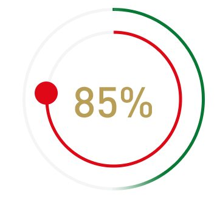

Jakiś czas temu na grupie facebookowej mój były kursant zadał pytanie jak zrobić okrągły wykres, po którym podąża jakaś kropka. Dość ciekawe zadanie, na które od razu wpadło mi kilka pomysłów. A czy uda się je zrealizować? Czas rzucić rękawice i stanąć do walki.

Wykres o którym mowa miał postać:

Zanim przejdziemy do walki, dodajmy temu wpisowi trochę nastroju: https://www.youtube.com/watch?v=VE8vKLEK6A8

Założenia: ma być ładnie, a samego wykresu powinienem móc używać na niejednokolorowym tle.

## Runda pierwsza
Pierwszy sposób, który przyszedł mi do głowy, to zastosowanie <a href="https://developer.mozilla.org/en-US/docs/Web/CSS/conic-gradient()">conic gradient</a>.
To najprostsza z omawianych tutaj metod, mająca bardzo duże możliwości.

Idea jest prosta. Rysuję conic, w którym załączam dwa kolory. Jeden kolor kończy się równo w momencie, gdzie zaczyna się drugi.

<pre><code class="language-css">
.element {
    width: 150px;
    height: 150px;
    border-radius: 50%;
    background: conic-gradient(red 30deg, #eee 30deg);
}
</code></pre>

Jeżeli mam teraz jednolite tło na stronie, wystarczy w środku wstawię koło, któremu dam tło z takim samym kolorem jak kolor strony.

Nasze założenie jednak było takie, by nasz wykres mógł być używany na niejednolitym tle. Oznacza to, że zamiast wstawiać w środku kółko, musimy wyciąć dziurę.

Wykorzystałem do tego <code>mask-image</code>. I spokojnie dało by to radę zrobić za pomocą pojedynczego elementu - gdyby maski w CSS działały jak należy. W każdym innym programie maskę tworzy się za pomocą czarnego i białego koloru. Czarny - ukryte, białe - pokaż.

W CSS ponownie wymyślono to na opak - czarny pokazuje, natomiast za pokazanie odpowiada kolor przezroczysty.

Gdyby to działało jak należy, za pomocą gradientu narysował bym białe kółko na czarnym tle, a potem odpowiednią część zamaskował za pomocą czarno-przezroczystego conic-gradient. W wyniku dostał bym kawałek białego łuku na czarnym tle.

https://codepen.io/kartofelek007/pen/xxEvgPq

Problem w tym, że tutaj ukrywana jest część, gdzie maska jest niewidzialna. A takim kolorem nie da się "zapaćkać" niepotrzebnej części.
Pozostało więc rozbić to na 2 oddzielne elementy. Wewnętrzny tworzył kółko, natomiast zewnętrzny wycinał kawałek.

W poniższym linku 2 wersje. Do prawej dodałem tylko jeden element, który przycinam za pomocą image-mask i conic-gradient.

https://codepen.io/kartofelek007/pen/GRjbbmB

## Runda druga
Tym razem skorzystałem z svg.

Pomysłem było zastosowanie właściwości stroke-dashoffset i stroke-dasharray opisanych na <a href="https://css-tricks.com/svg-line-animation-works/">css-trick</a>. Mega technika, ponieważ bardzo łatwo pozwala nam animować stroke-dashoffset - nawet za pomocą transition. Jedyna rzecz, która musimy tutaj zrobić to wyliczyć długość pojedyńczego przerwania na takim obrysie.

https://codepen.io/kartofelek007/pen/JjRQQGE

## Runda trzecia
Tym razem spróbowałem użyć canvas. Metoda wydaje się najcięższa do zastosowania, ale też ma największe możliwości. Problemem niestety tutaj jest to, że w zasadzie każda czynność jest mega upierdliwa i wiąże się ze stosowaniem dziwnych manewrów. Do tego dochodzą bzdurne transformacje w canvasie. Gdybym swego czasu nie prowadził eksperymentów pisząc <a href="https://kursjs.pl/kurs/canvas/canvas.php#transform">pewien tekst</a>, to pewnie teraz bym potracił wszystkie włosy. Normalnie zapewne sięgnął bym po jakąś bibliotekę do tego np. https://dmitrybaranovskiy.github.io/raphael/, ale ćwiczenie to miało inny cel.

https://codepen.io/kartofelek007/pen/dypBBPR

## Ostatnia runda
Na sam koniec połączyłem technikę svg z conic-gradient.

https://codepen.io/kartofelek007/pen/YzGmoVr

