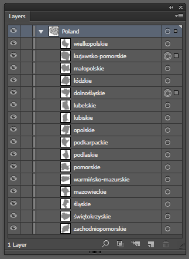
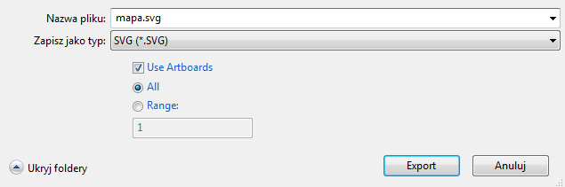
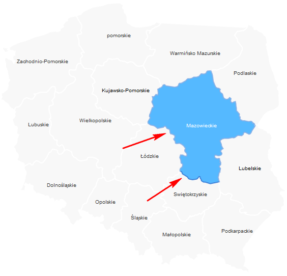

Już kilka razy na różnych grupach widziałem zapytania "jak zrobić klikalne mapy sklepów czy osiedli mieszkalnych".
W tym artykule zajmiemy się stworzeniem takiej mapy.

<!--more-->

Pokazana poniżej technika nie zawsze będzie trafna. Jeżeli nie musisz generować dynamicznie tekstów i robić jakiś szczególnie wybitnych rzeczy z svg, wtedy w ogóle nie musisz korzystać z żadnej biblioteki. Wystarczy, że przygotujesz svg, wrzucisz na chama jej kod w html, za pomocą JS wyłapiesz jej wszystkie elementy path i dla każdego dodasz mouseover, mouseout i click. Po najechaniu na path zmieniasz jego element.style.fill na inny kolor, po zjechaniu znowu zmieniasz. Czyli działasz praktycznie jak na zwykłych elementach DOM. I tyle.

Dodatkowo jak zauważył jeden z czytelników w EDGE mouseover z artykułu odpalany jest wiele razy co powoduje błędy. Faktycznie tak się dzieje. Żeby tego problemu uniknąć, zamiast robić pętlę for in (która widnieje w artykule), trzeba wpierw złapać elemety path tego svg i to po nich zrobić klasyczną pętlę każdorazowo podpinając obsługę zdarzeń poprzez addEventListener.

## Mapa z zastosowaniem znacznika MAP
Zacznijmy od omówienia dość często stosowanej techniki. Polega ona na wykorzystaniu grafiki jako tła mapy, a następnie nałożenie na taką grafikę htmlowej mapy odnośników (<a href="http://www.w3schools.com/tags/tag_map.asp">znacznik map</a>). Po najechaniu na dany element area znacznika map pokazujemy odpowiednie LI, którego tłem jest podświetlony fragment mapy. Takie rozwiązanie możemy zobaczyć chociażby <a href="http://winstonwolf.pl/clickable-maps/poland.html">tutaj</a> czy w <a href="http://lukasz-socha.pl/html/interaktywna-mapa-polski-w-htmlcss/">tym artykule</a> (pozdrowienia dla autora).

Rozwiązanie to stosowałem już kilka razy i nawet się sprawdzało. W necie istnieje kilka generatorów do takich map. Ja korzystałem z Fireworksa.

Rozwiązanie takie choć łatwe do implementacji, ma swoje minusy. Pierwszy z nich jest taki, że dla każdego obszaru, który zmieni się po najechaniu musimy przygotować osobną grafikę (możemy też przygotować sprite z takimi grafikami). Przy 5, 10 takich polach spokojnie można to zrobić. Problem się zaczyna, gdy będziemy musieli przygotować mapę składającą się powiedzmy z 300 obszarów. Czeka nas robota głupiego przy precyzyjnym pozycjonowaniu przesunięcia elementów sprite.
Drugim problemem jest skalowanie takiego rozwiązania. Jak pewnie wiesz, znacznik map nie jest skalowalny. Na szczęście istnieją pluginy takie jak
<a href="http://mattstow.com/experiment/responsive-image-maps/rwd-image-maps.html">http://mattstow.com/experiment/responsive-image-maps/rwd-image-maps.html</a>, które potrafią skalować htmlowe mapy (w przypadku tego plugina pamiętaj, by taką mapę odpalić dopiero po zakończonym wgrywaniu grafiki - czyli po zdarzeniu onload danej grafiki).

W dzisiejszym artykule my zostawimy ten sposób w spokoju, a zajmiemy się metodą bardziej nowoczesną.

## Mapa z zastosowaniem SVG
Zamiast opisywać teorię, przejdziemy przez cały proces tworzenia takiej mapki. Za wzór weźmiemy mapę Polski, ale omawiane podejście można wykorzystać przy tworzeniu interaktywnych map osiedli czy planów podboju Europy.

Do stworzenia interakcji wykorzystamy plugin <a href="http://snapsvg.io/">svgsnap</a>. Można też zamiennie wykorzystać <a href="http://raphaeljs.com/">raphaelljs</a>. Ten drugi wspiera starsze przeglądarki (np IE8), ale nie obsługuje nowszych funkcjonalności i grup ścieżek (da się to obejść), a dodatkowo w czasie pisania tego tekstu strona domowa tej biblioteki nie działała.

## Tworzenie svg
Do stworzenia wektorowej mapy skorzystałem z Ilustratora, ale w darmowym <a href="https://inkscape.org/en/">Inkscape</a> tworzenie będzie podobne. Rysowanie sobie darujmy, w zamian skorzystajmy z gotowca, który znajdziemy na stronie <a href="https://freevectormaps.com/poland/PL-EPS-01-0002">https://freevectormaps.com/poland/PL-EPS-01-0002</a>. W pliku tym trzeba troszkę posprzątać - szczególnie uporządkować nazwy warstw.

<strong>Kilka uwag co do samego tworzenia svg:</strong>
Ważne by odpowiednio nazywać "ścieżki", czyli fragmenty/składowe warstw. W naszym przykładzie kolejnym ścieżkom daliśmy nazwy województw.

Jest to o tyle ważne, że potem te nazwy trafią do kodu wygenerowanego pliku svg, i to właśnie po nich będziesz identyfikować odpowiednie ścieżki.
Pamiętaj, że możesz tworzyć tak zwane złożone kształty (compound path). Jeżeli pojedyncza ścieżka ma się składać z kilku oddzielnych, nie stykających się z sobą części, tworzymy ją za pomocą Object->Compound Path->Make (Ctrl + 8). W programie Inkscape są to klawisze Ctrl + K. Możemy też utworzyć grupę (Ctrl + G) - zależnie od potrzeb. Tutaj mała uwaga. Jeżeli zdecydowałeś się na użycie biblioteki raphael, stosuj raczej Compound Path, a nie grupy, ponieważ biblioteka ta grup nie obsługuje (ale można to zasymulować za pomocą tablic).

I w zasadzie tyle. Przerobiony przygotowany do eksportu plik możesz pobrać <a href="http://domanart.pl/dema/mapa-svg/mapa_polski.ai">tutaj (AI)</a> i <a href="http://domanart.pl/dema/mapa-svg/mapa_polski.svg">tutaj (SVG)</a>. Tak naprawdę zmieniłem w nim trochę rozmiar i uporządkowałem nazwy województw.

Gdy nasz plik jest gotowy, klikamy File->Export i wybieramy SVG. Zaznaczamy opcję Use Artboards.

Potem klikamy OK i dostajemy gotowy plik SVG. I to tyle...
Niezupełnie. Plik ten musimy teraz zamienić na odpowiedni kod dla JS. Moglibyśmy działać na czystym kodzie svg, ale kontrola nad takim cudem może w przyszłości być nieco utrudniona.

Do konwersji svg na kod js możemy wykorzystać konwerter ze strony <a href="http://readysetraphael.com/">http://readysetraphael.com/</a>. Wchodzimy na tą stronę, wybieramy nasz plik svg i otrzymujemy kod dla biblioteki raphael. Plugin snapsvg korzysta z bliźniaczej składni, więc kod pasuje jak ulał.

Otrzymany kod to jedno linijkowy potworek, który musimy uporządkować.
Wklejamy cały kod do nowego dokumentu w <a href="https://www.sublimetext.com/3">Sublime Text</a>. Ustawiamy kolorowanie składni na Javascript (Ctrl + Shift + P, wpisujemy JS i wybieramy Set Syntax: Javascript).

Wykonujemy teraz następujące zamiany tekstu:

1. Naciskamy Ctrl + H, zaznaczamy opcję Regular Expression (pierwsza ikonka z lewej strony). Wyszukujemy ciąg <code>\);</code> i zamieniamy go z <code>\);\n</code>. Klikamy Replace All.
2. Wykonujemy drugie szukanie (także Regular Expression) i zamieniamy <code>var</code> z <code>\nvar</code>. Oba wyrażenia regularne dodadzą nam nowe linie do dokumentu. Jest lepiej.
3. Gdy teraz spojrzymy na kod, zobaczymy dłuższe cześći określające atrybuty kolejnych ścieżek. Nam to nie jest potrzebne, bo i tak będziemy te atrybuty ustawiać za pomocą pętli w js. Wyszukujemy <code>\.attr\(.*?\)</code> i zamieniamy z pustym ciągiem znaków.
4. Atrybut data każdej ścieżki zostawiamy, bo przyda nam się do wyświetlania dodatkowych danych (w naszym przypadku nazwy województwa). Właściwość <code>'id'</code> daty dla lepszej czytelności zamieńmy na 'name'. Wyszukujemy więc (nie Regular Expression) ciąg <code>'id'</code> i zamieniamy go na <code>'name'</code>. Dodatkowo poprawiamy te nazwy by były prawidłowe (spacje, polskie znaki itp).
5. W atrybucie data dodajemy dla każdej ścieżki dodatkowy atrybut 'id', który zapisujemy bez polskich znaków, spacji itp

Aby wygodniej działać na kolejnych ścieżkach (a także sensownie robić na nich pętlę), zgrupujmy je w tablicę. Na początku kodu dodajemy zmienną tablicową o nazwie map, a następnie każdą ze ścieżek wrzucamy pod odpowiednim id do tej tablicy. W poniższym przykładzie dla swojej wygody zmieniłem indywidualne nazwy zmiennych ścieżek na zmienną "path".

<pre><code class="language-js">
var map = [];

var path = svg.path("M 166.23....");
path.data('name', 'Zachodnio-Pomorkie');
path.data('id', 'zachodniopomorskie');
map['zachodniopomorskie'] = path;

var path = svg.path("M 166.23....");
path.data('name', 'Świętokrzyskie');
path.data('id', 'swietokrzyskie');
map['swietokrzyskie'] = path;

...
</code></pre>

Gotowy poprawiony kod możesz znaleźć <a href="http://domanart.pl/dema/mapa-svg/mapa-skrypt.js">w tym miejscu</a>.

## Rysujemy mapę za pomocą svgSnap
Dorzucamy do naszej strony plik z biblioteką svgSnap, nasz uporządkowany kod mapy, a następnie rysujemy naszą mapę:

<pre><code class="language-html">
&lt;script src="snap.svg-min.js">&lt;/script>

&lt;svg id="svg" style="max-width:565px; max-height:533px">&lt;/svg>

&lt;script>
var svg = Snap('#svg');
svg.attr({ viewBox: "0 0 565 533" });

var map = [];

var path = svg.path("M 166.23....");
path.data('id', 'zachodniopomorskie');
map['zachodniopomorskie'] = path;

var path = svg.path("M 166.23....");
path.data('id', 'świętokrzyskie');
map['swietokrzyskie'] = path;

...
</script>
</code></pre>

Jedną ze wcześniejszych operacji było usunięcie przez nas domyślnych atrybutów wyglądu każdego z patha. Aby nasza mapa miała jakikolwiek wygląd, musimy te atrybuty im nadać. Robimy to w prostej pętli:

<pre data-line="12-25"><code class="language-js">
var svg = Snap('#svg');
svg.attr({ viewBox: "0 0 565 533" });

var map = [];

var path = svg.path("M 166.23....");
path.data('id', 'zachodniopomorskie');
map['zachodniopomorskie'] = path;

...

for (var key in map) {
    //ustawiamy domyślny wygląd ścieżki
    map[key].attr({
        'fill': '#eee',
        'opacity' : 0.4,
        'stroke' : '#fff',
        'stroke-width' : 2
    });

    //ustawiamy domyślny kolor tekstu
    this[1].animate({
        'fill' : '#333'
    }, 300);
}
</code></pre>

Dodatkowo wspominaliśmy coś o wypisywaniu nazw województw. Tu także zastosujemy prostą pętlę:

<pre><code class="language-js">
for (var key in map) {
    var path = map[key];
    var name = path.data('name');

    var bbox = path.getBBox(); //pobieramy kwadratowy obszar ścieżki
    //i w jego srodek wstawiamy tekst
    var text = path.paper.text(bbox.x + (bbox.width / 2), bbox.y + (bbox.height / 2), name).attr({
        font: '10px Arial',
        'text-anchor' : "middle"
    });
    var group = svg.group(map[key], text);
    map[key] = group;
}
</code></pre>

Od tej pory każdy indeks tablicy map będzie wskazywał nie na ścieżkę, a na grupę zawierającą 2 elementy: [0] - ścieżka, [1] - tekst.
W tym momencie powinniśmy dostać gotową mapę z nazwami województw. Część nazw wyświetla się nieco krzywo. Spokojnie można to
poprawić np. poprzez dodatkowe atrybuty przesunięcia trzymane w .data() dla każdej ścieżki. Ja ten krok pominąłem.

Mapę w <a href="http://domanart.pl/dema/mapa-svg/mapa-01.html">tym stadium możesz zobaczyć tutaj</a>.

## Dodanie interakcji do mapy
Wystarczy zrobić kolejną pętlę po elementach mapy i obsłużyć zdarzenia onmouseover, onmouseout i onclick dla każdego elementu:

<pre><code class="language-js">
for (var key in map) {
    //ustawiamy domyślny wygląd ścieżki
    map[key][0].attr({
        'fill': '#eee',
        'opacity' : 0.4,
        'stroke' : '#fff',
        'stroke-width' : 2
    });

    //ustawiamy domyślny kolor tekstu
    map[key][1].attr({
        'fill' : '#333'
    });

    map[key].mouseover(function() {
        this[0].animate({
            'fill': '#55B9FF',
            'opacity' : 1,
            'stroke' : '#3E81D8',
            'stroke-width' : 2
        }, 600);
        this[1].animate({
            'fill' : '#fff'
        }, 300);
    });

    map[key].mouseout(function() {
        this[0].animate({
            'fill': '#eee',
            'opacity' : 0.4,
            'stroke' : '#fff',
            'stroke-width' : 2
        }, 600);
        this[1].animate({
            fill : '#000'
        }, 300);
    });

    map[key].click(function() {
        console.log(this[0].data('name'));
    });
}
</code></pre>

Mapę z interakcją możesz zobaczyć <a href="http://domanart.pl/dema/mapa-svg/mapa-02a.html">tutaj</a>.

Jeżeli jesteś uważny, zauważysz, że niektóre ścieżki po najechaniu mają jakieś dziwne obramowanie.

Spowodowane jest to tym, że niektóre ścieżki leżą poniżej innych (zasada ta sama co z z-index). Aby to naprawić powinniśmy wskazaną ścieżkę przenosić na samą górę warstw, a ścieżkę którą opuszczamy kursorem przenosić na sam spód. W bibliotece raphael.js służyły do tego metody toFront() i toBack(). <a href="https://github.com/adobe-webplatform/Snap.svg/issues/121">Niestety w snapsvg ich nie ma</a>, dlatego musimy je więc dopisać. Gdzieś na początku naszego kodu dodajemy kod:

<pre><code class="language-js">
Snap.plugin(function (Snap, Element, Paper, glob) {
    var elproto = Element.prototype;
    elproto.toBack = function () {
        this.prependTo(this.paper);
    };
    elproto.toFront = function () {
        this.appendTo(this.paper);
    };
});
</code></pre>

oraz do zdarzeń mouoseover i mouseout dodajemy obsługę tych funkcji:

<pre data-line="15,29"><code class="language-js">
for (var key in map) {
...

map[key].mouseover(function() {
    this[0].animate({
        'fill': '#55B9FF',
        'opacity' : 1,
        'stroke' : '#3E81D8',
        'stroke-width' : 2
    }, 600);
    this[1].animate({
        'fill' : '#fff'
    }, 300);

    this.toFront();
});

map[key].mouseout(function() {
    this[0].animate({
        'fill': '#eee',
        'opacity' : 0.4,
        'stroke' : '#fff',
        'stroke-width' : 2
    }, 600);
    this[1].animate({
        fill : '#000'
    }, 300);

    this.toBack();
});
</code></pre>

Poprawioną mapę z interakcją możesz zobaczyć <a href="http://domanart.pl/dema/mapa-svg/mapa-02b.html">tutaj</a>.

## Oznaczanie klikniętego elementu
W tej chwili po najechaniu/opuszczeniu kursorem zmieniamy wygląd danego elementu. W ramach treningu dodajmy wyróżnianie elementu po jego kliknięciu.
Może to się przydać np do oznaczania elementu, dla którego wyświetlamy jakieś dane, czy ściągamy je z serwera.

Rozwiązań jest kilka. Jednym z nich jest podstawianie aktywnego elementu pod zmienną oraz zmienianie jego atrybutów.
Po takim oznaczeniu elementu w zdarzeniach mouseover, mouseout sprawdzimy czy mamy do czynienia z aktywnym elementem (czy jest to element ze zmiennej). Jeżeli nie, tak jak wcześniej zmieniamy wygląd wskazywanego elementu. Jeżeli jednak jest to element aktywny, nie ruszamy jego stanu.

<pre data-line="1,8,23-25,48,69"><code class="language-js">
var activeElement = null;

for (var key in map) {
    ...

    map[key].mouseover(function(e) {
        //jezeli wskazany element nie jest aktywny, zmieniamy jego atrybuty
        if (this[0] != activeElement) {
            this[0].animate({
                'fill': '#55B9FF',
                'opacity' : 1,
                'stroke' : '#3E81D8',
                'stroke-width' : 2
            }, 600);
            this[1].animate({
                'fill' : '#fff'
            }, 300);

            this.toFront();
        }

        //zawsze na koncu wyniesmy aktywny element na sama gore
        if (activeElement !=null) {
            activeElement.toFront();
        }
    });

    map[key].mouseout(function(e) {
        //jezeli element który opuszcamy kursorem nie jest aktywny, zmieniamy jego atrybuty
        if (this[0].data('active') != true) {
            this[0].animate({
                'fill': '#eee',
                'opacity' : 0.4,
                'stroke' : '#fff',
                'stroke-width' : 2
            }, 600);
            this[1].animate({
                fill : '#000'
            }, 300);

            this.toBack();
        }
    });

    map[key].click(function() {
        //jeżeli mamy juz zaznaczony element, sprawdzamy czy nie jest on taki sam jak właśnie kliknięty
        //jeżeli nie, znaczy to, że w zmiennej activeElement mamy jeszcze poprzednio kliknięty element.
        //zanim zaznaczymy teraz kliknięty elementu, musimy zresetować atrybuty poprzednio wybranemu :)
        if (activeElement != null && activeElement != this) {
            activeElement[0].animate({
                'fill': '#eee',
                'opacity' : 0.4,
                'stroke' : '#fff',
                'stroke-width' : 2
            }, 600);
            activeElement[1].animate({
                fill : '#000'
            }, 300);
            activeElement[0].attr({
                'filter' : ''
            })
        }

        //kliknięty element ustawiamy na aktywny
        activeElement = this;

        this.toFront();

        this[0].animate({
            'fill': '#DD1144',
            'opacity' : 1,
            'stroke' : '#B90834',
            'stroke-width' : 2
        }, 600);
        this[1].animate({
            fill : '#fff'
        }, 300)

        //dodajemy dodatkowy cień dla wyróżnionego elementu
        var f = svg.filter(Snap.filter.shadow(0, 2, 3));
        this[0].attr({
            filter: f
        });

        console.log(this[0].data('name'));

    });
}
</code></pre>

Gotowa mapa z interakcją i zaznaczaniem elementu dostępna jest <a href="http://domanart.pl/dema/mapa-svg/mapa-03.html">tutaj</a>.

## Wczytywanie danych po kliknięciu
W zasadzie to już nie jest tematem tego artykułu. Po kliknięciu na dany obszar, po ustawieniu atrybutów ścieżki korzystając z console.log wypisujemy nazwę danego obszaru pobierając ją z data('name'). Zmieńmy to na jakiś bardziej realny przykład.

W html dodajemy element, który będzie wyświetlał wczytane z serwera dane. Dla porządku element svg objąłem dodatkowym elementem .svg-cnt:

<pre><code class="language-html">
&lt;div class="svg-cnt">
    &lt;svg id="svg" style="max-width:565px; max-height:533px">&lt;/svg>
&lt;/div>

&lt;div class="map-data">
    &lt;h3>Nazwa województwa: &lt;strong class="name">&lt;/strong>&lt;/h3>
    &lt;**
        &lt;strong>Liczba ludzi w województwie:&lt;/strong>
        &lt;span class="people-count">&lt;/span>
    &lt;/div>
    &lt;**
        &lt;strong>Liczba kobiet w województwie:&lt;/strong>
        &lt;span class="man-count">&lt;/span>
    &lt;/div>
    &lt;**
        &lt;strong>Liczba mężczyzn w województwie:&lt;/strong>
        &lt;span class="woman-count">&lt;/span>
    &lt;/div>
&lt;/div>
</code></pre>

W naszym skrypcie na końcu obsługi zdarzenia click dodajemy:

<pre><code class="language-js">
map[key].click(function() {
    ...
    console.log(this[0].data('name'));

    $('.map-data').append('&lt;span class="loading">Wczytuje dane&lt;/span>');

    var pathName = this[0].data('name');

    $.ajax({
        url : 'skrypt-mapy.php',
        data : {
            id : this[0].data('id')
        },
        dataType : 'json',
        method : 'post',
        success : function(ret) {
            //po wczytaniu danych pokaż je na stronie
            $('.map-data .data').empty();
            $('.map-data .name').html(pathName);
            $('.map-data .people-count').html(ret.people);
            $('.map-data .man-count').html(ret.man);
            $('.map-data .woman-count').html(ret.woman);
        },
        complete : function() {
            //po zakończeniu requesta usuń loading
            $('.map-data .loading').remove();
        }
    })
});
</code></pre>
**
Po kliknięciu na dany element mapy, pobieramy jego atrybut data('name'). Musimy go podstawić pod zmienną <strong>pathName</strong>, bo we wnętrzu zdarzenia success ajaxa, słowo this wskazuje na ajax, a nie na nasz element mapy.
Do skryptu na serwerze przekazujemy tylko jeden parametr id, który także pobraliśmy z właściwości data ścieżki.
**
Przykładowy <strong>skrypt-mapy.php</strong> do którego odwołuje się powyższy przykład <a href="http://domanart.pl/dema/mapa-svg/skrypt-mapy.zip">możesz pobrać tutaj</a>. Ma on postać:

<pre><code class="language-php">
<?php
sleep(2); //dla testów spowalniamy skrypt o 2 sekundy

//http://stat.gov.pl/statystyka-regionalna/rankingi-statystyczne/ludnosc-wedlug-wojewodztw/
$province = array(
    'zachodniopomorskie' => array(
        'people' => 1715431,
        'man'    => 835069,
        'woman'  => 880362
    ),
    'swietokrzyskie' => array(
        'people' => 1263176,
        'man'    => 616670,
        'woman'  => 646506
    ),
    'slaskie' => array(
        'people' => 4585924,
        'man'    => 2212717,
        'woman'  => 2373207
    ),
    'mazowieckie' => array(
        'people' => 5334511,
        'man'    => 2552091,
        'woman'  => 2782420
    ),
    'warminskomazurskie' => array(
        'people' => 1443967,
        'man'    => 706988,
        'woman'  => 736979
    ),
    'pomorskie' => array(
        'people' => 2302077,
        'man'    => 1121987,
        'woman'  => 1180090
    ),
    'podlaskie' => array(
        'people' => 1191918,
        'man' =>    581164,
        'woman' =>  610754
    ),
    'podkarpackie' => array(
        'people' => 2129187,
        'man'    => 1042683,
        'woman'  => 1086504
    ),
    'opolskie' => array(
        'people' => 1000858,
        'man'    => 484182,
        'woman'  => 516676
    ),
    'lubuskie' => array(
        'people' => 1020307,
        'man'    => 496666,
        'woman'  => 523641
    ),
    'lubelskie' => array(
        'people' => 2147746,
        'man'    => 1040990,
        'woman'  => 1106756
    ),
    'dolnoslaskie' => array(
        'people' => 2908457,
        'man'    => 1398554,
        'woman'  => 1509903
    ),
    'lodzkie' => array(
        'people' => 2504136,
        'man'    => 1193418,
        'woman'  => 1310718
    ),
    'malopolskie' => array(
        'people' => 3368336,
        'man'    => 1634266,
        'woman'  => 1734070
    ),
    'kujawskopomorskie' => array(
        'people' => 2089992,
        'man'    => 1012878,
        'woman'  => 1077114
    ),
    'wielkopolskie' => array(
        'people' => 3472579,
        'man'    => 1689486,
        'woman'  => 1783093
    )
);

if ($_SERVER['REQUEST_METHOD'] == 'POST') {
    //$_POST['id'] przekazaliśmy w właściwości data AJAX
    if (isset($_POST['id']) && array_key_exists($_POST['id'], $province)) {
        echo json_encode($province[$_POST['id']]);
    }
}
?>
</code></pre>

Gotowy przykład z dema poniżej <a href="http://domanart.pl/dema/mapa-svg/mapa.zip"> możesz pobrać w całości z tego miejsca</a>. Wirusów nie załączam :)

<a class="demo" href="http://domanart.pl/dema/mapa-svg/mapa.html">Demo gotowej mapy</a>

## Przykład bardziej realny
Powyższy przykład to bardzo proste, praktycznie teoretyczne pokazanie jednej z możliwości takiej mapy.
Inne, polegające na bardzo podobnej zasadzie wykorzystałem <a href="http://www.slodowieccity.pl/oferty-mieszkan">na tej stronie</a>.
Po wybraniu danego piętra, pobieram z serwera tablicę mieszkań w postaci tablicy. Taka tablica ma w sobie zapisane różne dane dla każdego kawałka mapy (w tym przypadku mieszkania): czy mieszkanie jest dostępne, jaką ma powierzchnię itp. W metodzie success Ajaxa robię pętlę po takiej tablicy i za pomocą "id" do każdej ścieżki mapy dodaję odpowiednią obsługę onmouseover i onmouseout. Czyli to samo co robiliśmy powyżej.

Jak zwykle zachęcam do własnego eksperymentowania :)