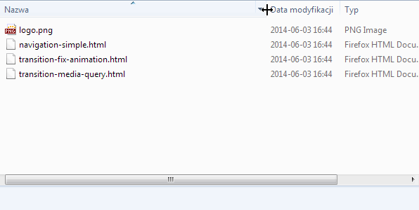
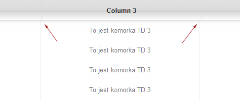

Jakiś czas temu miałem za zadanie zrobienie tabeli z rozszerzanymi kolumnami i sztywnym nagłówkiem tabeli. Jak się szybko okazało, w internecie istnieje całkiem sporo tego typu rozwiązań, ale jak to bardzo często bywa nie za często się sprawdzają. Jest to dobry powód do poćwiczenia.

<!--more-->

W ramach treningu za pomocą <a href="http://jqueryui.com/resizable/">jquery ui resizable</a> zrobimy dla tabeli mechanizm znany z okien windowsa. Jeżeli masz pod ręką okienko jakiegoś folderu w windowsie sprawdź jak się ten mechanizm zachowuje. A jak nie, to poświęciłem kawałek swojego życia i nagrałem dla ciebie naturę takich okien:

Ogólnie można zauważyć kilka cech tego mechanizmu:

* Gdy rozciągamy jakąś kolumnę, kolumny z prawej strony zmieniają swoją pozycję bez miany swoich rozmiarów (zmienia się tylko rozmiar rozciąganej kolumny).
* Gdy kolumny razem zajmują mniej miejsca niż szerokość okna, to nie dopasowują się do pełnej szerokości okna.
* Jeżeli kolumny zajmują więcej miejsca, po prostu wychodzą powierzchnię okna, a my mamy możliwość użyć bocznego paska przewijania.

W naszym przypadku dodamy jeszcze mechanizm zapisywania i odczytu wielkości każdej kolumny.

## HTML
Zaczynamy od kodu html, który zawiera zwykłą tabelę:

<pre><code class="language-html">
&lt;table>
    &lt;thead>
        &lt;tr>
            &lt;th>
                &lt;div>&lt;span class="column-label">Column 1&lt;/span>&lt;/div>
            &lt;/th>
            &lt;th>
                &lt;div>&lt;span class="column-label">Column 2&lt;/span>&lt;/div>
            &lt;/th>
            &lt;th>
                &lt;div>&lt;span class="column-label">Column 3&lt;/span>&lt;/div>
            &lt;/th>
            &lt;th>
                &lt;div>&lt;span class="column-label">Column 4&lt;/span>&lt;/div>
            &lt;/th>
            &lt;th>
                &lt;div>&lt;span class="column-label">Column 5&lt;/span>&lt;/div>
            &lt;/th>
        &lt;/tr>
    &lt;/thead>
    &lt;tbody>
        &lt;tr>
            &lt;td>
                &lt;div>Kolumna 1&lt;/div>
            &lt;/td>
            &lt;td>
                &lt;div>Kolumna 2&lt;/div>
            &lt;/td>
            &lt;td>
                &lt;div>Kolumna 3&lt;/div>
            &lt;/td>
            &lt;td>
                &lt;div>Kolumna 4&lt;/div>
            &lt;/td>
            &lt;td>
                &lt;div>Kolumna 5&lt;/div>
            &lt;/td>
        &lt;/tr>
        ...
    &lt;/tbody>
&lt;/table>
</code></pre>

Już za moment będziemy bawić się liczeniem wielkości komórek. Aby było to łatwiejsze, wszelkie paddingi itp. zmiany będziemy stosować dla divów. W nagłówkach tabeli zastosowaliśmy dodatkowo elementy <code>.column-label</code>. Dzięki nim łatwiej nam będzie stylować wygląd tych komórek.

## Sztywny nagłówek tabeli
Pierwszą rzeczą będzie zrobienie sztywnego nagłówka. Istnieją rozwiązania w czystym CSS (np. to: <a href="">http://www.imaputz.com/cssStuff/bigFourVersion.html</a>) ale nie za bardzo się one u mnie sprawdzały. Próbowałem i próbowałem, ale za każdym razem natrafiałem na jakiś problem nie do przeskoczenia. Jak zauważysz, w  przykładzie na podanej stronie wszystko jest ustawione na sztywno, a tego nie chcemy.

Zastosujemy więc nieco inne podejście - także czasami spotykane. Naszą tabele rozbijemy na dwie części - nagłówek thead i treść tbody. Obie te części wrzucimy do oddzielnych divów, które umieścimy w przewijanym kontenerze. Div z <code>.thead</code> będzie na sztywno przyklejony do górnej krawędzi skrolowanego diva. Element <code>.tbody</code> jak to mawiał pewien pan nie nie będzie miał niczego, więc będzie się przewijał wraz z przewijaniem <code>.wrap-table</code>:

<pre><code class="language-js">
$(function() {
    $('table').each(function() {
        var $table = $(this);
        var $tbody = null;
        var $thead = null;

        var $wrapAll =  $('&lt;div class="table-wrap">&lt;/div>'); //naszą tabelę obejmujemy przewijanym divem
        var $tbodydiv = $('&lt;div class="tbody">&lt;/div>'); //tutaj wrzucimy nagłówek thead
        var $theaddiv = $('&lt;div class="thead">&lt;/div>'); //tutaj wrzucimy część tbody

        $table.wrap($wrapAll);

        //tworzymy tabelę tylko z tbody (usuwamy thead)
        $thead = $table.clone();
        $thead.children('tbody').remove();
        $theaddiv.append($thead);

        //tworzymy tabelę tylko z thead (usuwamy tbody)
        $tbody = $table.clone();
        $tbody.children('thead').remove();
        $tbodydiv.append($tbody);

        $table.replaceWith($theaddiv); //zamieniamy naszą tabelę z .thead
        $theaddiv.after($tbodydiv); //za .thead wrzucamy .tbody

        ...
        ...
    });
});
</code></pre>

I stylowanie, by nasza tabela nie wyglądała jak kaszanka z ogrórkami:

<pre><code class="language-css">
* {
    font-family:sans-serif;
    font-size:13px;
}
body {
    margin:20px;
}

.table-wrap {
    /* kontener otaczający ma być przewijalny */
    overflow: auto;
    position: relative;
    max-height:500px;
    border:1px solid #ddd;
    box-shadow:inset 0 -2px 3px rgba(0,0,0,0.1);
}

/* sztywny nagłówek tabeli */
.table-wrap .thead {
    /* nagłówek będzie przyklejony */
    position:absolute;
    left:0;
    top:0;

    box-shadow:0 1px 10px rgba(0,0,0,0.1), 0 1px 2px rgba(0,0,0,0.1), inset 0 -1px 0 rgba(255,255,255,0.3);
    background: #f5f5f5;
    background: -moz-linear-gradient(top,  #ffffff 0%, #e5e5e5 100%);
    background: -webkit-gradient(linear, left top, left bottom, color-stop(0%,#ffffff), color-stop(100%,#e5e5e5));
    background: -webkit-linear-gradient(top,  #ffffff 0%,#e5e5e5 100%);
    background: -o-linear-gradient(top,  #ffffff 0%,#e5e5e5 100%);
    background: -ms-linear-gradient(top,  #ffffff 0%,#e5e5e5 100%);
    background: linear-gradient(to bottom,  #ffffff 0%,#e5e5e5 100%);
    min-width:100%;
    z-index: 2;
}

/* cielsko tabeli */
.table-wrap .tbody {
    /* thead ma position absolute, więc tbody trzeba odsunąć od góry o jego wysokość */
    margin-top:40px;
    z-index: 1;
    position: relative;
}

/* reszta stylowania by tabelka nie wyglądała jak pasztet podlaski */
.table-wrap table {
    table-layout: fixed;
    width:100%;
    border-collapse: collapse;
}
.table-wrap td,
.table-wrap th {
    padding:0;
    height:40px;
    line-height: 40px;
    border:0;
    border-right:1px solid #eee;
    text-align: center;
    overflow: hidden;
    margin:0;
    font-family:sans-serif;
    font-weight:400;
    font-size:15px;
}
.table-wrap th {
    color:#222;
    font-weight:bold;
    border-color:#ddd;
    box-shadow:inset 1px 0 rgba(255,255,255,0.5);
}
.table-wrap td {
    color:#777;
    -webkit-transition: 0.5s background-color;
    -o-transition: 0.5s background-color;
    transition: 0.5s background-color;
}
.table-wrap tr:hover td {
    background: #FFFAB9;
}
.table-wrap th > div {
    position: relative;
    height:100%;
}
table th .column-label,
table td div {
    white-space:nowrap;
    overflow: hidden;
    text-overflow:ellipsis;
    display: block;
    padding:0 5px;
}
</code></pre>

Dostajemy coś takiego: <a href="http://domanart.pl/dema/table-resize/table-resize-step1.html">Krok 1</a>.

Element <code>.thead</code> chcemy przykleić do górnej krawędzi przewijanego elementu <code>.table-wrap</code>. Pozycjonowania <code>fixed</code> nie możemy tutaj użyć, bo ono działa względem całej strony (0,0 to lewy górny róg ekranu). W przyszłości będziemy mogli użyć pozycjonowania <a href="http://updates.html5rocks.com/2012/08/Stick-your-landings-position-sticky-lands-in-WebKit">sticky</a>, ale póki co będziemy musieli wykorzystać pozycjonowanie absolutne i za pomocą skryptu aktualizować pozycję tego elementu.

<pre data-line="24-29"><code class="language-js">
$(function() {
    $('table').each(function() {
        var $table = $(this);
        var $tbody = null;
        var $thead = null;

        var $wrapAll =  $('&lt;div class="table-wrap">&lt;/div>'); //naszą tabelę obejmujemy przewijanym divem
        var $tbodydiv = $('&lt;div class="tbody">&lt;/div>'); //tutaj wrzucimy nagłówek thead
        var $theaddiv = $('&lt;div class="thead">&lt;/div>'); //tutaj wrzucimy część tbody

        $table.wrap($wrapAll);

        $thead = $table.clone();
        $thead.children('tbody').remove();
        $theaddiv.append($thead);

        $tbody = $table.clone();
        $tbody.children('thead').remove();
        $tbodydiv.append($tbody);

        $table.replaceWith($theaddiv);
        $theaddiv.after($tbodydiv);

        $('.table-wrap').scroll(function() {
            var top = $(this).scrollTop();
            $(this).find('.thead').css({
                top : top
            });
        });
    });
});
</code></pre>

Mamy w rezultacie tabelę ze sztywnym nagłówkiem: <a href="http://domanart.pl/dema/table-resize/table-resize-step2.html">Krok 2</a>

## Dołączamy rozszerzanie kolumn
Dorzucamy do naszej strony jquery ui i odpalamy rozszerzanie dla kolumn:

<pre data-line="1-2,37-47"><code class="language-html">
&lt;link rel="stylesheet" href="http://ajax.googleapis.com/ajax/libs/jqueryui/1.10.4/themes/smoothness/jquery-ui.css" />
&lt;script src="http://ajax.googleapis.com/ajax/libs/jqueryui/1.10.4/jquery-ui.min.js">&lt;/script>

&lt;script>
$(function() {
    $('table').each(function() {
        var $table = $(this);
        var $tbody = null;
        var $thead = null;

        var $wrapAll =  $('&lt;div class="table-wrap">&lt;/div>'); //naszą tabelę obejmujemy przewijanym divem
        var $tbodydiv = $('&lt;div class="tbody">&lt;/div>'); //tutaj wrzucimy nagłówek thead
        var $theaddiv = $('&lt;div class="thead">&lt;/div>'); //tutaj wrzucimy część tbody

        $table.wrap($wrapAll);

        //tworzymy tabelę tylko z tbody (usuwamy thead)
        $thead = $table.clone();
        $thead.children('tbody').remove();
        $theaddiv.append($thead);

        //tworzymy tabelę tylko z thead (usuwamy tbody)
        $tbody = $table.clone();
        $tbody.children('thead').remove();
        $tbodydiv.append($tbody);

        $table.replaceWith($theaddiv); //zamieniamy naszą tabelę z .thead
        $theaddiv.after($tbodydiv); //za .thead wrzucamy .tbody

        $('.table-wrap').scroll(function() {
            var top = $(this).scrollTop();
            $(this).find('.thead').css({
                top : top
            });
        });

        var $th = $thead.find('th');
        var $td = $tbody.find('tr:first td');

        $th.each(function() {
            $(this).resizable({
                handles: 'e',
                minWidth: 30,
                resize: function (event, ui) {
                }
            });
        });
    });
});
</script>
</code></pre>

Otrzymujemy coś takiego: <a href="http://domanart.pl/dema/table-resize/table-resize-step3.html">Krok 3</a>

Nie wiem czy wiesz jak działa jQueryUI resizable. Dla elementów rozszerzalnych dorzucany jest element-uchwyt <code>.ui-resizable-handle</code>, który służy jako uchwyt do rozciągania elementu. W naszym przypadku taki element zostanie wrzucony do TH. Wszystko cacy na nowych przeglądarkach w Windowsie, ale jeżeli przetestujemy powyższy przykład na Linuxie, okaże się, że nie jesteśmy w stanie w ogóle chwycić za taki uchwyt. Czemu tak się dzieje? Ano dlatego: <a href="http://stackoverflow.com/questions/4564638/using-position-relative-absolute-within-a-td">http://stackoverflow.com/questions/4564638/using-position-relative-absolute-within-a-td</a>. Jeżeli zbadasz sobie kod naszej tabeli, zauważysz, że wstawiony przez jQueryUI uchwyt ma pozycjonowanie absolutne. Ale przecież względem TD, TH takie pozycjonowanie nie powinno dziąłać. Na windowsie błędnie działa, na linuxie poprawnie nie działa. Na szczęście można to bardzdo łatwo obejść - przynajmniej dwoma metodami. Pierwszą jest nadpisanie domyślnego stylowania jqueryUI przez nasze własne:

<pre><code class="language-css">
.table th .ui-resizable-e {
    position:relative;
    float:right;
    ...
    ...
}
</code></pre>

Drugą jest włączenie rozszerzania nie tyle dla kolumn TH co dla divów które się w nich znajdują (które mamy w tabeli od samego początku). Przypinamy więc rozszerzanie dla divów, a podczas rozszerzania przenosimy szerokość z diva na komórkę TH:

<pre><code class="language-js">
...

$th.each(function() {
    $(this).children('div').resizable({
        handles: 'e',
        minWidth: 30,
        resize: function (event, ui) {
            event.stopPropagation();
            ui.element.parent().width($(this).width())
        }
    });
});

...
</code></pre>

Poprawioną wersję z rozszerzaniem przypisanym do divów znajdziesz tutaj: <a href="http://domanart.pl/dema/table-resize/table-resize-step3b.html.html">Krok 3b</a>.

Przy zmienie szerokości kolumn nagłówka, szerokość kolumn tabeli <code>.tbody</code> się nie zmienia. Aby to naprawić, wystarczy podczas zdarzenia resize które właśnie podpieliśmy robić pętlę po wszystkich TH i pobieraną od nich szerokość przepisywać do komórek TD z pierwszego rzędu tbody:

<pre data-line="14-16"><code class="language-js">
$(function() {
    $('table').each(function() {
        ...
        ...
        var $th = $thead.find('th');
        var $td = $tbody.find('tr:first td');

        $th.each(function() {
            $(this).children('div').resizable({
                handles: 'e',
                minWidth: 30,
                resize: function (event, ui) {
                    event.stopPropagation();
                    ui.element.parent().width($(this).get(0).style.width)
                    $td.each(function(i) {
                        $(this).width($th.eq(i).get(0).style.width);
                    });
                }
            });
        });
        ...
        ...
    });
});
</code></pre>

Sprawdzamy :) <a href="http://domanart.pl/dema/table-resize/table-resize-step4.html">Krok 4 a</a>.

## Poprawianie rozciągania
Rozszerzanie działa. Ale czy jest to efekt który chcieliśmy uzyskać? Nie za bardzo. Po pierwsze w tej chwili cała tabela rozciągnięta jest na pełną szerokość. Powoduje to pewne problemy. Pierwszym z nich jest to, że podczas zmiany szerokości jednej z kolumn reszta stara się dostosować swoją szerokość tak by wszystkie razem zajmowały 100%. Nie jest to zbyt piękny efekt.
Drugi problem jest taki, że teraz nie jesteśmy dowolnie zmieniać rozmiarów kolumn. Nie dość, że są one ograniczone do powierzchni 100% tabeli, to jeszcze reszta kolumn wpływa na ich rozmiar. Wystarczy pobawić się chwilę by zobaczyć, że coś jest nie tak jak trzeba. Trzeci problem pojawi się w przypadku ukrywania kolumn i zapisu ich rozmiarów. Gdy teraz ukryjemy jedną z kolumn, reszta starając się dopasować zmieni swoje rozmiary. Gdy teraz zapiszemy te rozmiary i na nowo pokażemy ukrytą kolumnę, całą rozmiarówkę szlak trafi. Ostatni problem - najważnieszy - efekt nie wygląda tak zakładaliśmy. Sprawdź raz jeszcze jak zachowują się nagłówki w oknach windowsa, albo przeczytaj opis z początku tego artykułu.

Poprawiamy więc dalej:

<pre data-line="28-32"><code class="language-js">
$(function() {
    $('table').each(function() {
        var $table = $(this);
        var $tbody = null;
        var $thead = null;

        var $wrapAll =  $('&lt;div class="table-wrap">&lt;/div>'); //naszą tabelę obejmujemy przewijanym divem
        var $tbodydiv = $('&lt;div class="tbody">&lt;/div>'); //tutaj wrzucimy nagłówek thead
        var $theaddiv = $('&lt;div class="thead">&lt;/div>'); //tutaj wrzucimy część tbody

        $table.wrap($wrapAll);

        //tworzymy tabelę tylko z tbody
        $thead = $table.clone();
        $thead.children('tbody').remove();
        $theaddiv.append($thead);

        //tworzymy tabelę tylko z thead
        $tbody = $table.clone();
        $tbody.children('thead').remove();
        $tbodydiv.append($tbody);

        $table.replaceWith($theaddiv);
        $theaddiv.after($tbodydiv);

        var $th = $thead.find('th');
        var $td = $tbody.find('tr:first td');

        $td.each(function(i) {
            $(this).width($(this).width());
            $th.eq(i).width($(this).width());
        });
        $thead.add($tbody).width(0);

        $th.each(function() {
            $(this).children('div').resizable({
                handles: 'e',
                minWidth: 30,
                resize: function (event, ui) {
                    event.stopPropagation();
                    ui.element.parent().width($(this).width())
                    $td.each(function(i) {
                        $(this).width($th.eq(i).width());
                    });
                }
            });
        });
    });
});
</code></pre>

Domyślnie nasze tabele są rozciągnięte na 100%, więc ich komórki mają jakiś wyliczony przez przeglądarkę rozmiar. Robimy pętlę po komórkach TD i ich rozmiary podstawiamy zarówno dla komórek TH jak i tych samych komórek TD.  Tutaj pojawia się pytanie - czemu dla TD ustawiamy wymiary, które właśnie od nich pobraliśmy? Robiby to, bo już za chwilę obu tabelom wyzerujemy ich szerokości.
Czemu to robimy? Gdy tabela ma ustawione <code>width:auto</code>, <code>width:100%</code>, czy jakąś inną dużą szerokość (np. sumę szerokości wszystkich komórek), wtedy tak jak to pokazywał wcześniejszy przykład podczas manipulacji szerokością kolumny reszta kolumn dopasowuje się tak by wszystkie razem zajmowały pełną szerokość. Tego nie chcemy.
Jeżeli teraz takiej tabeli ustawimy bardzo małą szerokość - np. 0, komórki już nie będą się dopasowywały. Ale aby taka wyzeorwana tabela była w ogóle widoczna, trzeba jej komórkom (tylko jednemu rzędowi) nadać jakiś rozmiar - co czynimy w powyższym skrypcie. Zachowania kobiet i tabel nie zrozumiecie...

<a href="http://domanart.pl/dema/table-resize/table-resize-step5.html">Krok 5</a>

W niektórych przeglądarkach (poza FF) występuje jakaś desynchronizacja. Szczególnie widać to w przeglądarce Safari:

Jak się okazuje, podczas zmiany rozmiaru kolumn kod:

<pre data-line="3"><code class="language-js">
resize: function (event, ui) {
    event.stopPropagation();
    ui.element.parent().width($(this).width())
    $td.each(function(i) {
        $(this).width($th.eq(i).width());
    });
}
</code></pre>

pobiera złe wymiary dla komórek. Wystarczy zastąpić go wersją z czystego JS:

<pre data-line="3"><code class="language-js">
resize: function (event, ui) {
    event.stopPropagation();
    ui.element.parent().width($(this).get(0).style.width)
    $td.each(function(i) {
        $(this).width($th.eq(i).get(0).style.width);
    });
}
</code></pre>

Swoją drogą <a href="http://domanart.pl/dema/table-resize/table-resize-step5b.html">wersja ta jest zauważalnie szybsza od wersji jquery</a>. Dla reszty kodu nie wprowadzałem tej zmiany (bo nie zauważyłem tam błędów, a i tamte momenty nie potrzebują optymalizacji wydajności), ale jak chcesz potraktuj to jako zadanie domowe.

## Obramowanie rzędów
Gdy teraz spojrzysz na naszą tabelę, zauważysz, że kolejne rzędy TR nie mają obramowania oddzielającego. Najłatwiej je uzyskać dodając dla TD border-bottom. W naszym przypadku nie będzie to jedna super pięknie wyglądać. W tej chwili belka nagłówka tabeli nawet przy bardzo ściśniętych kolumnach zawsze zajmuje całą szerokość. Gdy kolumny z border bottom zostaną zmniejszone, wtedy linie oddzielające nie będą zajmowały całej szerokości. Sprawdź to sam - <a href="http://domanart.pl/dema/table-resize/table-resize-step6.html">Krok 6</a>. Jeżeli takie działanie ci odpowiada, to pomiń kolejny krok. Jeżeli nie, zapraszam do lektury.
Można to naprawić dodając fejkowe linie, które będą oddzielały kolejne rzędy:

<pre data-line="49-57"><code class="language-js">
$(function() {
    $('table').each(function() {
        var $table = $(this);
        var $tbody = null;
        var $thead = null;

        var $wrapAll =  $('&lt;div class="table-wrap">&lt;/div>'); //naszą tabelę obejmujemy przewijanym divem
        var $tbodydiv = $('&lt;div class="tbody">&lt;/div>'); //tutaj wrzucimy nagłówek thead
        var $theaddiv = $('&lt;div class="thead">&lt;/div>'); //tutaj wrzucimy część tbody

        $table.wrap($wrapAll);

        //tworzymy tabelę tylko z tbody
        $thead = $table.clone();
        $thead.children('tbody').remove();
        $theaddiv.append($thead);

        //tworzymy tabelę tylko z thead
        $tbody = $table.clone();
        $tbody.children('thead').remove();
        $tbodydiv.append($tbody);

        $table.replaceWith($theaddiv);
        $theaddiv.after($tbodydiv);

        var $th = $thead.find('th');
        var $td = $tbody.find('tr:first td');

        $td.each(function(i) {
            $(this).width($(this).width());
            $th.eq(i).width($(this).width());
        });
        $thead.add($tbody).width(0);

        $th.each(function() {
            $(this).children('div').resizable({
                handles: 'e',
                minWidth: 30,
                resize: function (event, ui) {
                    event.stopPropagation();
                    ui.element.parent().width($(this).get(0).style.width)
                    $td.each(function(i) {
                        $(this).width($th.eq(i).get(0).style.width);
                    });
                }
            });
        });

        $('.tbody tr').each(function() {
            var $this = $(this);
            var $span = $('&lt;span class="fake-line">&lt;/span>');
            $span.css({
                position : 'absolute',
                top : $this.position().top,
            });
            $('.tbody').append($span);
        });
    });
});
</code></pre>

Oraz małe stylowanie dla tych linii:

<pre><code class="language-css">
.fake-line {
    min-width : 100%;
    height : 1px;
    background : #eee; /* kolor obramowania komurek TD */
    z-index: 0;
}
</code></pre>

<a href="http://domanart.pl/dema/table-resize/table-resize-step7.html">Zobacz przykład</a>. Rozciągnij kolumny tak by pojawił się boczny pasek przewijania. Gdy przewiniesz tabelę w bok, okaże się, że nasze linie nie zajmują całej powierzchni kontenera. Można to naprawić dodając do <code>.tbody</code> dwie właściwości:

<pre><code class="language-css">
.tbody {
    ...
    float:left;
    min-width:100%;
}
</code></pre>

Po dodaniu tego małego fixa, nasza tabela wygląda tak: <a href="http://domanart.pl/dema/table-resize/table-resize-step8.html">Krok 8</a>. Pozamiatane.

    Nawet w tym momencie można zauważyć pewne dziwne zachowanie kolumn. Rozszerz komórki i przewiń tabelę w bok. Zacznij zwężać którąś z kolumn.
    Zauważysz, że zwężają się także i kolumny poprzednie. Co ciekawe, to zachowanie występuje także w oknach esploratora windows, więc zostawiłem je w spokoju.

## Odczyt i zapis wielkości komórek
Jeżeli śledziłeś uważnie powyższe działania, nie będziesz miał tutaj najmniejszego problemu. Wystarczy zrobić pętlę po TH (lub TD) i zwyczajnie gdzieś to zapisać:

I tak dla przykładu zapis szerokości może wyglądać tak:

<pre><code class="language-js">
$('#saveWidths').on('click', function() {
    saveWidth = [];
    $('.tbody tr:first td').each(function() {
        saveWidth.push($(this).width());
    })
    alert('Zapisano: '+saveWidth)
    // zapisanie może być do ciasteczka, ajaxem do bazy danych, czy do jakiejś zmiennej
    localStorage.setItem("saveWidth", saveWidth.join('-'));
});
</code></pre>

Odczyt natomiast może wyglądać tak:

<pre><code class="language-js">
$('#getSavedWidth').on('click', function() {
    var getedWidth = localStorage.getItem('saveWidth').split('-');
    if (getedWidth.length!=0) {
        $('.tbody tr:first td').each(function(i) {
            $(this).width(getedWidth[i]);
            $('.thead th:eq('+i+')').width(getedWidth[i]);
            $('.thead th:eq('+i+') > div').width(getedWidth[i]);
        })
        alert('Pobrano: '+getedWidth);
    }
});
</code></pre>

<a href="http://domanart.pl/dema/table-resize/table-resize-step8.html">Krok 8 - zapis i odczyt szerokości</a>.

## Ukrywanie i pokazywanie kolumn
Jeszcze prostsza rzecz. Wystarczy skorzystać z selektora <a href="http://jqapi.com/#p=eq">eq()</a>.
Dla przykładu zróbmy listę checkboxów, na podstawie których będziemy pokazywać lub ukrywać poszczególne kolumny:

<pre><code class="language-html">
&lt;div class="toggle-cnt">
    &lt;div>
        &lt;input type="checkbox" val="1" checked />
        &lt;input type="checkbox" val="2" checked />
        &lt;input type="checkbox" val="3" checked />
        &lt;input type="checkbox" val="4" checked />
        &lt;input type="checkbox" val="5" checked />
    &lt;/div>

    &lt;button id="toggle">Pokaż zaznaczone&lt;/button>
&lt;/div>
</code></pre>

<pre><code class="language-js">
$(function() {
    $('#toggle').on('click', function() {
        var $chk = $('.toggle-cnt input:checkbox');
        //robimy pętlę po checkboxach za każdym razem zwiększając i
        $chk.each(function(i) {
            var $this = $(this);
            //jezeli dany checkbox jest zaznaczony
            if ($this.is(':checked')) {
                //to pokazujemy odpowiednią kolumnę
                $('.thead th:eq('+i+')').show();
                $('.tbody tr td:eq('+i+')').show();
            } else {
                //jeżeli nie jest zaznaczony, odpowiednią kolumnę ukrywamy
                $('.thead th:eq('+i+')').hide();
                $('.tbody tr td:eq('+i+')').hide();
            }
        })
    })
})
</code></pre>

<a href="http://domanart.pl/dema/table-resize/table-resize-step9.html" class="demo">Zobacz końcowy przykład</a>