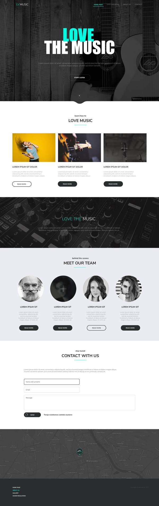
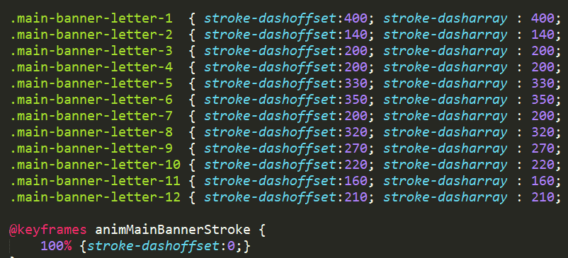
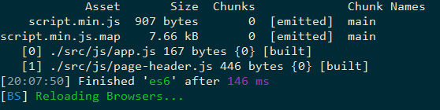
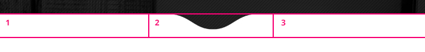
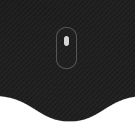

Sprawa ogólnie wygląda tak - jest do pocięcia layout. Wraz z takim cięciem pobawimy się gulpem, webpackiem, sasem, es6 i podobnymi rzeczami, które niektórzy wykorzystują w codziennej pracy.

Poniższy tekst jest opisem warsztatu, jaki kiedyś wykonywaliśmy na zajęciach. Dużo lania wody, dużo rzeczy, które każdy zna - swoiste podsumowanie. A może i między zdaniami jakaś głupotka a i ciekawa technika się znajdzie?

<!--more-->

## Przygotowanie do pracy
Layout o którym będzie mowa wygląda tak (klik by powiększyć):

Na górze mamy główny baner z wyśrodkowanymi elementami i nawigacją. Nawigacja będzie przypięta do góry ekranu i będzie się zmieniać przy skrolowaniu. Tekst w banerze będzie animowany. Dalej mamy jakieś kolumny, element z paralaxem, formularz kontaktowy i stylowaną google mapa. Z tym ostatnim po <a href="https://www.reddit.com/r/webdev/comments/8gkmeo/starting_google_maps_platform_arrives_with/">ostatnich decyzjach Googla</a> może być problem, ale to zobaczymy w praniu. Naszym celem jest zrobienie wszystkiego od początku do końca. Żadnego lania wody, realna praca.

Zaczynamy klasycznie od przygotowania repozytorium.

Przy naszej pracy skorzystamy z Gulpa - a dokładniej z templatki, którą <a href="http://domanart.pl/gulp">już opisywałem</a>. W poniższej wersji usunąłem obsługę HTML.

<a href="http://domanart.pl/dema/layout-music/templatka.zip" class="demo">Pobierz templatkę</a>

Nie jest to templatka do tworzenia aplikacji js-owych. Ale jeżeli chodzi o cięcie stron - sprawdza się całkiem dobrze - w moim odczuciu lepiej od <a href="https://prepros.io/">Preprosa</a> czy innych gotowych apek. Ale też nie jest ona żadnym wyznacznikiem. Sposobów podejścia do pracy z kodem są miliony. Pewnie każdy z was znajdzie lub znalazł swoje własne. Podobny efekt moglibyśmy uzyskać naginając domyślne działanie webpacka (chociaż w moim przypadku do cięcia webpack sprawdzał się gorzej od gulpa z webpackiem), używając samych skryptów npm, albo... moglibyśmy nie korzystać z żadnych takich narzędzi i pisać wszystko w czystym CSS i JS.
Niektórzy lubują się w tworzeniu i konfigurowaniu swoich własnych narzędzi, a inni po prostu odpalają programy takie jak <a href="https://prepros.io/">prepros</a>, <a href="https://codekitapp.com/">codekit</a> i zwyczajnie działają. Dla każdego co innego się sprawdzi. W ostateczności i tak kluczowe znaczenie ma rezultat.

Po ściągnięciu powyższej templatki otwórz w jej katalogu terminal (albo przejdź do tego katalogu w terminalu) i zainstaluj wszystkie niezbędne rzeczy poleceniem <code>npm i</code>.
Jak podczas instalacji nie pojawią się w konsoli terminala żadne czerwone błędy (żółte ostrzeżenia olej), odpal całość poleceniem <code>gulp</code>.

## Plan działania
W naszym przypadku layout jest klasyczny do bólu - <a href="http://www.novolume.co.uk/blog/all-websites-look-the-same/">wręcz wygląda tak samo jak inne</a>. Skorzystamy tutaj z różnych technik. Trochę flexboxa, trochę css grida, floaty zostawimy raczej w spokoju.

Całe stylowanie będziemy pisać w katalogu <strong>src/scss</strong> z odpowiednim podziałem na pliki. Skrypty JS będziemy pisać w katalogu <strong>src/js</strong> a ich kod będziemy dzielić na oddzielne pliki z użyciem modułów ES6. Obrobione CSS i JS zostaną wygenerowane w katalogach <strong>dist/css</strong> i <strong>dist/js</strong>.

Przy html nie będziemy stosować żadnego systemu templatek, dlatego kod html będzie się znajdował w docelowym katalogu <strong>dist</strong>.

## Pierwsze style
Zaczynamy od przygotowania pierwszych styli, które zaraz będziemy używać.
Nasza strona jest wycentrowana w poziomie. Szerokość treści właściwej na layoucie to 1395px w poziomie. Sporo. Zbyt sporo dla części urządzeń. W razie czego zmodyfikujemy.

W pliku <strong>src/scss/style.scss</strong> dodajemy pierwszy kod:

<pre><code class="language-scss">
//src/scss/style.scss

*, *:before, *:after {
    box-sizing: border-box;
}

html {
    font-size: 10px; //dzięki temu łatwiej będzie przeliczać px na rem
}

@media (min-width:1900px) {
    html {
        font-size: 11px;
    }
}

body {
    margin: 0; //domyślnie body ma marginesy
    min-width: 32rem;
    font-size: 1.6rem;
}

.container {
    max-width: 138rem;
    margin-left: auto;
    margin-right: auto;
    padding-left: 1.5rem;
    padding-right: 1.5rem;
}
</code></pre>

Na razie tyle. Resztę klas będziemy dodawać z czasem.

Te trzy pierwsze linijki - w dzisiejszych czasach niezbędne - występują też w <a href="https://css-tricks.com/inheriting-box-sizing-probably-slightly-better-best-practice/">nieco innej postaci</a>. Ja osobiście przyzwyczaiłem się do powyższego zapisu (a częstokroć stosuję samą *) i nigdy nie odczułem potrzeby jego zmiany.

Layout ma jeden główny kolor - "zielonkawo-morski" (yhy - raczej cyjan). Będziemy go wiele razy używać, więc stwórzmy z niego zmienną:

<pre data-line="3"><code class="language-scss">
//src/scss/style.scss

$color-main: #00FFE4;

*, *:before, *:after {
    box-sizing: border-box;
}

html {
    font-size: 10px;
}

@media (min-width:1900px) {
    html {
        font-size: 11px;
    }
}

body {
    margin: 0;
    min-width: 32rem;
    font-size: 1.6rem;
}

.container {
    max-width: 138rem;
    margin-left: auto;
    margin-right: auto;
    padding-left: 1.5rem;
    padding-right: 1.5rem;
}
</code></pre>

Na początku możemy pisać wszystko w jednym pliku. Dzięki temu w początkowej fazie dajesz sobie trochę spontanu, nie skupiasz się na pierdołach. Coś jak z malowaniem. Początkowo mażesz po płótnie. Jak już zacznie formować się jakaś bryła, można sobie to poukładać na odpowiednie warstwy. Podobnie tutaj. Jak już się rozpędzisz, przydało by się uporządkować pisany kod.

Ja osobiście pisząc stylowanie do tego projektu porządkowanie kodu rozpoczynałem trochę później niż my to zrobimy, ale wydaje mi się, że jak to zrobimy od razu, łatwiej będzie mi wam przedstawiać listingi, a i wam się w nich odnaleźć. Posprzątajmy więc powyższy kod.

Stylowanie ogólnego layoutu, klasy globalne przeniesiemy do oddzielnych plików, zmienne do osobnego. W pliku <strong>src/scss/style.scss</strong> pozostanie tylko importowanie plików. Pamiętaj by nazwy importowanych plików w stylach zaczynać od znaku "podłogi". Może przy zastosowanej templatce nie ma to znaczenia (bo tak ustawiony jest nasz gulp), ale są niektóre kompilatory, które dzięki tej konwencji nazywania importowanych scss nie będą nam generować osobnych plików <a href="http://sass-lang.com/guide#topic-4">css dla każdego takiego pliku scss</a>. My tak czy siak dostaniemy tylko jeden plik style.min.css, ale konwencję trzymajmy - ok?.

<pre><code class="language-scss">
//src/scss/_variables.scss

$color-main: #00FFE4;
</code></pre>

<pre><code class="language-scss">
//src/scss/components/_layout.scss

*, *:before, *:after {
    box-sizing: border-box;
}

html {
    font-size: 10px;
}

@media (min-width:1900px) {
    html {
        font-size: 11px;
    }
}

body {
    margin: 0;
    min-width: 32rem;
    font-size: 1.6rem;
}
</code></pre>

<pre><code class="language-scss">
//src/scss/components/_class.scss

.container {
    max-width: 138rem;
    margin-left: auto;
    margin-right: auto;
    padding-left: 1.5rem;
    padding-right: 1.5rem;
}
</code></pre>

<pre><code class="language-scss">
//src/scss/style.scss

@import "_variables.scss"; //zmienne zawsze pierwsze
@import "_class.scss";
@import "_layout.scss";
</code></pre>

Zanim przejdziemy już do właściwego stylowania, dodajmy do projektu 2 rzeczy.
Pierwsza z nich to odpowiedni font. W całym projekcie wykorzystywany jest <a href="https://fonts.google.com/specimen/Nunito+Sans">Nunito Sans</a>. Taki font możemy dodać na kilka sposobów. Możemy korzystając z różnych generatorów (np. <a href="https://www.fontsquirrel.com/tools/webfont-generator">Wiewiórek</a>, czy <a href="https://google-webfonts-helper.herokuapp.com/fonts">https://google-webfonts-helper.herokuapp.com/fonts</a>) wygenerować odpowiednie formaty plików (woff i woff2) i definicje dla css, a potem serwować je z własnego serwera.

Możemy też skorzystać z <a href="https://fonts.google.com/">Google Fonta</a> czy innych podobnych serwisów (TypeKit itp.). Opcja o wiele wygodniejsza, ale nie zawsze możliwa do użycia. Liczba fontów w Google Fonts jest skończona, a poza tym nie każdy klient pozwoli na pobieranie elementów jego strony z zewnętrznych serwerów. Pozostają też inne sprawy - np. bezpieczeństwa. To ogólnie nie są takie oczywiste rzeczy i wszystko zależy od danej sytuacji. Z jednej strony mamy artykuły takie jak <a href="https://csswizardry.com/2019/05/self-host-your-static-assets/">https://csswizardry.com/2019/05/self-host-your-static-assets/</a>, z drugiej pojawiają się <a href="https://stackoverflow.com/questions/26192897/should-i-use-bootstrap-from-cdn-or-make-a-copy-on-my-server">kontrargumenty</a>. Jeden powie tak, drugi inaczej. Zależy.

Wracając do naszej strony. U nas klienta nie ma, a i grafika można całować po rączkach, bo powyższy font w Google Fonts istnieje i ma się dobrze.

Przechodzimy więc na <a href="https://fonts.google.com/specimen/Nunito+Sans">stronę z tym fontem</a>. Klikamy na <strong>Select this font</strong> w prawym górnym rogu. Pojawia nam się na dole schowane okienko, które klikając rozwijamy. Od razu przechodzimy do zakładki <strong>Customize</strong>.
Kroje które wybierzemy - na razie strzelam - pewnie regular 400, bold 700. Więcej chyba nie trzeba, ale nie ma to teraz super znaczenia, bo spokojnie możemy potem dodać kolejne. Najważniejsza dla nas opcja to leżąca na dole tej zakładki <strong>Latin Extended</strong>, która określa litery jakie będziemy używać. My chcemy polskie litery - dlatego do zapamiętania - musimy wybrać <strong>Latin Extended</strong>.

Po wybraniu opcji wracamy do zakładki embed i widzimy 2 przygotowane dla nas kody.

Jeden to znacznik link który wstawimy do nagłówka strony. Drugi to już <strong>font-family</strong> jakiego mamy użyć w css. W okienku, które przed chwilą nam wyskoczyło w zakładce Embed istnieje jeszcze jedna metoda dołączenia definicji fontów - za pomocą @import w css. Metoda z linkiem w head <a href="https://stackoverflow.com/questions/12316501/including-google-web-fonts-link-or-import">działa lepiej</a> więc pozostańmy przy niej.
Ok. Dodajmy ten kod do html (przed nasze style) i użyjmy ten krój dla body:

<pre data-line="11"><code class="language-html">
&lt;!-- dist/index.html -->
&lt;!doctype html>
&lt;html class="no-js" lang="en">
    &lt;head>
        &lt;meta charset="utf-8">
        &lt;meta http-equiv="x-ua-compatible" content="ie=edge">
        &lt;title>Love the music&lt;/title>
        &lt;meta name="description" content="">
        &lt;meta name="viewport" content="width=device-width, initial-scale=1, shrink-to-fit=no">
        &lt;link rel="apple-touch-icon" href="apple-touch-icon.png">
        &lt;link href="https://fonts.googleapis.com/css?family=Nunito+Sans:100,400,700&amp;subset=latin-ext" rel="stylesheet">
        &lt;link rel="stylesheet" href="css/style.min.css">
    &lt;/head>
    &lt;body>

        &lt;script src="js/script.min.js">&lt;/script>
    &lt;/body>
&lt;/html>
</code></pre>

<pre data-line="15"><code class="language-scss">
//src/scss/_layout.scss

*, *:before, *:after {
    box-sizing: border-box;
}

html {
    font-size: 10px;
}

body {
    margin: 0;
    min-width: 32rem;
    font-size: 1.6rem;
    font-family: 'Nunito Sans', sans-serif;
}
</code></pre>

Zanim przejdziemy dalej spójrz na adres linka, który właśnie wstawiliśmy. Spokojnie możesz do niego dopisać z palca grubości czcionki (zostaną użyte tylko te, które dany font oferuje), czy nawet dodawać zupełnie nowe kroje (rozdzielając je znakiem |). Wystarczy, że na Google font wybierzesz kilka fontów by zobaczyć jak taki link jest budowany.

    Tak naprawdę znak | w powyższym urlu nie jest <a href="https://stackoverflow.com/questions/22466913/google-fonts-url-break-html5-validation-on-w3-org">popranym znakiem</a>. Poprawny zapis znaku | w powyższym urlu to <code>%7C</code>.
    Zapewne jest to celowe działanie ze strony Googla, bo łatwiej wzrokowo wynaleźć w takim linku znak | niż jakieś dziwne kody.
    Czy bym się tym przejmował? Co zyskasz jeżeli twój dokument będzie przechodził na 100% testy stron typu page speeed czy walidatora na w3.org? W zasadzie nie za wiele. Sporo stron z pierwszych miejsc Googla takich testów nie przechodzi a do 100% im baaaardzo daleko. I co? I nic. Dalej sobie spokojnie siedzą na pierwszych miejscach i patrzą się z uśmiechem jak plankton walczy o miejsca poza podium.
    "A bo ja bym chciał by Internet był lepszy". To jedz warzywa.

Jak skopiujesz ten adres i otworzysz go w oknie przeglądarki, zobaczysz, że prowadzi on na stylowanie, w których znajdują się deklaracje fontów których chcemy użyć. Podobne deklaracje byśmy dostali gdybyśmy skorzystali z <a href="https://www.fontsquirrel.com/tools/webfont-generator">generatora Font Squirell</a>. Tutaj jednak są one bardziej zoptymalizowane, bo dostosowane do tego co obsługuje przeglądarka. <a href="https://developers.google.com/fonts/docs/technical_considerations#what_is_the_google_fonts_api_serving">Google wykrywa jakie formaty zaserwować</a> dla danej przeglądarki (a jak to robi? - pewnie <a href="http://kursjs.pl/kurs/ajax/ajax.php#http">tak</a>) i takie generuje dla nas definicje. Zacnie.

Poza fontem dodajmy jeszcze jedną rzecz - normalizację stylów.
Normalnie przeglądarki wyświetlają niektóre elementy na własną modłę. Aby sobie z tym poradzić możemy zastosować <strong>jedno z 3 podejść</strong>.

Pierwsze z nich to użycie tak zwanego <a href="https://cssreset.com/what-is-a-css-reset/">resetu</a>, czyli przygotowanych przez ludzików zestawu styli, które resetują nam stylowanie przeglądarki. Oznacza to, że po dołączeniu takich styli do naszej strony (przed nasze style) wszystkie elementy zostaną "wyczyszczone". Nagłówki będą wyglądać jak zwykły tekst, listy nie będą miały marginesów, paddingów czy kropek itp. Niektóre elementy potrzebują specjalnego podejścia (o którym w wielu przypadkach człowiek nawet nie wie), dlatego o wiele lepiej zastosować tutaj <a href="http://html5doctor.com/html-5-reset-stylesheet/">gotowce</a>.

Drugim podejściem jest użycie <a href="https://github.com/h5bp/html5-boilerplate/blob/master/dist/css/normalize.css">normalize.css</a>. Jest to podobne podejście do resetu. Tym razem jednak zamiast czyścić wszystko do zera, starają się ujednolicić tak by w jak największej liczbie przeglądarek  elementy wyświetlały się podobnie (co nie jest w 100% osiągalne, ale próbować warto).

Są to dwa najbardziej popularne sposoby radzenia sobie z domyślnymi różnicami w wyświetlaniu elementów przez przeglądarki. Który wybrać? Osobiście gdybym miał wybierać wolałbym zostać przy normalize. W moim odczuciu normalize jest też bardziej "page flow friendly" (cokolwiek by to nie znaczyło) - ale w ogólnym rozrachunku wybranie podejścia zależy od naszych preferencji i tego z czym nam się lepiej pracuje.

Istnieją też inne <a href="https://www.youtube.com/watch?v=L4wPV-K1lNI">rozwiązania</a>. Dla przykładu <a href="http://jonathantneal.github.io/sanitize.css/">sanitize.css</a>, który jest bardzo podobny do normalize (nawet zawiera kawałki jego kodu) ale dodaje też kilka użytecznych styli (np. box-sizing). Ja tam w życiu sanitize nie użyłem...

No ale powiedziałem o 3 podejściach. Trzecie - najprostsze - to nie używanie żadnego z powyższych. Ostatnimi czasy moje ulubione. W większości przypadków nie potrzeba nadpisywać podstawowego zachowania elementów, a nawet jeżeli zdarzy się taka potrzeba, bardzo łatwo indywidualnie do tego podejść (korzystając z ostatnimi czasy marginalizowanej umiejętności - wyszukania w necie).

No dobrze. Powiedzmy jednak, że w tym przypadku dla treningu skorzystamy z normalize.css.

Pobieramy więc taki plik z <a href="https://github.com/h5bp/html5-boilerplate/blob/master/dist/css/normalize.css">https://github.com/h5bp/html5-boilerplate/blob/master/dist/css/normalize.css</a>. Wrzucamy go do katalogu <strong>src/scss/partials</strong>. Musimy dodatkowo zmienić jego rozszerzenie na scss i zaimportować taki plik w style.scss. Jeżeli zaimportujemy ten plik bez zamiany rozszerzenia na scss, nie zostanie on skompilowany i zminimalizowany, a tylko jego zawartość zostanie bezczelnie doklejona do reszty zminimalizowanych styli.

<pre><code class="language-scss">
//src/scss/style.scss

@import "_variables.scss";

@import "partials/_normalize.scss"; //wpierw normalizujemy, potem dopiero piszemy nasze style
@import "components/_class.scss";
@import "components/_layout.scss";
</code></pre>

Ja takie rzeczy jak normalize wrzucam zazwyczaj w swoją templatkę i zostawiam na wieki w spokoju. Ewentualnie raz na jakiś czas zmieniam na nowszą wersję czy dodaje do takiej kolekcji stałych styli dodatkowe rzadko zmieniane stylowania - np. dla druku - ale tym zajmiemy się później.
Niektórzy stosują też inne podejście - np. ściągając takie normalize za pomocą npm i dopiero wtedy je dołączają.

## Góra strony
Przechodzimy do stylowania strony.
Zaczynamy od nagłówka strony i głównego banera.

<pre><code class="language-html">
&lt;!-- dist/index.html -->
&lt;body>

&lt;header class="page-header">
    &lt;div class="container">
        &lt;h1 class="page-header-logo">
            &lt;a href="/">
                &lt;img src="./images/logo.png" alt="Love the music">
            &lt;/a>
        &lt;/h1>

        &lt;nav class="page-nav">
            &lt;ul class="page-nav-list">
                &lt;li>&lt;a href="">Home page&lt;/a>&lt;/li>
                &lt;li>&lt;a href="">Music&lt;/a>&lt;/li>
                &lt;li>&lt;a href="">About us&lt;/a>&lt;/li>
                &lt;li>&lt;a href="">Contact&lt;/a>&lt;/li>
            &lt;/ul>
        &lt;/nav>
    &lt;/div>
&lt;/header>

&lt;section class="main-banner">
&lt;/section>
</code></pre>

Na górze jest nagłówek strony z logiem i nawigacją. Poniżej znajdzie się <strong>.main-banner</strong> gdzie wrzucimy animowany główny tytuł strony, tekst i jakiś button. Elementy nagłówka centrujemy w poziomie za pomocą wcześniej przygotowanej klasy .container.

Element <strong>.main-banner</strong> ma na layoucie wysokość 1050px. To sporo - na bank za dużo. Jeżeli ktoś otworzy taki layout na laptopie ze średnią rozdzielczością zobaczy co najwyżej połowę tego elementu. Z tym też będziemy musieli podziałać. Spróbujmy ustawić taki banner na całą wysokość ekranu (100vh), ewentualnie dodać mu jakąś minimalną wysokość.
Dodajemy do styli plik <strong>_main-banner.scss</strong> (importujemy go też w stylach!):

<pre><code class="language-scss">
//src/scss/components/_main-banner.scss

.main-banner {
    min-height: 800px;
    height: calc(100vh + 5rem); //na dole banera jest stopka z dziura o wysokości 50px
    background: url(../images/main-banner.jpg);
    background-size: cover;
    background-repeat: no-repeat;
    background-position: center bottom;
    background-attachment: fixed;
}
</code></pre>

Jak zobaczysz, baner może i jakoś wygląda, ale wygląd ten jest zupełnie inny niż na layoucie. Przede wszystkim jest za jasny. Taką dostaliśmy grafikę. Musimy ją przyciemnić dowolną techniką.

Pierwszą z nich to użycie programu graficznego - najprostsza a i dająca często najlepsze efekty (zależy od tego jak chcemy przyciemniać, bo za pomocą CSS nie jesteśmy w stanie uzyskać każdego rodzaju przyciemnienia).

Druga z technik polega na użyciu :after/:before dla którego dalibyśmy przezroczyste ziemne tło, pozycjonowanie absolutne, wymiary na cały baner, opacity itp.

Trzecia - ta, którą wybierzemy to nałożenie na <strong>.main-banner</strong> <a href="https://developer.mozilla.org/en-US/docs/Web/CSS/CSS_Backgrounds_and_Borders/Using_multiple_backgrounds">kilku teł</a>. Podobnie jak np. przy box-shadow dla background możemy podawać kilka teł rozdzielając je przecinkiem.

Zachowują się one jak warstwy w Photoshopie - jeżeli tło jest wyżej w kodzie, wtedy jest nakładane na inne tła. Na nasz baner nałożymy grafikę tła (tą co powyżej), a na nią kolejny obrazek - linear-gradient. Nie możemy tutaj użyć zwykłego koloru, bo kolor to nie image.

<pre data-line="5,11"><code class="language-scss">
//src/scss/components/_main-hero.scss

.main-banner {
    $c1 : rgba(black, 0.6); //kolor przyciemnienia

    min-height: 800px;
    height: calc(100vh + 5rem);
    background-color: #202020;
    background-image:
        linear-gradient($c1, $c1),
        url(../images/main-banner.jpg);
    background-size: cover;
    background-repeat: repeat, no-repeat;
    background-position: center bottom;
    background-attachment:scroll, fixed;
}
</code></pre>

Powyższy kod moglibyśmy też zapisać za pomocą tak zwanych <strong>short-hand</strong>, czyli zbiorczych definicji:

<pre><code class="language-js">
.main-banner {
    $c1 : rgba(black, 0.6);

    min-height: 800px;
    height: calc(100vh + 5rem);
    background-color: #202020;
    background:
        linear-gradient($c1, $c1) scroll,
        url(../images/main-banner.jpg) center bottom / cover no-repeat fixed;
}
</code></pre>

Ewentualnie możemy dodać do tego lekkie przyciemnienie po bokach - taka mini winietka, którą też uzyskamy za pomocą gradientu:

<pre data-line="12-17"><code class="language-scss">
//src/scss/components/_main-hero.scss

.main-banner {
    $c1 : rgba(black, 0.6);

    min-height: 800px;
    height: calc(100vh + 5rem);
    background-color: #202020;

    background-image:
        linear-gradient($c1, $c1),
        linear-gradient(90deg, rgba(#000, 0.8), rgba(#000, 0.1), rgba(#000, 0.8)),
        url(../images/main-banner.jpg);
    background-size: cover;
    background-repeat: repeat, repeat, no-repeat;
    background-position: center bottom;
    background-attachment:scroll, fixed, fixed;
}
</code></pre>

## Nagłówek strony i nawigacja
Ok tło już mamy. Układamy więc elementy. Na górze naszej strony jest nagłówek strony - <strong>.page-header</strong>. Ostylujmy go.
Tworzymy plik <strong>_page-header.scss</strong> z poniższym kodem i dołączamy go do styli:

<pre><code class="language-scss">
//src/scss/components/_page-header.scss

.page-header {
    position: fixed; //przypięty do góry
    top: 0;
    left: 0;
    width: 100%;
    z-index: 100;
    padding: 1.5rem 0;
}
.page-header .container {
    width: 100%;
    display: flex;
    justify-content: space-between;
    align-items: center;
}
.page-header-logo {
    display: block;
}
.page-header-logo img {
    max-width: 12rem;
    height:auto;
    display: block;
}

/* na małych ekranach nie ma sensu przyklejać nagłówka - tracimy cenne miejsce na ekranie,
a i przy powiększaniu paluchami dziwnie to wszystko się zachowuje */
@media (max-width:760px) {
    .page-header {
        position: absolute;
    }

    .page-header .container {
        flex-direction: column;
    }
}
</code></pre>

W sumie wcale tutaj nie potrzebujemy tego <strong>.container</strong>. Można by użyć grida i po bokach dać automatycznie dopasowujące się miejsca. Można, ale nie trzeba. Mieszanie różnych technik to dobra sprawa. Jak w życiu. Raz warzywa, raz schabowy.

Na nagłówku strony znajduje się logo <strong>.page-logo</strong> i główna nawigacja <strong>.page-nav</strong>. Dla <strong>.page-logo</strong> nie potrzebujemy na razie stylowania - ewentualnie później dodamy. Skupmy się teraz na nawigacji. Tworzymy plik <strong>_page-nav.scss</strong>:

<pre><code class="language-scss">
//src/scss/components/_page-nav.scss
.page-nav {
    margin: 0;
    padding: 0;
    list-style: none;
}
.page-nav-list {
    list-style: none;
    padding: 0;
    margin:0;
}
.page-nav-list li {
    display: inline-block;
}
.page-nav-list a {
    text-transform: uppercase;
    font-weight: 700;
    text-decoration: none;
    padding: 1rem 2rem;
    color: rgba(#fff, 0.8);
    position: relative;
    transition: 0.5s all;
}

@media (max-width:47.5em) {
    .page-nav-list {
        text-align: center;
    }
}
@media (max-width:560px) {
    .page-nav-list li {
        margin-bottom: 2.5rem;
    }
}
</code></pre>

Pobawmy się trochę. Na layoucie jest zaznaczony link po najechaniu. Ma on na dole podkreślenie. Jeżeli damy tutaj zwykłe text-decoration:underline czy border-bottom, to nikogo nie zachwycimy. Użyjmy tutaj pseudoelementu i jakiejś animacji. Kreska będzie więc wypozycjonowana absolutnie do dolnej krawędzi linka, a jej pozycje left i right będą ustawione na 50% (czyli kreska nie będzie miała szerokości). Po najechaniu wystarczy zanimować te pozycje:

<pre data-line="7,13-15,25-26"><code class="language-scss">
.page-nav-list a {
    text-transform: uppercase;
    font-weight: 700;
    text-decoration: none;
    padding: 1rem 2rem;
    color: rgba(#fff, 0.8);
    position: relative;
    transition: 0.5s all;
}
.page-nav-list a::before {
    content:'';
    position: absolute;
    left: 50%;
    right: 50%;
    bottom: 0;
    opacity: 0;
    height: 2px;
    background: $color-main;
    transition: 0.4s all;
}
.page-nav-list a:hover {
    color: $color-main;
}
.page-nav-list a:hover::before {
    left: 1.5rem;
    right: 1.5rem;
    opacity: 1;
}
</code></pre>

Pewnie zauważyłeś, że nie używam <a href="https://sass-lang.com/guide#topic-3">zagnieżdżeń w sass</a> i znaku &amp;. Ostatnimi czasy znak ten coraz mniej się pojawiają w moich stylach - w zasadzie tylko w wyszukanych sytuacjach jak stylowanie elementów w formularzach (co w tej sytuacji bardzo zaoszczędza kodu - ale o tym pogadamy gdy zajmiemy się formularzem).

Raczej nie używam go do budowania nazw klas. Może to kwestia przyzwyczajenia, a może nie chcę tracić możliwości wyszukiwania. Gdy budujesz klasy z wykorzystaniem <a href="https://css-tricks.com/snippets/sass/bem-mixins/">mixinów</a> czy znaku &amp; nie możesz potem ich tak prosto wyszukiwać w projekcie. Zyskujesz niby szybkość w pisaniu, ale tracisz wyszukiwanie - coś za coś. Sourcemapy czasami mogą zawieść (albo może ich nie być), a dobra struktura czasami nie chce z nami współpracować - bywa różnie. A może też jest inny powód - ja po prostu lubię klasyczny CSS, gdzie czasami małe odskoki od ultra płaskiej <a href="https://developer.mozilla.org/en-US/docs/Web/CSS/Specificity">css specyfity</a> nie jest niczym strasznym. Znowu to powtórzę - każdy z nas wypracowuje swoje podejście (też grupowo-teamowo), które ma pomóc w sprawniejszej pracy nad projektem.

## Elementy w bannerze
Nagłówek strony jest przyklejony do góry strony (fixed), więc tak naprawdę nie wpływa na resztę strony (w tym banner). Nasz baner podzielimy za pomocą grida na odpowiednie miejsca. Na górze zostanie miejsce puste które normalnie zajął by nagłówek, potem miejsce na środek banera (tytuł, tekst i link), a na dole miejsce na ikonę przewijania i tą dziwnie wyciętą dziurę na dole banera.
Spokojnie można by tutaj też zastosować inne techniki. Dla przykładu wycentrować główną treść banera flexem, a ikonę przewijania i stopkę z dziurą dać na dół pozycjonowaniem absolutnym względem .main-banner.

<pre data-line="24-32"><code class="language-scss">
//src/scss/components/_main-banner.scss

.main-banner {
    $c1 : rgba(black, 0.8);
    $c2 : rgba(black, 0.85);

    min-height:calc(100vh + 5rem);
    background-color: #202020;
    background-image:
        linear-gradient(
            -45deg,
            $c1 0%,  $c1 25%,
            $c2 25%, $c2 50%,
            $c1 50%, $c1 75%,
            $c2 75%, $c2 100%
        ),
        linear-gradient(90deg, rgba(#000, 0.4), rgba(#000, 0.1), rgba(#000, 0.4)),
        url(../images/main-banner.jpg);
    background-size: cover;
    background-repeat: repeat, repeat, no-repeat;
    background-position: center bottom;
    background-attachment:scroll, fixed, fixed;

    display: grid;

    //nagłówek, środek banera, ikona przewijania, stopka z dziurą
    grid-template-rows: 9.6rem 1fr 8rem 5rem;
    grid-template-areas:
        "banner-header"
        "banner-content"
        "banner-icon"
        "banner-footer";
}
</code></pre>

Na małych ekranach nawigacja trafi pod logo i może się zawijać. Tak czy siak trzeba dla niej zostawić trochę więcej miejsca:

<pre><code class="language-scss">
//src/scss/components/_main-banner.scss

.main-banner {
    ...
}

@media (max-width:760px) {
    .main-banner {
        grid-template-rows: 24rem 1fr 8rem 5rem;
    }
}
</code></pre>

Przechodzimy do stylowania środka tego baneru. Zaczniemy od łatwych rzeczy jak button i tekst:

<pre><code class="language-html">
&lt;section class="main-banner">
    &lt;div class="main-banner-content">
        &lt;h2 class="main-banner-title">
            &lt;!-- tutaj wstawimy główny tekst jako svg -->
        &lt;/h2>

        &lt;div class="main-banner-text">
            Lorem ipsum dolor sit amet, consectetur adipisicing elit. Est id obcaecati ipsam nisi nesciunt voluptatibus molestiae minus quibusdam et illo!
        &lt;/div>

        &lt;a href="" class="main-banner-button">
            Start listen
        &lt;/a>
    &lt;/div>
&lt;/section>
</code></pre>

Środek bannera powinien być wycentrowany w pionie, dlatego dla <strong>.main-banner-content</strong> uzyjemy flexboxa i wrzucimy go do odpowiedniego miejsca w gridzie:

<pre><code class="language-scss">
//src/scss/components/_main-banner.scss

.main-banner {
    ...
}

.main-banner-content {
    grid-area: banner-content;

    display: flex;
    justify-content: center;
    align-items: center;
    flex-direction: column;
}
</code></pre>

Pozostaje nadać wygląd elementom:

<pre><code class="language-scss">
//src/scss/components/_main-banner.scss

.main-banner {
    ...
}

.main-banner-content {
    ...
}

.main-banner-title {
    width: 70%;
    max-width: 75.2rem;
}
.main-banner-text {
    margin-top: 3.2rem;
    max-width: 100rem;
    padding-left: 1.6rem;
    padding-right: 1.6rem;
    font-size: 1.8rem;
    color: rgba(#fff, .35);
    text-align: center;
}

.main-banner-button {
    margin-top: 6rem;
    font-size: 1.6rem;
    font-weight: 500;
    text-decoration: none;
    text-transform: uppercase;
    color: #fff;
    padding:2.2rem 6rem;
    border-radius: 4.8rem;
    border: 1px solid rgba(#fff, 0.2);
    background: rgba(#fff, 0.05);
    transition: 0.5s all;
}
.main-banner-button:hover {
    background: $color-main;
    color: #222;
    border-color: $color-main;
    box-shadow:0 0 0 0.5rem rgba($color-main, 0.2);
}
</code></pre>

## Tekst w banerze
Główny tekst w banerze przygotowałem jako svg w Adobe Ilustratorze. Sam tekst po prostu napisałem jakimś prostym fontem.
Potem litery zamieniłem na krzywe (Object->Expand), a następnie rozdzieliłem je na poszczególne litery (Object->Ungroup). Pozostało potem tylko przycięcie Artbordu tak, by obszar grafiki nie zajmował zbyt dużo miejsca.
Gotową grafikę zapisałem (File->Save as) jako svg, otrzymując poniższy kod:

<pre><code class="language-html">
&lt;?xml version="1.0" encoding="utf-8"?>
&lt;!-- Generator: Adobe Illustrator 22.0.1, SVG Export Plug-In . SVG Version: 6.00 Build 0)  -->
&lt;svg version="1.1" id="Layer_1" xmlns="http://www.w3.org/2000/svg" xmlns:xlink="http://www.w3.org/1999/xlink" x="0px" y="0px"
     viewBox="0 0 680 265" style="enable-background:new 0 0 680 265;" xml:space="preserve">
&lt;style type="text/css">
    .st0{fill:#FFEC65;stroke:#FFEC65;stroke-miterlimit:10;}
    .st1{fill:#00FBE0;stroke:#00FBE0;stroke-miterlimit:10;}
&lt;/style>
&lt;path class="st0" d="M330.9,90.2c0,13.4-0.3,22.9-0.9,28.4c-0.7,5.6-2.6,10.6-5.9,15.3c-3.3,4.7-7.8,8.2-13.5,10.6 c-5.7,2.5-12.3,3.7-19.8,3.7c-7.1,0-13.6-1.1-19.2-3.5c-5.7-2.4-10.3-5.8-13.7-10.5c-3.4-4.7-5.5-9.8-6.2-15.2 c-0.7-5.5-0.9-15.1-0.9-28.8V67.4c0-13.4,0.3-22.9,0.9-28.4c0.7-5.6,2.6-10.6,5.9-15.3c3.3-4.7,7.8-8.2,13.5-10.6s12.3-3.7,19.8-3.7 c7.1,0,13.6,1.1,19.2,3.5c5.7,2.4,10.3,5.8,13.7,10.5c3.4,4.7,5.5,9.8,6.2,15.2c0.7,5.5,0.9,15.1,0.9,28.8L330.9,90.2L330.9,90.2z  M296.2,46.4c0-6.2-0.4-10.2-1-11.9c-0.7-1.7-2.1-2.6-4.3-2.6c-1.8,0-3.2,0.7-4.2,2.1c-0.9,1.4-1.4,5.5-1.4,12.3v62.2 c0,7.7,0.3,12.5,0.9,14.3s2.1,2.8,4.4,2.8c2.4,0,3.9-1,4.6-3.1c0.7-2.1,0.9-7,0.9-14.9L296.2,46.4L296.2,46.4z"/>
&lt;path class="st0" d="M432.1,12.2h57.8v26.7h-23.2v25.3h21.7v25.4h-21.7v29.4h25.5v26.7H432L432.1,12.2L432.1,12.2z"/>
&lt;path class="st1" d="M90,132.7v24.1H71.4v96.5H40v-96.5H21.4v-24.1H90z"/>
&lt;path class="st1" d="M169.2,132.7v120.6h-31.3v-50.6h-9.4v50.6H97.1V132.7h31.3v43.1h9.4v-43.1H169.2z"/>
&lt;path class="st1" d="M181.8,132.7h52.3v24.1h-20.9v22.9h19.6v23h-19.6v26.5h23v24.1h-54.3L181.8,132.7L181.8,132.7z"/>
&lt;path class="st1" d="M368.9,132.7v120.6h-27.5v-81.4l-10.9,81.4H311l-11.5-79.6v79.6h-27.5V132.7h40.6c1.2,7.2,2.5,15.8,3.7,25.6 l4.5,30.7l7.2-56.3H368.9z"/>
&lt;path class="st1" d="M452.8,132.7v80.7c0,9.1-0.3,15.6-0.9,19.3c-0.6,3.7-2.4,7.5-5.3,11.4c-2.9,3.9-6.8,6.8-11.6,8.8 c-4.7,2-10.4,3-16.9,3c-7.2,0-13.6-1.2-19.1-3.6c-5.5-2.4-9.6-5.5-12.3-9.3s-4.4-7.9-4.8-12.1c-0.5-4.3-0.8-13.2-0.8-26.8v-71.3 h31.3v90.4c0,5.2,0.3,8.6,0.9,10.1c0.6,1.4,1.7,2.2,3.4,2.2c2,0,3.2-0.8,3.8-2.4s0.9-5.4,0.9-11.4v-88.9L452.8,132.7L452.8,132.7z" />
&lt;path class="st1" d="M531.4,169.3h-29.2v-8.9c0-4.2-0.4-6.8-1.1-8c-0.8-1.1-2-1.7-3.7-1.7c-1.9,0-3.3,0.8-4.3,2.3 c-0.9,1.5-1.4,3.9-1.4,7c0,4,0.6,7,1.6,9.1c1,2,4,4.5,8.8,7.4c14,8.3,22.8,15.1,26.4,20.4c3.6,5.3,5.4,13.9,5.4,25.7 c0,8.5-1,14.9-3,19c-2,4.1-5.9,7.5-11.7,10.3c-5.8,2.8-12.4,4.2-20.1,4.2c-8.4,0-15.6-1.6-21.5-4.7c-5.9-3.1-9.8-7.2-11.7-12.2 c-1.8-4.9-2.8-11.9-2.8-20.9v-7.9h29.2V225c0,4.6,0.4,7.4,1.2,8.7c0.9,1.3,2.3,1.9,4.4,1.9s3.6-0.9,4.7-2.5c1-1.6,1.5-4.1,1.5-7.3 c0-7.1-0.9-11.8-2.9-14c-2-2.2-6.8-5.8-14.6-10.9c-7.8-5.1-12.9-8.9-15.5-11.2c-2.6-2.4-4.7-5.6-6.3-9.7c-1.7-4.1-2.5-9.4-2.5-15.8 c0-9.2,1.1-16,3.5-20.2s6.2-7.6,11.4-10c5.2-2.4,11.6-3.6,19.1-3.6c8.2,0,15.1,1.3,20.8,4c5.7,2.7,9.5,6,11.4,10 c1.9,4,2.8,10.8,2.8,20.3L531.4,169.3L531.4,169.3z"/>
&lt;path class="st1" d="M575.2,132.7v120.6h-31.3V132.7H575.2z"/>
&lt;path class="st1" d="M661,185.2h-31.3v-21c0-6.1-0.4-9.9-1-11.4c-0.7-1.5-2.2-2.3-4.5-2.3c-2.6,0-4.2,0.9-4.9,2.8 c-0.7,1.8-1,5.8-1,11.9v56c0,5.9,0.4,9.7,1,11.5c0.7,1.8,2.3,2.7,4.7,2.7s3.9-0.9,4.6-2.7c0.8-1.8,1-6,1-12.6v-15.2h31.3v4.7 c0,12.4-0.9,21.4-2.7,26.6c-1.8,5.2-5.7,9.8-11.7,13.8c-6.1,3.9-13.5,5.9-22.3,5.9c-9.2,0-16.7-1.7-22.7-5c-6-3.3-9.9-8-11.9-13.8 c-1.9-5.9-2.9-14.7-2.9-26.6v-35.2c0-8.6,0.3-15.2,0.9-19.6c0.6-4.4,2.4-8.5,5.3-12.5c2.9-4,7-7.2,12.3-9.5c5.2-2.3,11.3-3.4,18-3.4 c9.2,0,16.9,1.8,22.9,5.3c6,3.6,10,8,11.9,13.4c1.9,5.3,2.8,13.6,2.8,24.9v11.5H661z"/>
&lt;path class="st0" d="M224.8,12.2v106.6h21v26.7H190V12.2H224.8z"/>
&lt;path class="st0" d="M426.2,12.2l-17.7,133.3h-52.6L335.9,12.2h36.6c4.3,36.8,7.3,67.8,9.1,93.2c1.8-25.6,3.7-48.4,5.7-68.4 l2.4-24.8C389.7,12.2,426.2,12.2,426.2,12.2z"/>
&lt;/svg>
</code></pre>

Następnie otworzyłem otrzymany svg w edytorze tekstowym i edytowałem otrzymany kod troszkę go oczyszczając i zmieniając domyślnie nadane klasy które miał każdy path. Stylowanie przeniesiemy do css, więc też je usunąłem. Gotowy kod svg ma postać:

<pre><code class="language-html">
&lt;svg version="1.1" xmlns="http://www.w3.org/2000/svg" xmlns:xlink="http://www.w3.org/1999/xlink" x="0px" y="0px" viewBox="0 0 680 265" style="enable-background:new 0 0 680 265;" xml:space="preserve">
    &lt;path class="main-banner-letter-type-1 main-banner-letter-2"  d="M330.9,90.2c0,13.4-0.3,22.9-0.9,28.4c-0.7,5.6-2.6,10.6-5.9,15.3c-3.3,4.7-7.8,8.2-13.5,10.6 c-5.7,2.5-12.3,3.7-19.8,3.7c-7.1,0-13.6-1.1-19.2-3.5c-5.7-2.4-10.3-5.8-13.7-10.5c-3.4-4.7-5.5-9.8-6.2-15.2 c-0.7-5.5-0.9-15.1-0.9-28.8V67.4c0-13.4,0.3-22.9,0.9-28.4c0.7-5.6,2.6-10.6,5.9-15.3c3.3-4.7,7.8-8.2,13.5-10.6s12.3-3.7,19.8-3.7 c7.1,0,13.6,1.1,19.2,3.5c5.7,2.4,10.3,5.8,13.7,10.5c3.4,4.7,5.5,9.8,6.2,15.2c0.7,5.5,0.9,15.1,0.9,28.8L330.9,90.2L330.9,90.2z  M296.2,46.4c0-6.2-0.4-10.2-1-11.9c-0.7-1.7-2.1-2.6-4.3-2.6c-1.8,0-3.2,0.7-4.2,2.1c-0.9,1.4-1.4,5.5-1.4,12.3v62.2 c0,7.7,0.3,12.5,0.9,14.3s2.1,2.8,4.4,2.8c2.4,0,3.9-1,4.6-3.1c0.7-2.1,0.9-7,0.9-14.9L296.2,46.4L296.2,46.4z"/>
    &lt;path class="main-banner-letter-type-1 main-banner-letter-4"  d="M432.1,12.2h57.8v26.7h-23.2v25.3h21.7v25.4h-21.7v29.4h25.5v26.7H432L432.1,12.2L432.1,12.2z"/>
    &lt;path class="main-banner-letter-type-2 main-banner-letter-5"  d="M90,132.7v24.1H71.4v96.5H40v-96.5H21.4v-24.1H90z"/>
    &lt;path class="main-banner-letter-type-2 main-banner-letter-6"  d="M169.2,132.7v120.6h-31.3v-50.6h-9.4v50.6H97.1V132.7h31.3v43.1h9.4v-43.1H169.2z"/>
    &lt;path class="main-banner-letter-type-2 main-banner-letter-7"  d="M181.8,132.7h52.3v24.1h-20.9v22.9h19.6v23h-19.6v26.5h23v24.1h-54.3L181.8,132.7L181.8,132.7z"/>
    &lt;path class="main-banner-letter-type-2 main-banner-letter-8"  d="M368.9,132.7v120.6h-27.5v-81.4l-10.9,81.4H311l-11.5-79.6v79.6h-27.5V132.7h40.6c1.2,7.2,2.5,15.8,3.7,25.6 l4.5,30.7l7.2-56.3H368.9z"/>
    &lt;path class="main-banner-letter-type-2 main-banner-letter-9"  d="M452.8,132.7v80.7c0,9.1-0.3,15.6-0.9,19.3c-0.6,3.7-2.4,7.5-5.3,11.4c-2.9,3.9-6.8,6.8-11.6,8.8 c-4.7,2-10.4,3-16.9,3c-7.2,0-13.6-1.2-19.1-3.6c-5.5-2.4-9.6-5.5-12.3-9.3s-4.4-7.9-4.8-12.1c-0.5-4.3-0.8-13.2-0.8-26.8v-71.3 h31.3v90.4c0,5.2,0.3,8.6,0.9,10.1c0.6,1.4,1.7,2.2,3.4,2.2c2,0,3.2-0.8,3.8-2.4s0.9-5.4,0.9-11.4v-88.9L452.8,132.7L452.8,132.7z" />
    &lt;path class="main-banner-letter-type-2 main-banner-letter-10" d="M531.4,169.3h-29.2v-8.9c0-4.2-0.4-6.8-1.1-8c-0.8-1.1-2-1.7-3.7-1.7c-1.9,0-3.3,0.8-4.3,2.3 c-0.9,1.5-1.4,3.9-1.4,7c0,4,0.6,7,1.6,9.1c1,2,4,4.5,8.8,7.4c14,8.3,22.8,15.1,26.4,20.4c3.6,5.3,5.4,13.9,5.4,25.7 c0,8.5-1,14.9-3,19c-2,4.1-5.9,7.5-11.7,10.3c-5.8,2.8-12.4,4.2-20.1,4.2c-8.4,0-15.6-1.6-21.5-4.7c-5.9-3.1-9.8-7.2-11.7-12.2 c-1.8-4.9-2.8-11.9-2.8-20.9v-7.9h29.2V225c0,4.6,0.4,7.4,1.2,8.7c0.9,1.3,2.3,1.9,4.4,1.9s3.6-0.9,4.7-2.5c1-1.6,1.5-4.1,1.5-7.3 c0-7.1-0.9-11.8-2.9-14c-2-2.2-6.8-5.8-14.6-10.9c-7.8-5.1-12.9-8.9-15.5-11.2c-2.6-2.4-4.7-5.6-6.3-9.7c-1.7-4.1-2.5-9.4-2.5-15.8 c0-9.2,1.1-16,3.5-20.2s6.2-7.6,11.4-10c5.2-2.4,11.6-3.6,19.1-3.6c8.2,0,15.1,1.3,20.8,4c5.7,2.7,9.5,6,11.4,10 c1.9,4,2.8,10.8,2.8,20.3L531.4,169.3L531.4,169.3z"/>
    &lt;path class="main-banner-letter-type-2 main-banner-letter-11" d="M575.2,132.7v120.6h-31.3V132.7H575.2z"/>
    &lt;path class="main-banner-letter-type-2 main-banner-letter-12" d="M661,185.2h-31.3v-21c0-6.1-0.4-9.9-1-11.4c-0.7-1.5-2.2-2.3-4.5-2.3c-2.6,0-4.2,0.9-4.9,2.8 c-0.7,1.8-1,5.8-1,11.9v56c0,5.9,0.4,9.7,1,11.5c0.7,1.8,2.3,2.7,4.7,2.7s3.9-0.9,4.6-2.7c0.8-1.8,1-6,1-12.6v-15.2h31.3v4.7 c0,12.4-0.9,21.4-2.7,26.6c-1.8,5.2-5.7,9.8-11.7,13.8c-6.1,3.9-13.5,5.9-22.3,5.9c-9.2,0-16.7-1.7-22.7-5c-6-3.3-9.9-8-11.9-13.8 c-1.9-5.9-2.9-14.7-2.9-26.6v-35.2c0-8.6,0.3-15.2,0.9-19.6c0.6-4.4,2.4-8.5,5.3-12.5c2.9-4,7-7.2,12.3-9.5c5.2-2.3,11.3-3.4,18-3.4 c9.2,0,16.9,1.8,22.9,5.3c6,3.6,10,8,11.9,13.4c1.9,5.3,2.8,13.6,2.8,24.9v11.5H661z"/>
    &lt;path class="main-banner-letter-type-1 main-banner-letter-1"  d="M224.8,12.2v106.6h21v26.7H190V12.2H224.8z"/>
    &lt;path class="main-banner-letter-type-1 main-banner-letter-3"  d="M426.2,12.2l-17.7,133.3h-52.6L335.9,12.2h36.6c4.3,36.8,7.3,67.8,9.1,93.2c1.8-25.6,3.7-48.4,5.7-68.4 l2.4-24.8C389.7,12.2,426.2,12.2,426.2,12.2z"/>
&lt;/svg>
</code></pre>

Zauważ, że litery 1, 2, 3 i 4 nie są po kolei. Wynika to z tego, że jedne zakrywają drugie (spójrz na layout). Moglibyśmy tutaj pobawić się z-indexem, ale ja już tego nie ruszałem.

Powyższy kod wstawiamy do html do elementu <strong>h2.main-banner-title</strong>, który przed chwilą wstawiliśmy do .main-banner.

Na chwilę się zatrzymajmy. A właściwie czemu H2, a nie H1?
Oho zaczyna się :). Gdy na fb dasz temat typu "ps4 vs xbox1" albo "konsole vs pc" to możesz mieć praktycznie 100% pewność, że właśnie rozpocząłeś "flame war". Podobnie jest z wieloma tematami typu "PO vs PIS", "PHP vs JS", "kobiety vs mężczyźni", "px vs rem/em" czy w końcu "logo jako H1".

Ja dla H1 wybrałem logo strony. Czy to dobry wybór? Niektórzy stwierdzą, że H1 pasuje właśnie na logo strony. Bo w sumie H1 to główny tytuł - jak z książką. Zgadzam się z tym. Ale też wiele osób stwierdzi, że miejsce nagłówka zależy od tego jak chcemy by była indeksowana dana podstrona. Ciężko się nie zgodzić. Bardzo często na stronach z konkretnym artykułem jako H1 wybiera się dla przykładu tytuł głównego artykułu.

W naszym przypadku oba miejsca wydają się sensowne - i logo i tekst. Pytanie więc co będzie lepiej tutaj działać? Czy logo z altem czy kod svg który nie ma w sobie tekstu? Ewentualnie moglibyśmy w tym i w tym elemencie dodać dodatkowy ukryty tekst (odpowiednią metodą)... Ja pozostanę w tym przypadku przy logo. Jeżeli tobie to przeszkadza, zmień po prostu znaczniki. Stylujemy po klasach więc nie będzie większej różnicy.
Naszy wybór ewentualnie będzie nam przeszkadzał na podstronach, bo prawdopodobnie tam tytuł podstrony byłby lepszym wyborem...

Wracamy do tytułu w banerze. Do animacji liter skorzystamy z techniki opisanej dokładnie pod adresem <a href="https://css-tricks.com/svg-line-animation-works/">https://css-tricks.com/svg-line-animation-works/</a>.
Każda litera ma swoje przerywane obramowanie. Jeżeli odpowiednio zwiększymy parametr <strong>stroke-dasharray</strong>, to pojedyncza kreska będzie na tyle długa, że przykryje cały obrys litery. Równocześnie wtedy przerwa między takimi pojedynczymi kreskami także będzie na długość obrysu litery. Wystarczy teraz animować przesunięcie takiej przerywanej kreski zmieniając właściwość <strong>stroke-dashoffset</strong>.

No i właśnie tak to wyglądało w praktyce gdy przygotowywałem ten tekst. Po wrzuceniu wygenerowanego kodu svg do html (na początku na oddzielną testową stronkę) otworzyłem tą stronę w przeglądarce. W stylach dla wszystkich liter ustawiłem stroke-dashoffset i stroke-dasharray na 0. Następnie korzystając z debugera badałem każdą literę z osobna. Za pomocą strzałek góra-dół (+shift) w debugerze zwiększałem parametr <strong>stroke-dasharray</strong> aż przerywana linia zapełniała cały obrys danej litery. Dzięki temu otrzymywałem liczbę np. 400, którą podstawiałem dla danej litery pod obydwie właściwości - stroke-dasharray i stroke-dashoffset.

<pre><code class="language-css">
/* te klasy wygenerował mi ilustrator - to ogólne stylowanie liter */
.main-banner-letter-type-1 { fill-opacity:0; fill:#00FCE1; stroke:#00FCE1; }
.main-banner-letter-type-2 { fill-opacity:0; fill:#FFFFFF; stroke:#FFFFFF; }

/* w tych klasach dobierałem wielkości stroke-dasharray */
.main-banner-letter-1  {stroke-dasharray:400; stroke-dashoffset:400;}
.main-banner-letter-2  {stroke-dasharray:400; stroke-dashoffset:400;}
.main-banner-letter-3  {stroke-dasharray:620; stroke-dashoffset:620;}
.main-banner-letter-4  {stroke-dasharray:510; stroke-dashoffset:510;}
...
</code></pre>

Gdy już ustawiłem te wielkości dla każdej litery, pozostało napisanie bardzo skomplikowanej animacji, która zmieniała <strong>stroke-dashoffset</strong> do 0:

<pre><code class="language-scss">
@keyframes animMainBannerStroke {
    100% { stroke-dashoffset:0; }
}
</code></pre>

Ale to nie wszystko. Chcemy by nasza animacja była atrakcyjna. Na początku obrysujemy każdą literę linią - ale nie wszystkie równocześnie. Po obrysowaniu litery poczekamy chwilę, a następnie wypełnimy ją kolorem (właściwość fill). Oznacza to, że dla każdej litery musimy wywołać 2 animacje. Jedna do obrysu, druga do wypełnienia.

Żeby litery animowały się kolejno, dla każdej z nich animację powinniśmy wywoływać z odpowiednim opóźnieniem. W testach mi wyszło, że opóźnienie 0.3s jest całkiem spoko.
Kod - na razie jeszcze CSS - dla liter wygląda w rezultacie tak:

<pre><code class="language-css">
.main-banner-letter-type-1 {
    fill-opacity: 0;
    fill: #00FFE4;
    stroke: #00FFE4;
}
.main-banner-letter-type-2 {
    fill-opacity: 0;
    fill: #FFFFFF;
    stroke: #FFFFFF;
}

.main-banner-letter-1  { stroke-dasharray:400; stroke-dashoffset:400; animation: animMainBannerStroke 0.5s 1.8s 1 linear forwards, animMainBannerTitleFill 1s 3.3s 1 linear forwards; }
.main-banner-letter-2  { stroke-dasharray:400; stroke-dashoffset:400; animation: animMainBannerStroke 0.5s 2.1s 1 linear forwards, animMainBannerTitleFill 1s 3.6s 1 linear forwards; }
.main-banner-letter-3  { stroke-dasharray:620; stroke-dashoffset:620; animation: animMainBannerStroke 0.5s 2.4s 1 linear forwards, animMainBannerTitleFill 1s 3.9s 1 linear forwards; }
.main-banner-letter-4  { stroke-dasharray:510; stroke-dashoffset:510; animation: animMainBannerStroke 0.5s 2.7s 1 linear forwards, animMainBannerTitleFill 1s 4.2s 1 linear forwards; }
.main-banner-letter-5  { stroke-dasharray:400; stroke-dashoffset:400; animation: animMainBannerStroke 0.5s 3.0s 1 linear forwards, animMainBannerTitleFill 1s 4.5s 1 linear forwards; }
.main-banner-letter-6  { stroke-dasharray:610; stroke-dashoffset:610; animation: animMainBannerStroke 0.5s 3.3s 1 linear forwards, animMainBannerTitleFill 1s 4.8s 1 linear forwards; }
.main-banner-letter-7  { stroke-dasharray:460; stroke-dashoffset:460; animation: animMainBannerStroke 0.5s 3.6s 1 linear forwards, animMainBannerTitleFill 1s 5.1s 1 linear forwards; }
.main-banner-letter-8  { stroke-dasharray:880; stroke-dashoffset:880; animation: animMainBannerStroke 0.5s 3.9s 1 linear forwards, animMainBannerTitleFill 1s 5.4s 1 linear forwards; }
.main-banner-letter-9  { stroke-dasharray:600; stroke-dashoffset:600; animation: animMainBannerStroke 0.5s 4.2s 1 linear forwards, animMainBannerTitleFill 1s 5.7s 1 linear forwards; }
.main-banner-letter-10 { stroke-dasharray:570; stroke-dashoffset:570; animation: animMainBannerStroke 0.5s 4.5s 1 linear forwards, animMainBannerTitleFill 1s 6.0s 1 linear forwards; }
.main-banner-letter-11 { stroke-dasharray:320; stroke-dashoffset:320; animation: animMainBannerStroke 0.5s 4.8s 1 linear forwards, animMainBannerTitleFill 1s 6.3s 1 linear forwards; }
.main-banner-letter-12 { stroke-dasharray:580; stroke-dashoffset:580; animation: animMainBannerStroke 0.5s 5.1s 1 linear forwards, animMainBannerTitleFill 1s 6.6s 1 linear forwards; }

@keyframes animMainBannerStroke {
    100% { stroke-dashoffset:0; }
}

@keyframes animMainBannerTitleFill {
    0% { fill-opacity: 0; }
    100% { fill-opacity: 1; }
}
</code></pre>

Długi kod - i ciężki do zmiany gdyby okazało się, że opóźnienie 0.3s to nie to co nam pasuje.
Korzystamy z scss, więc aż prosi się by wykorzystać tutaj jego możliwości - w szczególności pętli.
Podobne manewry robiliśmy już przy animacji liter w <a href="http://domanart.pl/baner-animowany/">animowanym banerze</a>...

Opóźnienia dla każdej litery są zwiększane co 0.3s więc z tym w pętli nie będzie problemu - podobnie jak w tamtym artykule po prostu sobie je wyliczymy.

Ale co zrobić z wartościami stroke? Każda litera ma zupełnie inną. Można tutaj skorzystać np. z listy do której przerzucimy wszystkie takie wartości i będziemy kolejno je wybierać za pomocą funkcji <strong>nth(lista, index)</strong>.

Do takiego przerzucania wartości w kodzie przydaje się fajna opcja w Sublime Text czy Visual Studio Code, gdzie stawiamy kursor w danym miejscu i za pomocą Ctrl + Alt + strzałek góra-dół możemy zaznaczać wiele wierszy równocześnie. Potem tylko copy pasta i mamy listę.

Poniższy kod to w zasadzie połączenie kilku technik.
Wykorzystanie listy wraz z <a href="http://sass-lang.com/documentation/Sass/Script/Functions.html#nth-instance_method">nth()</a> do przetrzymywania i pobierania wartości, interpolacja <a href="https://webdesign.tutsplus.com/tutorials/all-you-ever-need-to-know-about-sass-interpolation--cms-21375">#{}</a> do generowania nazw klas, czy bezpieczne mnożenie, gdzie jednostkę wyrzucam poza nawias (bo 1px*1px daje w rezultacie 1px*px).

Zawrzyjmy go w osobnym pliku <strong>_main-banner-text.scss</strong> (który oczywiście stworzymy i dołączamy do style.scss):

<pre><code class="language-scss">
//src/scss/components/_main-banner-text.scss

.main-banner-letter-type-1 {
    fill-opacity: 0;
    fill: $color-main;
    stroke: $color-main;
}
.main-banner-letter-type-2 {
    fill-opacity: 0;
    fill: #FFFFFF;
    stroke: #FFFFFF;
}

$offset : 400 400 620 510 400 610 460 880 600 570 320 580;

@for $i from 1 through length($offset) {
    .main-banner-letter-#{$i} {

        $strokeDelay : (1 + 0.3 * $i) * 1s;
        $fillDelay : (2.5 + 0.3 * $i) * 1s;

        stroke-dashoffset: nth($offset, $i);
        stroke-dasharray : nth($offset, $i);
        animation: animMainBannerStroke 0.5s $strokeDelay 1 linear forwards,
                   animMainBannerTitleFill 1s $fillDelay 1 linear forwards;
    }
}

@keyframes animMainBannerStroke {
    100% { stroke-dashoffset:0; }
}

@keyframes animMainBannerTitleFill {
    0% { fill-opacity: 0; }
    100% { fill-opacity: 1; }
}
</code></pre>

I mamy skończony kod dla naszego tekstu.

Możesz go zobaczyć <a href="https://codepen.io/kartofelek007/pen/MQpEMq">tutaj</a>.

Uatrakcyjnijmy go - przynajmniej w przeglądarkach w których jest to możliwe. Po pierwsze nałóżmy na ten tekst teksturę.
Taką teksturę stworzymy za pomocą nałożonej na ten tekst grafiki, którą przytniemy do obszaru tekstu za pomocą maski.
Wstawiamy do svg element image:

<pre data-line="15"><code class="language-html">
&lt;svg version="1.1" id="Layer_1" xmlns="http://www.w3.org/2000/svg" xmlns:xlink="http://www.w3.org/1999/xlink" x="0px" y="0px" viewBox="0 0 680.5 263.8" style="enable-background:new 0 0 680.5 263.8;" xml:space="preserve">
    &lt;path class="main-banner-letter-type-1 main-banner-letter-2" d="M328.6,87.4c0,14.1-0.3,24.1-1,29.9c-0.7,5.9-2.7,11.2-6.2,16.1c-3.5,4.9-8.2,8.6-14.2,11.2 c-6,2.6-12.9,3.9-20.8,3.9c-7.5,0-14.3-1.2-20.2-3.7c-6-2.5-10.8-6.1-14.4-11.1c-3.6-4.9-5.8-10.3-6.5-16c-0.7-5.8-1-15.9-1-30.3 v-24c0-14.1,0.3-24.1,1-29.9c0.7-5.9,2.7-11.2,6.2-16.1c3.5-4.9,8.2-8.6,14.2-11.2c6-2.6,12.9-3.9,20.8-3.9c7.5,0,14.3,1.2,20.2,3.7 c6,2.5,10.8,6.1,14.4,11.1c3.6,4.9,5.8,10.3,6.5,16c0.7,5.8,1,15.9,1,30.3V87.4z M292.1,41.3c0-6.5-0.4-10.7-1.1-12.5 c-0.7-1.8-2.2-2.7-4.5-2.7c-1.9,0-3.4,0.7-4.4,2.2c-1,1.5-1.5,5.8-1.5,13v65.5c0,8.1,0.3,13.2,1,15.1c0.7,1.9,2.2,2.9,4.6,2.9 c2.5,0,4.1-1.1,4.8-3.3c0.7-2.2,1-7.4,1-15.7V41.3z"/>
    &lt;path class="main-banner-letter-type-1 main-banner-letter-4" d="M435.1,5.3h60.8v28.1h-24.4v26.6h22.8v26.7h-22.8v30.9h26.8v28.1h-63.3V5.3z"/>
    &lt;path class="main-banner-letter-type-2 main-banner-letter-5" d="M75,132.1v25.4H55.4v101.6h-33V157.5H2.8v-25.4H75z"/>
    &lt;path class="main-banner-letter-type-2 main-banner-letter-6" d="M158.4,132.1v127h-33v-53.3h-9.9v53.3h-33v-127h33v45.4h9.9v-45.4H158.4z"/>
    &lt;path class="main-banner-letter-type-2 main-banner-letter-7" d="M171.7,132.1h55.1v25.4h-22v24.1h20.6v24.2h-20.6v27.9h24.2v25.4h-57.2V132.1z"/>
    &lt;path class="main-banner-letter-type-2 main-banner-letter-8" d="M368.6,132.1v127h-28.9l0-85.7l-11.5,85.7h-20.5l-12.1-83.8l0,83.8h-28.9v-127h42.7c1.3,7.6,2.6,16.6,3.9,27 l4.7,32.3l7.6-59.3H368.6z"/>
    &lt;path class="main-banner-letter-type-2 main-banner-letter-9" d="M456.9,132.1V217c0,9.6-0.3,16.4-0.9,20.3c-0.6,3.9-2.5,7.9-5.6,12c-3.1,4.1-7.2,7.2-12.2,9.3 c-5,2.1-11,3.2-17.8,3.2c-7.6,0-14.3-1.3-20.1-3.8c-5.8-2.5-10.1-5.8-13-9.8c-2.9-4-4.6-8.3-5.1-12.7c-0.5-4.5-0.8-13.9-0.8-28.2 v-75.1h33v95.2c0,5.5,0.3,9.1,0.9,10.6c0.6,1.5,1.8,2.3,3.6,2.3c2.1,0,3.4-0.8,4-2.5c0.6-1.7,0.9-5.7,0.9-12v-93.6H456.9z"/>
    &lt;path class="main-banner-letter-type-2 main-banner-letter-10" d="M539.7,170.6H509v-9.4c0-4.4-0.4-7.2-1.2-8.4c-0.8-1.2-2.1-1.8-3.9-1.8c-2,0-3.5,0.8-4.5,2.4 c-1,1.6-1.5,4.1-1.5,7.4c0,4.2,0.6,7.4,1.7,9.6c1.1,2.1,4.2,4.7,9.3,7.8c14.7,8.7,24,15.9,27.8,21.5c3.8,5.6,5.7,14.6,5.7,27.1 c0,9-1.1,15.7-3.2,20c-2.1,4.3-6.2,7.9-12.3,10.8c-6.1,2.9-13.1,4.4-21.2,4.4c-8.8,0-16.4-1.7-22.6-5c-6.2-3.3-10.3-7.6-12.3-12.8 c-1.9-5.2-2.9-12.5-2.9-22v-8.3h30.7v15.4c0,4.8,0.4,7.8,1.3,9.2c0.9,1.4,2.4,2,4.6,2c2.2,0,3.8-0.9,4.9-2.6 c1.1-1.7,1.6-4.3,1.6-7.7c0-7.5-1-12.4-3.1-14.7c-2.1-2.3-7.2-6.1-15.4-11.5c-8.2-5.4-13.6-9.4-16.3-11.8c-2.7-2.5-4.9-5.9-6.6-10.2 c-1.8-4.3-2.6-9.9-2.6-16.6c0-9.7,1.2-16.8,3.7-21.3c2.5-4.5,6.5-8,12-10.5c5.5-2.5,12.2-3.8,20.1-3.8c8.6,0,15.9,1.4,21.9,4.2 c6,2.8,10,6.3,12,10.5c2,4.2,2.9,11.4,2.9,21.4V170.6z"/>
    &lt;path class="main-banner-letter-type-2 main-banner-letter-11" d="M585.8,132.1v127h-33v-127H585.8z"/>
    &lt;path class="main-banner-letter-type-2 main-banner-letter-12" d="M676.1,187.4h-33v-22.1c0-6.4-0.4-10.4-1.1-12c-0.7-1.6-2.3-2.4-4.7-2.4c-2.7,0-4.4,1-5.2,2.9 c-0.7,1.9-1.1,6.1-1.1,12.5v59c0,6.2,0.4,10.2,1.1,12.1c0.7,1.9,2.4,2.8,4.9,2.8c2.5,0,4.1-0.9,4.8-2.8c0.8-1.9,1.1-6.3,1.1-13.3 v-16h33v4.9c0,13.1-0.9,22.5-2.8,28c-1.9,5.5-6,10.3-12.3,14.5c-6.4,4.1-14.2,6.2-23.5,6.2c-9.7,0-17.6-1.8-23.9-5.3 c-6.3-3.5-10.4-8.4-12.5-14.5c-2-6.2-3.1-15.5-3.1-28v-37.1c0-9.1,0.3-16,0.9-20.6c0.6-4.6,2.5-9,5.6-13.2c3.1-4.2,7.4-7.6,12.9-10 c5.5-2.4,11.9-3.6,19-3.6c9.7,0,17.8,1.9,24.1,5.6c6.3,3.8,10.5,8.4,12.5,14.1c2,5.6,3,14.3,3,26.2V187.4z"/>
    &lt;path class="main-banner-letter-type-1 main-banner-letter-1" d="M216.9,5.3v112.2H239v28.1h-58.7V5.3H216.9z"/>
    &lt;path class="main-banner-letter-type-1 main-banner-letter-3" d="M428.9,5.3l-18.6,140.3h-55.4L333.9,5.3h38.5c4.5,38.7,7.7,71.4,9.6,98.1c1.9-27,3.9-51,6-72l2.5-26.1H428.9z"/>

    &lt;image xlink:href="images/main-banner3.jpg" class="main-banner-svg-img" preserveAspectRatio="xMinYMin slice" x="0" y="0" height="100%" width="100%" />
&lt;/svg>
</code></pre>

Gdy wstawiłem taką grafikę do tego svg, nie przykrywała ona całych swoich wymiarów (100%, 100%) i po bokach pojawiały się białe dziury. Wynika to z tego, że domyslnie grafika w svg się nie skaluje. Szybkie szukanie w necie wykazało, że trzeba dodać atrybut preserveAspectRadio (
<a href="https://stackoverflow.com/questions/23227195/how-to-make-svg-fill-act-in-a-similar-way-to-css-background-size-cover">1</a>, <a href="https://developer.mozilla.org/en-US/docs/Web/SVG/Attribute/preserveAspectRatio">2</a>). W powyższym listingu już to zrobiłem.

Ok grafikę dodaliśmy. Teraz trzeba ją przyciąć za pomocą jakiś kształtów. Działa to podobnie jak cliping path w Photoshopie. Czyli jeżeli dla maski użyjemy jakiegoś kształtu, to na jego obszarze będzie widoczna przycinana grafika. Dla takiej maski my wykorzystamy kod samych liter:

<pre data-line="15-30"><code class="language-html">
&lt;svg version="1.1" id="Layer_1" xmlns="http://www.w3.org/2000/svg" xmlns:xlink="http://www.w3.org/1999/xlink" x="0px" y="0px" viewBox="0 0 680.5 263.8" style="enable-background:new 0 0 680.5 263.8;" xml:space="preserve">
    &lt;path class="main-banner-letter-type-1 main-banner-letter-2" d="M328.6,87.4c0,14.1-0.3,24.1-1,29.9c-0.7,5.9-2.7,11.2-6.2,16.1c-3.5,4.9-8.2,8.6-14.2,11.2 c-6,2.6-12.9,3.9-20.8,3.9c-7.5,0-14.3-1.2-20.2-3.7c-6-2.5-10.8-6.1-14.4-11.1c-3.6-4.9-5.8-10.3-6.5-16c-0.7-5.8-1-15.9-1-30.3 v-24c0-14.1,0.3-24.1,1-29.9c0.7-5.9,2.7-11.2,6.2-16.1c3.5-4.9,8.2-8.6,14.2-11.2c6-2.6,12.9-3.9,20.8-3.9c7.5,0,14.3,1.2,20.2,3.7 c6,2.5,10.8,6.1,14.4,11.1c3.6,4.9,5.8,10.3,6.5,16c0.7,5.8,1,15.9,1,30.3V87.4z M292.1,41.3c0-6.5-0.4-10.7-1.1-12.5 c-0.7-1.8-2.2-2.7-4.5-2.7c-1.9,0-3.4,0.7-4.4,2.2c-1,1.5-1.5,5.8-1.5,13v65.5c0,8.1,0.3,13.2,1,15.1c0.7,1.9,2.2,2.9,4.6,2.9 c2.5,0,4.1-1.1,4.8-3.3c0.7-2.2,1-7.4,1-15.7V41.3z"/>
    &lt;path class="main-banner-letter-type-1 main-banner-letter-4" d="M435.1,5.3h60.8v28.1h-24.4v26.6h22.8v26.7h-22.8v30.9h26.8v28.1h-63.3V5.3z"/>
    &lt;path class="main-banner-letter-type-2 main-banner-letter-5" d="M75,132.1v25.4H55.4v101.6h-33V157.5H2.8v-25.4H75z"/>
    &lt;path class="main-banner-letter-type-2 main-banner-letter-6" d="M158.4,132.1v127h-33v-53.3h-9.9v53.3h-33v-127h33v45.4h9.9v-45.4H158.4z"/>
    &lt;path class="main-banner-letter-type-2 main-banner-letter-7" d="M171.7,132.1h55.1v25.4h-22v24.1h20.6v24.2h-20.6v27.9h24.2v25.4h-57.2V132.1z"/>
    &lt;path class="main-banner-letter-type-2 main-banner-letter-8" d="M368.6,132.1v127h-28.9l0-85.7l-11.5,85.7h-20.5l-12.1-83.8l0,83.8h-28.9v-127h42.7c1.3,7.6,2.6,16.6,3.9,27 l4.7,32.3l7.6-59.3H368.6z"/>
    &lt;path class="main-banner-letter-type-2 main-banner-letter-9" d="M456.9,132.1V217c0,9.6-0.3,16.4-0.9,20.3c-0.6,3.9-2.5,7.9-5.6,12c-3.1,4.1-7.2,7.2-12.2,9.3 c-5,2.1-11,3.2-17.8,3.2c-7.6,0-14.3-1.3-20.1-3.8c-5.8-2.5-10.1-5.8-13-9.8c-2.9-4-4.6-8.3-5.1-12.7c-0.5-4.5-0.8-13.9-0.8-28.2 v-75.1h33v95.2c0,5.5,0.3,9.1,0.9,10.6c0.6,1.5,1.8,2.3,3.6,2.3c2.1,0,3.4-0.8,4-2.5c0.6-1.7,0.9-5.7,0.9-12v-93.6H456.9z"/>
    &lt;path class="main-banner-letter-type-2 main-banner-letter-10" d="M539.7,170.6H509v-9.4c0-4.4-0.4-7.2-1.2-8.4c-0.8-1.2-2.1-1.8-3.9-1.8c-2,0-3.5,0.8-4.5,2.4 c-1,1.6-1.5,4.1-1.5,7.4c0,4.2,0.6,7.4,1.7,9.6c1.1,2.1,4.2,4.7,9.3,7.8c14.7,8.7,24,15.9,27.8,21.5c3.8,5.6,5.7,14.6,5.7,27.1 c0,9-1.1,15.7-3.2,20c-2.1,4.3-6.2,7.9-12.3,10.8c-6.1,2.9-13.1,4.4-21.2,4.4c-8.8,0-16.4-1.7-22.6-5c-6.2-3.3-10.3-7.6-12.3-12.8 c-1.9-5.2-2.9-12.5-2.9-22v-8.3h30.7v15.4c0,4.8,0.4,7.8,1.3,9.2c0.9,1.4,2.4,2,4.6,2c2.2,0,3.8-0.9,4.9-2.6 c1.1-1.7,1.6-4.3,1.6-7.7c0-7.5-1-12.4-3.1-14.7c-2.1-2.3-7.2-6.1-15.4-11.5c-8.2-5.4-13.6-9.4-16.3-11.8c-2.7-2.5-4.9-5.9-6.6-10.2 c-1.8-4.3-2.6-9.9-2.6-16.6c0-9.7,1.2-16.8,3.7-21.3c2.5-4.5,6.5-8,12-10.5c5.5-2.5,12.2-3.8,20.1-3.8c8.6,0,15.9,1.4,21.9,4.2 c6,2.8,10,6.3,12,10.5c2,4.2,2.9,11.4,2.9,21.4V170.6z"/>
    &lt;path class="main-banner-letter-type-2 main-banner-letter-11" d="M585.8,132.1v127h-33v-127H585.8z"/>
    &lt;path class="main-banner-letter-type-2 main-banner-letter-12" d="M676.1,187.4h-33v-22.1c0-6.4-0.4-10.4-1.1-12c-0.7-1.6-2.3-2.4-4.7-2.4c-2.7,0-4.4,1-5.2,2.9 c-0.7,1.9-1.1,6.1-1.1,12.5v59c0,6.2,0.4,10.2,1.1,12.1c0.7,1.9,2.4,2.8,4.9,2.8c2.5,0,4.1-0.9,4.8-2.8c0.8-1.9,1.1-6.3,1.1-13.3 v-16h33v4.9c0,13.1-0.9,22.5-2.8,28c-1.9,5.5-6,10.3-12.3,14.5c-6.4,4.1-14.2,6.2-23.5,6.2c-9.7,0-17.6-1.8-23.9-5.3 c-6.3-3.5-10.4-8.4-12.5-14.5c-2-6.2-3.1-15.5-3.1-28v-37.1c0-9.1,0.3-16,0.9-20.6c0.6-4.6,2.5-9,5.6-13.2c3.1-4.2,7.4-7.6,12.9-10 c5.5-2.4,11.9-3.6,19-3.6c9.7,0,17.8,1.9,24.1,5.6c6.3,3.8,10.5,8.4,12.5,14.1c2,5.6,3,14.3,3,26.2V187.4z"/>
    &lt;path class="main-banner-letter-type-1 main-banner-letter-1" d="M216.9,5.3v112.2H239v28.1h-58.7V5.3H216.9z"/>
    &lt;path class="main-banner-letter-type-1 main-banner-letter-3" d="M428.9,5.3l-18.6,140.3h-55.4L333.9,5.3h38.5c4.5,38.7,7.7,71.4,9.6,98.1c1.9-27,3.9-51,6-72l2.5-26.1H428.9z"/>

    &lt;defs>
        &lt;mask id="mainBannerSvgMask" x="0" y="0" width="680" height="263" >
            &lt;path class="main-banner-letter-type-1 main-banner-letter-2" d="M328.6,87.4c0,14.1-0.3,24.1-1,29.9c-0.7,5.9-2.7,11.2-6.2,16.1c-3.5,4.9-8.2,8.6-14.2,11.2 c-6,2.6-12.9,3.9-20.8,3.9c-7.5,0-14.3-1.2-20.2-3.7c-6-2.5-10.8-6.1-14.4-11.1c-3.6-4.9-5.8-10.3-6.5-16c-0.7-5.8-1-15.9-1-30.3 v-24c0-14.1,0.3-24.1,1-29.9c0.7-5.9,2.7-11.2,6.2-16.1c3.5-4.9,8.2-8.6,14.2-11.2c6-2.6,12.9-3.9,20.8-3.9c7.5,0,14.3,1.2,20.2,3.7 c6,2.5,10.8,6.1,14.4,11.1c3.6,4.9,5.8,10.3,6.5,16c0.7,5.8,1,15.9,1,30.3V87.4z M292.1,41.3c0-6.5-0.4-10.7-1.1-12.5 c-0.7-1.8-2.2-2.7-4.5-2.7c-1.9,0-3.4,0.7-4.4,2.2c-1,1.5-1.5,5.8-1.5,13v65.5c0,8.1,0.3,13.2,1,15.1c0.7,1.9,2.2,2.9,4.6,2.9 c2.5,0,4.1-1.1,4.8-3.3c0.7-2.2,1-7.4,1-15.7V41.3z"/>
            &lt;path class="main-banner-letter-type-1 main-banner-letter-4" d="M435.1,5.3h60.8v28.1h-24.4v26.6h22.8v26.7h-22.8v30.9h26.8v28.1h-63.3V5.3z"/>
            &lt;path class="main-banner-letter-type-2 main-banner-letter-5" d="M75,132.1v25.4H55.4v101.6h-33V157.5H2.8v-25.4H75z"/>
            &lt;path class="main-banner-letter-type-2 main-banner-letter-6" d="M158.4,132.1v127h-33v-53.3h-9.9v53.3h-33v-127h33v45.4h9.9v-45.4H158.4z"/>
            &lt;path class="main-banner-letter-type-2 main-banner-letter-7" d="M171.7,132.1h55.1v25.4h-22v24.1h20.6v24.2h-20.6v27.9h24.2v25.4h-57.2V132.1z"/>
            &lt;path class="main-banner-letter-type-2 main-banner-letter-8" d="M368.6,132.1v127h-28.9l0-85.7l-11.5,85.7h-20.5l-12.1-83.8l0,83.8h-28.9v-127h42.7c1.3,7.6,2.6,16.6,3.9,27 l4.7,32.3l7.6-59.3H368.6z"/>
            &lt;path class="main-banner-letter-type-2 main-banner-letter-9" d="M456.9,132.1V217c0,9.6-0.3,16.4-0.9,20.3c-0.6,3.9-2.5,7.9-5.6,12c-3.1,4.1-7.2,7.2-12.2,9.3 c-5,2.1-11,3.2-17.8,3.2c-7.6,0-14.3-1.3-20.1-3.8c-5.8-2.5-10.1-5.8-13-9.8c-2.9-4-4.6-8.3-5.1-12.7c-0.5-4.5-0.8-13.9-0.8-28.2 v-75.1h33v95.2c0,5.5,0.3,9.1,0.9,10.6c0.6,1.5,1.8,2.3,3.6,2.3c2.1,0,3.4-0.8,4-2.5c0.6-1.7,0.9-5.7,0.9-12v-93.6H456.9z"/>
            &lt;path class="main-banner-letter-type-2 main-banner-letter-10" d="M539.7,170.6H509v-9.4c0-4.4-0.4-7.2-1.2-8.4c-0.8-1.2-2.1-1.8-3.9-1.8c-2,0-3.5,0.8-4.5,2.4 c-1,1.6-1.5,4.1-1.5,7.4c0,4.2,0.6,7.4,1.7,9.6c1.1,2.1,4.2,4.7,9.3,7.8c14.7,8.7,24,15.9,27.8,21.5c3.8,5.6,5.7,14.6,5.7,27.1 c0,9-1.1,15.7-3.2,20c-2.1,4.3-6.2,7.9-12.3,10.8c-6.1,2.9-13.1,4.4-21.2,4.4c-8.8,0-16.4-1.7-22.6-5c-6.2-3.3-10.3-7.6-12.3-12.8 c-1.9-5.2-2.9-12.5-2.9-22v-8.3h30.7v15.4c0,4.8,0.4,7.8,1.3,9.2c0.9,1.4,2.4,2,4.6,2c2.2,0,3.8-0.9,4.9-2.6 c1.1-1.7,1.6-4.3,1.6-7.7c0-7.5-1-12.4-3.1-14.7c-2.1-2.3-7.2-6.1-15.4-11.5c-8.2-5.4-13.6-9.4-16.3-11.8c-2.7-2.5-4.9-5.9-6.6-10.2 c-1.8-4.3-2.6-9.9-2.6-16.6c0-9.7,1.2-16.8,3.7-21.3c2.5-4.5,6.5-8,12-10.5c5.5-2.5,12.2-3.8,20.1-3.8c8.6,0,15.9,1.4,21.9,4.2 c6,2.8,10,6.3,12,10.5c2,4.2,2.9,11.4,2.9,21.4V170.6z"/>
            &lt;path class="main-banner-letter-type-2 main-banner-letter-11" d="M585.8,132.1v127h-33v-127H585.8z"/>
            &lt;path class="main-banner-letter-type-2 main-banner-letter-12" d="M676.1,187.4h-33v-22.1c0-6.4-0.4-10.4-1.1-12c-0.7-1.6-2.3-2.4-4.7-2.4c-2.7,0-4.4,1-5.2,2.9 c-0.7,1.9-1.1,6.1-1.1,12.5v59c0,6.2,0.4,10.2,1.1,12.1c0.7,1.9,2.4,2.8,4.9,2.8c2.5,0,4.1-0.9,4.8-2.8c0.8-1.9,1.1-6.3,1.1-13.3 v-16h33v4.9c0,13.1-0.9,22.5-2.8,28c-1.9,5.5-6,10.3-12.3,14.5c-6.4,4.1-14.2,6.2-23.5,6.2c-9.7,0-17.6-1.8-23.9-5.3 c-6.3-3.5-10.4-8.4-12.5-14.5c-2-6.2-3.1-15.5-3.1-28v-37.1c0-9.1,0.3-16,0.9-20.6c0.6-4.6,2.5-9,5.6-13.2c3.1-4.2,7.4-7.6,12.9-10 c5.5-2.4,11.9-3.6,19-3.6c9.7,0,17.8,1.9,24.1,5.6c6.3,3.8,10.5,8.4,12.5,14.1c2,5.6,3,14.3,3,26.2V187.4z"/>
            &lt;path class="main-banner-letter-type-1 main-banner-letter-1" d="M216.9,5.3v112.2H239v28.1h-58.7V5.3H216.9z"/>
            &lt;path class="main-banner-letter-type-1 main-banner-letter-3" d="M428.9,5.3l-18.6,140.3h-55.4L333.9,5.3h38.5c4.5,38.7,7.7,71.4,9.6,98.1c1.9-27,3.9-51,6-72l2.5-26.1H428.9z"/>
        &lt;/mask>
    &lt;/defs>

    &lt;image xlink:href="images/main-banner3.jpg" class="main-banner-svg-img" preserveAspectRatio="xMinYMin slice" x="0" y="0" height="100%" width="100%" />
&lt;/svg>
</code></pre>

Literki się animują, więc i kształt maski będzie się animować. Same plusy.
Ostatnią rzeczą jaka nam została to ustawienie dla image danej maski. Robimy to za pomocą css:

<pre><code class="language-scss">
//src/scss/components/_main-banner-text.scss

...

.main-banner-svg-img {
    opacity: 0.4;
    mask: url(#mainBannerSvgMask);
}
</code></pre>

Wynik możesz zobaczyć pod poniższym linkiem. Dla jeszcze większego uatrakcyjnienia zmniejszyłem leciutko ich opacity.

<pre data-line="8,14"><code class="language-scss">
//src/scss/components/_main-banner.scss

...

.main-banner-title {
    width: 70%;
    max-width: 75rem;
    opacity: 0.8;
}

...

.main-banner-svg-img {
    opacity: 0.2;
    mask: url(#mainBannerSvgMask);
}
</code></pre>

Zobacz poniższy wynik. Zakomentowałem tam dla 2 powyższych elementów dodatkowe detale - czyli właściwość mix-blend-mode. A nóż tobie to będzie odpowiadać.
<a href="https://codepen.io/kartofelek007/pen/mXvvKW">https://codepen.io/kartofelek007/pen/mXvvKW</a>

Ostatnią (naprawdę!) rzeczą jaką dodamy dla uatrakcyjnienia tego napisu to lekkie rozmycie zielo... ehm cyjanowych liter. Znowu - szybkie szukanie i mamy przepis na przykładowej stronie <a href="https://codepen.io/OpherV/pen/dRoQdN">https://codepen.io/OpherV/pen/dRoQdN</a>.
Dodajemy więc do defs w elemencie svg definicję filtru rozmycia, a następnie dodajemy ją do liter typu 1:

<pre data-line="32-40"><code class="language-html">
&lt;!-- dist/index.html -->
&lt;svg version="1.1" xmlns="http://www.w3.org/2000/svg" xmlns:xlink="http://www.w3.org/1999/xlink" x="0px" y="0px" viewBox="0 0 680 265" style="enable-background:new 0 0 680 265;" xml:space="preserve">
    &lt;path class="main-banner-letter-type-1 main-banner-letter-2"  d="M330.9,90.2c0,13.4-0.3,22.9-0.9,28.4c-0.7,5.6-2.6,10.6-5.9,15.3c-3.3,4.7-7.8,8.2-13.5,10.6 c-5.7,2.5-12.3,3.7-19.8,3.7c-7.1,0-13.6-1.1-19.2-3.5c-5.7-2.4-10.3-5.8-13.7-10.5c-3.4-4.7-5.5-9.8-6.2-15.2 c-0.7-5.5-0.9-15.1-0.9-28.8V67.4c0-13.4,0.3-22.9,0.9-28.4c0.7-5.6,2.6-10.6,5.9-15.3c3.3-4.7,7.8-8.2,13.5-10.6s12.3-3.7,19.8-3.7 c7.1,0,13.6,1.1,19.2,3.5c5.7,2.4,10.3,5.8,13.7,10.5c3.4,4.7,5.5,9.8,6.2,15.2c0.7,5.5,0.9,15.1,0.9,28.8L330.9,90.2L330.9,90.2z  M296.2,46.4c0-6.2-0.4-10.2-1-11.9c-0.7-1.7-2.1-2.6-4.3-2.6c-1.8,0-3.2,0.7-4.2,2.1c-0.9,1.4-1.4,5.5-1.4,12.3v62.2 c0,7.7,0.3,12.5,0.9,14.3s2.1,2.8,4.4,2.8c2.4,0,3.9-1,4.6-3.1c0.7-2.1,0.9-7,0.9-14.9L296.2,46.4L296.2,46.4z"/>
    &lt;path class="main-banner-letter-type-1 main-banner-letter-4"  d="M432.1,12.2h57.8v26.7h-23.2v25.3h21.7v25.4h-21.7v29.4h25.5v26.7H432L432.1,12.2L432.1,12.2z"/>
    &lt;path class="main-banner-letter-type-2 main-banner-letter-5"  d="M90,132.7v24.1H71.4v96.5H40v-96.5H21.4v-24.1H90z"/>
    &lt;path class="main-banner-letter-type-2 main-banner-letter-6"  d="M169.2,132.7v120.6h-31.3v-50.6h-9.4v50.6H97.1V132.7h31.3v43.1h9.4v-43.1H169.2z"/>
    &lt;path class="main-banner-letter-type-2 main-banner-letter-7"  d="M181.8,132.7h52.3v24.1h-20.9v22.9h19.6v23h-19.6v26.5h23v24.1h-54.3L181.8,132.7L181.8,132.7z"/>
    &lt;path class="main-banner-letter-type-2 main-banner-letter-8"  d="M368.9,132.7v120.6h-27.5v-81.4l-10.9,81.4H311l-11.5-79.6v79.6h-27.5V132.7h40.6c1.2,7.2,2.5,15.8,3.7,25.6 l4.5,30.7l7.2-56.3H368.9z"/>
    &lt;path class="main-banner-letter-type-2 main-banner-letter-9"  d="M452.8,132.7v80.7c0,9.1-0.3,15.6-0.9,19.3c-0.6,3.7-2.4,7.5-5.3,11.4c-2.9,3.9-6.8,6.8-11.6,8.8 c-4.7,2-10.4,3-16.9,3c-7.2,0-13.6-1.2-19.1-3.6c-5.5-2.4-9.6-5.5-12.3-9.3s-4.4-7.9-4.8-12.1c-0.5-4.3-0.8-13.2-0.8-26.8v-71.3 h31.3v90.4c0,5.2,0.3,8.6,0.9,10.1c0.6,1.4,1.7,2.2,3.4,2.2c2,0,3.2-0.8,3.8-2.4s0.9-5.4,0.9-11.4v-88.9L452.8,132.7L452.8,132.7z" />
    &lt;path class="main-banner-letter-type-2 main-banner-letter-10" d="M531.4,169.3h-29.2v-8.9c0-4.2-0.4-6.8-1.1-8c-0.8-1.1-2-1.7-3.7-1.7c-1.9,0-3.3,0.8-4.3,2.3 c-0.9,1.5-1.4,3.9-1.4,7c0,4,0.6,7,1.6,9.1c1,2,4,4.5,8.8,7.4c14,8.3,22.8,15.1,26.4,20.4c3.6,5.3,5.4,13.9,5.4,25.7 c0,8.5-1,14.9-3,19c-2,4.1-5.9,7.5-11.7,10.3c-5.8,2.8-12.4,4.2-20.1,4.2c-8.4,0-15.6-1.6-21.5-4.7c-5.9-3.1-9.8-7.2-11.7-12.2 c-1.8-4.9-2.8-11.9-2.8-20.9v-7.9h29.2V225c0,4.6,0.4,7.4,1.2,8.7c0.9,1.3,2.3,1.9,4.4,1.9s3.6-0.9,4.7-2.5c1-1.6,1.5-4.1,1.5-7.3 c0-7.1-0.9-11.8-2.9-14c-2-2.2-6.8-5.8-14.6-10.9c-7.8-5.1-12.9-8.9-15.5-11.2c-2.6-2.4-4.7-5.6-6.3-9.7c-1.7-4.1-2.5-9.4-2.5-15.8 c0-9.2,1.1-16,3.5-20.2s6.2-7.6,11.4-10c5.2-2.4,11.6-3.6,19.1-3.6c8.2,0,15.1,1.3,20.8,4c5.7,2.7,9.5,6,11.4,10 c1.9,4,2.8,10.8,2.8,20.3L531.4,169.3L531.4,169.3z"/>
    &lt;path class="main-banner-letter-type-2 main-banner-letter-11" d="M575.2,132.7v120.6h-31.3V132.7H575.2z"/>
    &lt;path class="main-banner-letter-type-2 main-banner-letter-12" d="M661,185.2h-31.3v-21c0-6.1-0.4-9.9-1-11.4c-0.7-1.5-2.2-2.3-4.5-2.3c-2.6,0-4.2,0.9-4.9,2.8 c-0.7,1.8-1,5.8-1,11.9v56c0,5.9,0.4,9.7,1,11.5c0.7,1.8,2.3,2.7,4.7,2.7s3.9-0.9,4.6-2.7c0.8-1.8,1-6,1-12.6v-15.2h31.3v4.7 c0,12.4-0.9,21.4-2.7,26.6c-1.8,5.2-5.7,9.8-11.7,13.8c-6.1,3.9-13.5,5.9-22.3,5.9c-9.2,0-16.7-1.7-22.7-5c-6-3.3-9.9-8-11.9-13.8 c-1.9-5.9-2.9-14.7-2.9-26.6v-35.2c0-8.6,0.3-15.2,0.9-19.6c0.6-4.4,2.4-8.5,5.3-12.5c2.9-4,7-7.2,12.3-9.5c5.2-2.3,11.3-3.4,18-3.4 c9.2,0,16.9,1.8,22.9,5.3c6,3.6,10,8,11.9,13.4c1.9,5.3,2.8,13.6,2.8,24.9v11.5H661z"/>
    &lt;path class="main-banner-letter-type-1 main-banner-letter-1"  d="M224.8,12.2v106.6h21v26.7H190V12.2H224.8z"/>
    &lt;path class="main-banner-letter-type-1 main-banner-letter-3"  d="M426.2,12.2l-17.7,133.3h-52.6L335.9,12.2h36.6c4.3,36.8,7.3,67.8,9.1,93.2c1.8-25.6,3.7-48.4,5.7-68.4 l2.4-24.8C389.7,12.2,426.2,12.2,426.2,12.2z"/>

    &lt;defs>
        &lt;mask id="mainBannerSvgMask" x="0" y="0" width="680" height="265" >
            &lt;path class="main-banner-letter-type-1 main-banner-letter-2"  d="M330.9,90.2c0,13.4-0.3,22.9-0.9,28.4c-0.7,5.6-2.6,10.6-5.9,15.3c-3.3,4.7-7.8,8.2-13.5,10.6 c-5.7,2.5-12.3,3.7-19.8,3.7c-7.1,0-13.6-1.1-19.2-3.5c-5.7-2.4-10.3-5.8-13.7-10.5c-3.4-4.7-5.5-9.8-6.2-15.2 c-0.7-5.5-0.9-15.1-0.9-28.8V67.4c0-13.4,0.3-22.9,0.9-28.4c0.7-5.6,2.6-10.6,5.9-15.3c3.3-4.7,7.8-8.2,13.5-10.6s12.3-3.7,19.8-3.7 c7.1,0,13.6,1.1,19.2,3.5c5.7,2.4,10.3,5.8,13.7,10.5c3.4,4.7,5.5,9.8,6.2,15.2c0.7,5.5,0.9,15.1,0.9,28.8L330.9,90.2L330.9,90.2z  M296.2,46.4c0-6.2-0.4-10.2-1-11.9c-0.7-1.7-2.1-2.6-4.3-2.6c-1.8,0-3.2,0.7-4.2,2.1c-0.9,1.4-1.4,5.5-1.4,12.3v62.2 c0,7.7,0.3,12.5,0.9,14.3s2.1,2.8,4.4,2.8c2.4,0,3.9-1,4.6-3.1c0.7-2.1,0.9-7,0.9-14.9L296.2,46.4L296.2,46.4z"/>
            &lt;path class="main-banner-letter-type-1 main-banner-letter-4"  d="M432.1,12.2h57.8v26.7h-23.2v25.3h21.7v25.4h-21.7v29.4h25.5v26.7H432L432.1,12.2L432.1,12.2z"/>
            &lt;path class="main-banner-letter-type-2 main-banner-letter-5"  d="M90,132.7v24.1H71.4v96.5H40v-96.5H21.4v-24.1H90z"/>
            &lt;path class="main-banner-letter-type-2 main-banner-letter-6"  d="M169.2,132.7v120.6h-31.3v-50.6h-9.4v50.6H97.1V132.7h31.3v43.1h9.4v-43.1H169.2z"/>
            &lt;path class="main-banner-letter-type-2 main-banner-letter-7"  d="M181.8,132.7h52.3v24.1h-20.9v22.9h19.6v23h-19.6v26.5h23v24.1h-54.3L181.8,132.7L181.8,132.7z"/>
            &lt;path class="main-banner-letter-type-2 main-banner-letter-8"  d="M368.9,132.7v120.6h-27.5v-81.4l-10.9,81.4H311l-11.5-79.6v79.6h-27.5V132.7h40.6c1.2,7.2,2.5,15.8,3.7,25.6 l4.5,30.7l7.2-56.3H368.9z"/>
            &lt;path class="main-banner-letter-type-2 main-banner-letter-9"  d="M452.8,132.7v80.7c0,9.1-0.3,15.6-0.9,19.3c-0.6,3.7-2.4,7.5-5.3,11.4c-2.9,3.9-6.8,6.8-11.6,8.8 c-4.7,2-10.4,3-16.9,3c-7.2,0-13.6-1.2-19.1-3.6c-5.5-2.4-9.6-5.5-12.3-9.3s-4.4-7.9-4.8-12.1c-0.5-4.3-0.8-13.2-0.8-26.8v-71.3 h31.3v90.4c0,5.2,0.3,8.6,0.9,10.1c0.6,1.4,1.7,2.2,3.4,2.2c2,0,3.2-0.8,3.8-2.4s0.9-5.4,0.9-11.4v-88.9L452.8,132.7L452.8,132.7z" />
            &lt;path class="main-banner-letter-type-2 main-banner-letter-10" d="M531.4,169.3h-29.2v-8.9c0-4.2-0.4-6.8-1.1-8c-0.8-1.1-2-1.7-3.7-1.7c-1.9,0-3.3,0.8-4.3,2.3 c-0.9,1.5-1.4,3.9-1.4,7c0,4,0.6,7,1.6,9.1c1,2,4,4.5,8.8,7.4c14,8.3,22.8,15.1,26.4,20.4c3.6,5.3,5.4,13.9,5.4,25.7 c0,8.5-1,14.9-3,19c-2,4.1-5.9,7.5-11.7,10.3c-5.8,2.8-12.4,4.2-20.1,4.2c-8.4,0-15.6-1.6-21.5-4.7c-5.9-3.1-9.8-7.2-11.7-12.2 c-1.8-4.9-2.8-11.9-2.8-20.9v-7.9h29.2V225c0,4.6,0.4,7.4,1.2,8.7c0.9,1.3,2.3,1.9,4.4,1.9s3.6-0.9,4.7-2.5c1-1.6,1.5-4.1,1.5-7.3 c0-7.1-0.9-11.8-2.9-14c-2-2.2-6.8-5.8-14.6-10.9c-7.8-5.1-12.9-8.9-15.5-11.2c-2.6-2.4-4.7-5.6-6.3-9.7c-1.7-4.1-2.5-9.4-2.5-15.8 c0-9.2,1.1-16,3.5-20.2s6.2-7.6,11.4-10c5.2-2.4,11.6-3.6,19.1-3.6c8.2,0,15.1,1.3,20.8,4c5.7,2.7,9.5,6,11.4,10 c1.9,4,2.8,10.8,2.8,20.3L531.4,169.3L531.4,169.3z"/>
            &lt;path class="main-banner-letter-type-2 main-banner-letter-11" d="M575.2,132.7v120.6h-31.3V132.7H575.2z"/>
            &lt;path class="main-banner-letter-type-2 main-banner-letter-12" d="M661,185.2h-31.3v-21c0-6.1-0.4-9.9-1-11.4c-0.7-1.5-2.2-2.3-4.5-2.3c-2.6,0-4.2,0.9-4.9,2.8 c-0.7,1.8-1,5.8-1,11.9v56c0,5.9,0.4,9.7,1,11.5c0.7,1.8,2.3,2.7,4.7,2.7s3.9-0.9,4.6-2.7c0.8-1.8,1-6,1-12.6v-15.2h31.3v4.7 c0,12.4-0.9,21.4-2.7,26.6c-1.8,5.2-5.7,9.8-11.7,13.8c-6.1,3.9-13.5,5.9-22.3,5.9c-9.2,0-16.7-1.7-22.7-5c-6-3.3-9.9-8-11.9-13.8 c-1.9-5.9-2.9-14.7-2.9-26.6v-35.2c0-8.6,0.3-15.2,0.9-19.6c0.6-4.4,2.4-8.5,5.3-12.5c2.9-4,7-7.2,12.3-9.5c5.2-2.3,11.3-3.4,18-3.4 c9.2,0,16.9,1.8,22.9,5.3c6,3.6,10,8,11.9,13.4c1.9,5.3,2.8,13.6,2.8,24.9v11.5H661z"/>
            &lt;path class="main-banner-letter-type-1 main-banner-letter-1"  d="M224.8,12.2v106.6h21v26.7H190V12.2H224.8z"/>
            &lt;path class="main-banner-letter-type-1 main-banner-letter-3"  d="M426.2,12.2l-17.7,133.3h-52.6L335.9,12.2h36.6c4.3,36.8,7.3,67.8,9.1,93.2c1.8-25.6,3.7-48.4,5.7-68.4 l2.4-24.8C389.7,12.2,426.2,12.2,426.2,12.2z"/>
        &lt;/mask>

        &lt;filter id="mainBannerSvgGlow">
            &lt;fegaussianblur class="blur" result="coloredBlur" stddeviation="4">&lt;/fegaussianblur>
            &lt;femerge>
            &lt;femergenode in="coloredBlur">&lt;/femergenode>
            &lt;femergenode in="coloredBlur">&lt;/femergenode>
            &lt;femergenode in="coloredBlur">&lt;/femergenode>
            &lt;femergenode in="SourceGraphic">&lt;/femergenode>
            &lt;/femerge>
        &lt;/filter>
    &lt;/defs>

    &lt;image xlink:href="images/main-banner3.jpg" class="main-banner-svg-img" preserveAspectRatio="xMinYMin slice" x="0" y="0" height="100%" width="100%" />
&lt;/svg>
</code></pre>

<pre><code class="language-scss">
//src/scss/components/_main-banner-text.scss

.main-banner-letter-type-1 {
    fill-opacity: 0;
    fill: $color-main;
    stroke: $color-main;
    filter: url(#mainBannerSvgGlow);
}
.main-banner-letter-type-2 {
    fill-opacity: 0;
    fill: #FFFFFF;
    stroke: #FFFFFF;
}
</code></pre>

W tej definicji filtru masz atrybut <strong>stddeviation="4"</strong>. Jak rozmycie jest za duże, zmień tą wartość.
Efekt końcowy możesz <a href="https://codepen.io/kartofelek007/pen/wyZwMz">zobaczyć pod tym linkiem</a>.

W poprzednich wersjach Edge był problem z animacją stroke-dasharray i stroke-dashoffset. Dało się go animować tylko za pomocą JS, natomiast sam CSS nie wystarczał. Niby działo, a nie działało (<a href="https://developer.microsoft.com/en-us/microsoft-edge/platform/issues/6493460/">1</a>, <a href="https://developer.microsoft.com/en-us/microsoft-edge/platform/issues/8507953/">2</a>). W najnowszej wersji gdy sprawdzałem, wszystko już się zachowywało jak należy. Pozostaje albo to olać i albo robić dodatkowe fixy dla starszych wersji Edge. Osobiście bym olał, bo Windows i tak narzuca nam update tej przeglądarki. W razie czego pokażę wam jak łatwo się to robi za pomocą JS.

## Zmiana nagłówka
Nasz nagłówek jest przyklejony do góry strony (bo ma position fixed). Przy przewijaniu strony zlewa się on z resztą elementów bo nie ma tła. Chcemy więc by na samej górze był przezroczysty, a przy przewijaniu zmieniał swój wygląd - w naszym przypadku dostanie tło i cień.

Najłatwiej to osiągnąć poprzez dodanie do niego dodatkowej klasy. Podczas przewijania strony będziemy sprawdzać pozycję paska przewijania. Jeżeli będzie ona większa od 100, dodamy do nagłówka klasę, która zmieni jego wygląd.

W pliku stylowania headera dodajemy dodatkowe style:

<pre data-line="19-23,29-32"><code class="language-scss">
//src/scss/components/_page-header.scss
.page-header {
    position: fixed;
    top: 0;
    left: 0;
    width: 100%;
    z-index: 100;
    padding: 1.5rem 0;
    transition: 0.5s all; //dzięki temu zmiana nagłówka będzie płynna
}
.page-header-logo {
    display: block;
}
.page-header-logo img {
    max-width: 12rem;
    height:auto;
    display: block;
}
.page-header.sticky {
    background: #000;
    box-shadow: 0 0.1rem 0.8rem rgba(#000, 0.5);
    padding: 0.5rem 0;
}

@media (max-width:760px) {
    .page-header { //na małych rozdzielczościach nie przyklejamy nagłówka - tylko by przeszkadzał
        position: absolute;
    }
    .page-header.sticky { //tutaj już header nie jest przyklejony więc nie ma sensu go zmieniać
        background: transparent;
        box-shadow: none;
    }
    .page-header .container {
        flex-direction: column;
    }
}

...
</code></pre>

Napiszemy teraz pierwszy skrypt na naszej stronie. Skrypty będziemy pisać z wykorzystaniem modułów w ES6. Pisałem o tym troszkę <a href="http://kursjs.pl/kurs/es6/moduly.php">tutaj</a> (ale artykułów o tej tematyce są miliony i są znacznie lepsze).

Nasza templatka podobnie jak w przypadku scss połączy takie pliki w jeden plik wynikowy, czyli <strong>dist/js/script.min.js</strong> (jeżeli nie odpowiada ci się ta nazwa, możesz sobie ją zmienić w pliku webpack.config.js - ale wcześniej przerwij działanie gulpa kombinacją Ctrl + C w terminalu).

Tworzymy plik <strong>src/js/page-header.js</strong>. Kod napiszemy jako funkcję, którą exportujemy a następnie importujemy w <strong>src/js/app.js</strong>. Mechanizm ciut podobny do tego z scss:

<pre><code class="language-js">
//src/js/page-header.js

function pageHeaderSticky() {
    const pageHeader = document.querySelector('.page-header');

    window.addEventListener('scroll', function() {
        if (this.pageYOffset >= 100) {
            pageHeader.classList.add('sticky');
        } else {
            pageHeader.classList.remove('sticky');
        }
    });
}

export { pageHeaderSticky }
</code></pre>

Prosta funkcjonalność. Podpinamy się pod event scroll i sprawdzamy pozycję paska przewijania. Jeżeli jest większa od 100 dodajemy dla nagłówka klasę <strong>.sticky</strong>. Jeżeli pozycja jest mniejsza usuwamy tą klasę. Pozostaje zaimportować tą funkcję do app.js:

<pre><code class="language-js">
//src/js/app.js

import { pageHeaderSticky } from "./page-header.js";

document.addEventListener('DOMContentLoaded', function() {
    pageHeaderSticky();
});
</code></pre>

Po stworzeniu powyższych czynności w konsoli terminala powinna pojawić się informacja o zakończonej kompilacji:

Jak masz wysoki monitor to pewnie ciężko będzie ci sprawdzić przewijanie strony która zajmuje co najwyżej jeden ekran. Dla testu w html tuż przed zamknięciem body dodaj długi tekst. Najłatwiej to zrobić poprzez wpisanie tam <code>lorem1000</code> i naciśnięcie klawisza <strong>Tab</strong>. Żeby ten trik zadziałał trzeba mieć zainstalowanego <a href="https://www.youtube.com/watch?v=5BIAdWNcr8Y">Emmeta</a>. Edytory takie jak <a href="http://domanart.pl/visual-studio-code">Visual Studio Code</a>, WebStorm, PHPStorm mają go domyślnie. W innych trzeba sobie <a href="https://emmet.io/download/">doinstalować</a>. Ewentualnie wejdź w necie na <a href="https://loremipsumgenerator.com/">dowolną stronę z lorem</a> i skopiuj sobie taki testowy tekst...

## Opcjonalny fix nagłówka
Zanim przejdziemy dalej możemy pokusić się o zoptymalizowanie powyższego skryptu.
Na małych urządzeniach nagłówek dostaje <code>position:absolute</code> więc nie jest już przypięty do góry ekranu. Nie ma więc już sensu zmieniać jego wyglądu. I to właśnie napisaliśmy w powyższych stylach, które na małych rozdzielczościach nie nadają nagłówkowi ani tła ani cienia.

Pytanie które tutaj się pojawia to czy jest w takim razie sens być dalej podpiętym pod event scroll. Ogólnie zabawa z tym eventem uważana jest raczej za obciążającą. My pewnie różnicy nie zauważymy (bo to tylko jeden event), ale czemu by nie pobawić się tutaj w dodatkową optymalizację. Wystarczy w tym przypadku użyć <a href="http://kursjs.pl/kurs/match-media.php#matchMedia">matchMedia</a>, który służy do wykrywania @media w JS.
Postąpimy tak samo jak w tekście z tego linka i po prostu w odpowiednim momencie będziemy podpinać lub odpinać nasze zdarzenie:

<pre><code class="language-js">
//src/js/page-header.js

function stickyHeader() {
    const pageHeader = document.querySelector('.page-header');

    if (this.pageYOffset >= 100) {
        pageHeader.classList.add('sticky');
    } else {
        pageHeader.classList.remove('sticky');
    }
}

function pageHeaderSticky() {
    const media = window.matchMedia("(max-width: 760px)");

    if (media.matches) {
        window.removeEventListener('scroll', stickyHeader);
    } else {
        window.addEventListener('scroll', stickyHeader);
    }

    media.addListener(function(media) {
        if (media.matches) {
            window.removeEventListener('scroll', stickyHeader);
        } else {
            window.addEventListener('scroll', stickyHeader);
        }
    });
}

export { pageHeaderSticky }
</code></pre>

## Dół baneru
Pozostały nam dwie ostatnie rzeczy by skończyć nagłówek. Pierwsza z nich to ta dziwna dziura na dole baneru, a druga to ta równie dziwna ikona wskazująca możliwość przewijania.

Pierwsze pod ostrze idzie dolne wykończenie. Po pierwsze musimy tą "belkę"" przypiąć na dole <strong>.main-hero</strong> banera. Moglibyśmy tutaj spokojnie użyć pozycjonowania absolutnego, ale my zrobiliśmy dla tej belki miejsce za pomocą grida.
Po przypięciu musimy ją podzielić na 3 części.

Na środku grafika z wyciętą dziurą, a po bokach białe zaślepki. Grafikę z wyciętą dziurą zrobimy za pomocą svg. Masz ją w templatce w <strong>dist/images/banner-bottom.svg</strong>

Boczne paski mają nieokreśloną wielkość więc możemy założyć, że powinny się "automatycznie rozrastać" do odpowiednich szerokości. Czyli flex-grow, css grid lub ewentualnie position:absolute wraz z overflow:hidden. Ja użyję flexa.

Do html na końcu <strong>.main-banner</strong> dodajemy dodatkowy element:

<pre data-line="22-24"><code class="language-html">
&lt;!-- dist/index.html -->

&lt;header class="page-header">
    ...
&lt;/header>

&lt;section class="main-banner">
    &lt;div class="main-banner-content">
        &lt;h2 class="main-banner-title">
            &lt;svg>&lt;/svg>
        &lt;/h2>

        &lt;div class="main-banner-text">
            Lorem ipsum dolor sit amet...
        &lt;/div>

        &lt;a href="" class="main-banner-button">
            Love music
        &lt;/a>
    &lt;/div>

    &lt;div class="main-banner-footer">
        &lt;span>&lt;/span>
    &lt;/div>
&lt;/section>
</code></pre>

a w pliku <strong>src/scss/components/_main-banner.scss</strong> dodajemy:

<pre><code class="language-scss">
//src/scss/components/_main-banner.scss

...

.main-banner-footer {
    grid-area: banner-footer; //element trafia w odpowiednie miejsce w gridzie
    display: flex; //i ma wyświetlanie flex
}

//element środkowy z grafiką
.main-banner-footer span {
    width: 26rem;
    height: 5rem;
    background: url(../images/banner-bottom.svg) no-repeat;
    background-size: 100% 100%;
    display: block;
}

//dla elementów 1 i 3 użyliśmy pseudo elementów.
//właściwość flex-grow sprawia że rosną na właściwą szerokość */
//domyślnie flex rozciąga elementy w pionie więc nie musimy tutaj dawać wysokości
.main-banner-footer:before,
.main-banner-footer:after {
    content: '';
    background: #fff;
    display: block;
    flex-grow: 1;
}
</code></pre>

## Super zaawansowany scroll indicator
Yhy. Tak naprawdę prosta ikonka podpowiadająca nam, że można naszą stronę przewijać.
Już w poprzednim tekście pokazywałem wam <a href="http://domanart.pl/mini-trening-animacji/">o wiele bardziej zaawansowane</a>.

Wpierw dodajemy ją do naszego banera:

<pre data-line="21-22"><code class="language-html">
&lt;!-- dist/index.html -->
&lt;section class="main-banner">
    &lt;div class="main-banner-content">
        &lt;h2 class="main-banner-title">
            &lt;svg>&lt;/svg>
        &lt;/h2>

        &lt;div class="main-banner-text">
            Lorem ipsum dolor sit amet...
        &lt;/div>

        &lt;a href="" class="main-banner-button">
            Love music
        &lt;/a>
    &lt;/div>

    &lt;div class="main-banner-footer">
        &lt;span>&lt;/span>
    &lt;/div>

    &lt;span class="main-banner-scroll-icon">
    &lt;/span>
&lt;/section>
</code></pre>

a następnie wstawiamy w odpowiednie miejsce w gridzie i stylujemy wraz z jej <a href="http://domanart.pl/animacje-css">animacją</a>:

<pre><code class="language-scss">
//src/scss/components/_main-banner.scss

...

.main-banner-scroll-icon {
    width: 2rem;
    height: 4rem;
    border: 1px solid rgba(#fff, 0.4);
    border-radius: 2rem;
    position: relative;
    grid-area: banner-icon;
    align-self: center;
    margin: 0 auto;
}
.main-banner-scroll-icon:before { //latająca kuleczka
    width: 0.5rem;
    height: 0.8rem;
    border-radius: 0.3rem;
    background: rgba(#fff, 0.8);
    content: '';
    position: absolute;
    left: 50%;
    top: 0.5rem;
    transform: translateX(-50%);
    animation: bannerScrollIconAnim 0.6s 0s infinite ease-in-out alternate;
}

@keyframes bannerScrollIconAnim {
    100% {
        top: 2.4rem;
    }
}

@media (max-height: 730px) {
    .main-banner-scroll-icon {
        display: none;
    }
}
</code></pre>

## Podsumowanie
Poniżej możesz zobaczyć co udało nam się zrobić:

<a class="demo" href="http://domanart.pl/dema/layout-music/part1/index.html">DEMO</a>

Kolejny odcinek będzie łatwiejszy, więc wykorzystam go na bajdurzenie o kilku sprawach, które pewnie rzucają się w oczy w powyższych listingach. Trochę jednostek, trochę mobile first, trochę o BEM, a pewnie i podobne. Ale głównie będziemy działać dalej. No to do usłyszenia.